2023年6月19日星期一

 

# Building a root filesystem

 

Reference:

1: [用 QEMU/Spike+KVM 运行 RISC-V Host/Guest Linux - 泰晓科技 (tinylab.org)](#组件下载与编译)

2: [Building a root filesystem (tldp.org)](https://tldp.org/HOWTO/Bootdisk-HOWTO/buildroot.html)

3: [initrd和initramfs的区别是什么? - 知乎 (zhihu.com)](https://www.zhihu.com/question/22045825)

4：[手把手带你实现linux内核根文件系统的制作！（超级详细~） - 知乎 (zhihu.com)](#:~:text=一、根文件系统预备知识 1 2、建立动态链接库 动态链接库直接用友善之臂的，先解压友善之臂的根文件包，拷贝lib的内容到新建的根文件目录lib内。 ... 2 3、交叉编译Bosybox Bosybox是一个遵循GPL,... 4 5、编译busybox 编译busybox到指定目录： ... 5 6、etc/init.d/rcS文件： )

5：[移植Linux：如何制作rootfs？详细教程 - 知乎 (zhihu.com)](https://zhuanlan.zhihu.com/p/373928629)

6：[根文件系统制作详解_青丶空゛的博客-CSDN博客](https://blog.csdn.net/qq_17308321/article/details/79624536)

理论上说一个嵌入式设备如果内核能够运行起来，且不需要运行用户进程的话，是不是需要文件系统的，文件系统简单的说就是一种目录结构，由于Linux操作系统的设备在系统中是以文件的形式存在，将这些文件进行分类管理以及提供和内核交互的接口，就形成一定的目录结构也就是文件系统，文件系统是为用户反映系统的一种形式，为用户提供一个检测系统的接口。
根文件系统，是一种特殊的文件系统。由于根文件系统是内核启动时挂载的第一个文件系统，它就要包括Linux启动时所必须的目录和关键性文件，例如Linux启动时都需要有init程序，在Linux挂载分区时一定会找/etc/fstab这个挂载文件等。内核启动后的应用启动配置（etc目录）在根文件系统上，几乎可以认为：发行版=内核+rootfs。shell命令程序在根文件系统上。

## initrd.cpio/img (external)是怎么加载的？

这里外部的initrd.cpio也可能被称作`initramfs`，当**挂载init根文件系统时**，关注的是其**挂载**方式，目前有**ramfs/tmpfs**和**RAM disk**(RAM block device)两种。如果用前一种，则称为`initramfs`（外置时即为initrd.cpio），后一种则为`initrd`（只能外置，initrd.img）。形式上，前一种打包为cpio包，后一种生成为image镜像文件，不过它们都可以被再次压缩为tarball。

如果是在镜像文件**加载**（load）时，则关注的是其来源于外部，由bootloader加载；还是内核中内置的。前者被称为`initrd`，后者则为`initramfs`。
内置的根文件系统只支持ramfs/tmpfs的挂载方式。

目前**initrd.img**格式的根文件系统加载成功了，后续还需要测initrd.cpio格式（外置initrd.cpio/内置initramfs）的rootfs。然后将cpio格式的根文件系统转为构建时内置，这样方便在FPGA上调试。

## FHS

嵌入式Linux中都需要构建根文件系统 ，构建根文件系统的规则在FHS(Filesystem Hierarchy Standard)文档中，下面是根文件系统顶层目录。
/bin 存放所有用户都可以使用的，基本的命令。
/sbin 存放的是基本的系统命令，它们用于启动系统，修复系统等。
/usr 里面存放的是共享的和只读的程序和数据。
/proc 这是个空目录，常作为proc文件系统的挂载点。
/dev 该目录存放设备文件和其它特殊文件。
/etc 存放系统配置文件，包括启动文件。
/lib 存放共享库和可加载块（即驱动程序）。共享库用于启动系统，运行根文件系统中的可执行程序
/boot 引导加载程序使用的静态文件
/home 用户主目录，包括供服务账号所使用的主目录，如FTP
/mnt 用于临时挂接某个文件系统的挂接点，通常是空目录。也可以在里面创建空的子目录。
/opt 给主机额外安装软件所摆放的目录。
/root root用户的主目录。
/tmp 存放临时文件，通常是空目录。
/var 存放可变的数据。

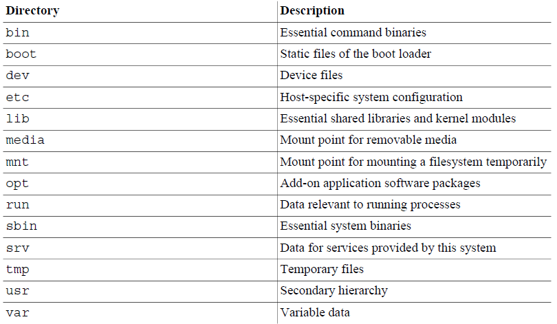

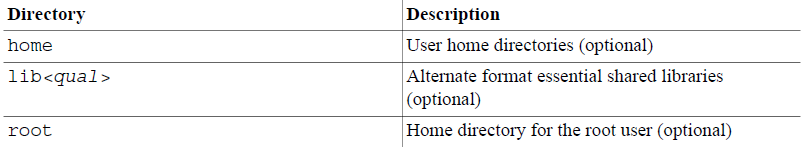


## 建立根文件系统目录

minimum set of directories: /dev, /proc, /bin, /etc, /lib, /usr, /tmp

```bash
#!/bin/sh
echo “-------Create rootfs directions start...-------”
mkdir rootfs
cd rootfs
echo “--------------Create root,dev....--------------”
mkdir root dev etc boot tmp var sys proc lib mnt home
mkdir etc/init.d etc/rc.d etc/sysconfig
mkdir usr/sbin usr/bin usr/lib usr/modules
touch etc/passwd
echo root:x:0:0:root user,,,:/:/sbin/sh > etc/passwd
touch etc/group
touch etc/shells
echo /bin/sh > etc/shells
#echo “make node in dev/console dev/null”
#mknod -m 600 dev/console c 5 1
#mknod -m 600 dev/null c 1 3

mkdir mnt/etc mnt/jffs2 mnt/yaffs mnt/data mnt/temp
mkdir var/lib var/lock var/run var/tmp
chmod 1777 tmp
chmod 1777 var/tmp
echo “-----------make direction done----------”

```

改变tmp目录的使用权，让它开启sticky位，为tmp目录的使用权开启此位，可确tmp目录底下建立的文件，只有建立它的用户和root用户有权删除。尽管嵌入式系统多半是单用户，不过有些嵌入式应用不一定用root权根来执行，因此需要遵照根文件系统权限位的基本规定来设计。


### 建立动态链接库

动态链接库可以从交叉编译器获得，然后复制到/lib下面。

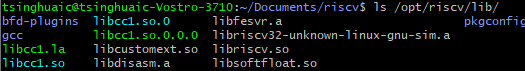

复制完成后可以删除其中的静态库：

```
rm lib/*.a
```

删除共享库中的符号表以减小体积：

```
riscv32-unknown-linux-gnu-strip lib/*
```

在编译器目录下，/sysroot/中：

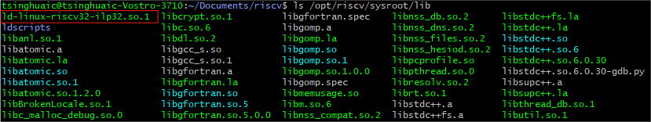

需要有链接器，才能识别**动态链接**的elf文件！


lib库的分类：

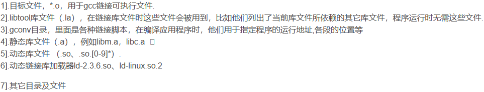

#### readelf -> lib

交叉编译工具readelf可查看busybox（及其它的应用）依赖了哪些库文件：

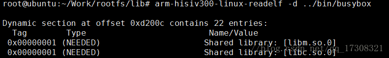

### 交叉编译Busybox

首先要从仓库获取busybox源码：https://git.busybox.net/busybox

然后设置环境变量：

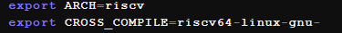

然后根据需要配置busybox （`make menuconfig`  # This creates a file called ".config"）

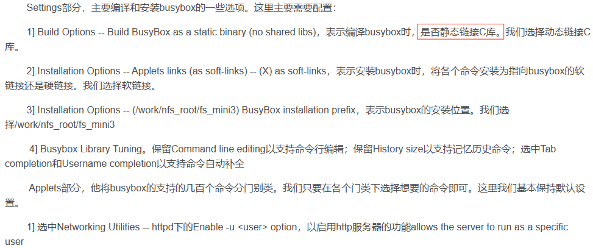

然后：
```bash
make menuconfig     # This creates a file called ".config"
make                # This creates the "busybox" executable
make install        # or make CONFIG_PREFIX=/path/from/root install
```
就能在`_install`目录下看到编译出来的结果：

最后，复制到根文件系统目录下。

Other ways of configuration:

```bash
make defconfig		# This enable features. 
					# It's allyesconfig minus debugging options,
					# optional packaging choices, 
					# and a few special-purpose features requiring
					# extra configuration to use.
					
make allnoconfig	# Everything is disabled

make allbareconfig	# Enables all applets but disables all optional features

make allyesconfig	# Enables absolutely everything including debug features

make randconfig		# Produce a random configuration

make help			# List all *_defconfig files
```

**Tips**:

If menuconfig is run without an existing configuration, `make defconfig` will run first to create a known starting point.


### init

Busybox的init进程会依次进行以下工作：

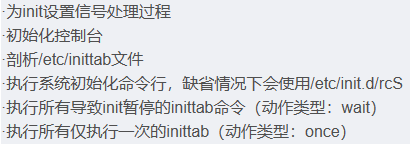


First, your boot loader will load the kernel image you have defined in the boot loader configuration. The kernel is then loaded. When it is loaded and run, it initializes all kernel-specific structures and tasks and starts the init process.

This process then makes sure that all **filesystems** (defined in `/etc/fstab`) are mounted and ready to be used. Then it executes several scripts located in `/etc/init.d`, which will start the services you need for a successful booting.

Finally, when all scripts are executed, init activates the terminals (in most cases just the virtual consoles which are hidden beneath ALT+F1, ALT+F2, etc.), attaching a special process called agetty to each console. This process will then allow you to log on through these terminals by running login.


#### System V init PROCESS

ref: https://www.softprayog.in/tutorials/starting-linux-services-with-init-scripts

In Unix System V, there is the /etc/inittab file, which provides the script for the init process. `/etc/inittab` serves two purposes. 

First, it identifies a default runlevel for the init process, that is, the runlevel to which it should bring up the system to, unless it has been executed with a specific runlevel parameter. When the system is booted, init brings the system to the default runlevel. 

Second, /etc/inittab gave init a list of programs to be executed for a given runlevel. 

**/etc/inittab is not found on present day Ubuntu Linux systems as now System V init process is no longer used and the Upstart init process management daemon (described later on, in this tutorial) is used instead**.

Looking at a part of a typical /etc/inittab file,

```
# The default runlevel     
id:2:initdefault:     

# Boot-time system configuration/initialization script.     
si::sysinit:/etc/rc.sysinit     

# What to do in single-user mode.     
~:S:wait:/sbin/sulogin

# /etc/init.d executes the S and K scripts upon change     
# of runlevel.
#
# Runlevel 0 is halt.
# Runlevel 1 is single-user.
# Runlevels 2-5 are multi-user.
# Runlevel 6 is reboot.

l0:0:wait:/etc/rc 0     
l1:1:wait:/etc/rc 1     
l2:2:wait:/etc/rc 2     
l3:3:wait:/etc/rc 3     
l4:4:wait:/etc/rc 4     
l5:5:wait:/etc/rc 5     
l6:6:wait:/etc/rc 6     

# What to do at the CTRL-ALT-DEL
ca::ctrlaltdel:/sbin/shutdown -t3 -r now   

# Runlevel 2,3: getty on virtual consoles  
1:23:respawn:/sbin/mingetty tty1     
2:23:respawn:/sbin/mingetty tty2     
3:23:respawn:/sbin/mingetty tty3     
4:23:respawn:/sbin/mingetty tty4     

```

The entries are of the form *id:runlevels:action:process*, 

- where *id* is the identifier of the relevant inittab entry, 
- *runlevels* are the runlevels at which the entry is to be processed 
- and *process* refers to the command to be executed. 
- The third field, *action* tells how init should execute the command in the *process* field. *action* can have values like, *wait*, *respawn*, *initdefault*, etc. 
  - *wait* means that init should start this process when it enters this runlevel and **wait for its completion**. If the system was already at this runlevel and the init command for this runlevel was given, init would not execute this command. 
  - *respawn* means that the process would be restarted whenever it terminates.


Looking at the lines like *l2:2:wait:/etc/rc 2* in the inittab file, it means that after entering the given runlevel (2, here), init executes /etc/rc with the runlevel (2, here) parameter. rc uses the runlevel parameter to decide which set of scripts are to be run. For example, in this case, rc, using the runlevel **parameter 2**, would run the scripts in **/etc/rc2.d** directory.

The scripts are kept in the /etc/init.d directory. A runlevel scripts directory, like /etc/rc1.d or /etc/rc2.d has **symbolic links to these scripts**. The links start with a *K* or an *S* character, followed by a number between 01 and 99. The /etc/rc script executes first the *K* scripts and then the *S* scripts, both in the ascending order of the two digit number, following the *K* or *S* character in the script link name.

Programs can be disabled in a run level by removing the links or changing the case of the `K` or `S` to `k` or `s`.

#### init and Upstart

init has been in operation for a long time, but there are difficulties. Most of the problems stem from the fact that init is essentially a synchronous kind of process system. It executes certain scripts when it enters a runlevel sequentially, one after another. It is not able to discover and mount devices, when there is no change in runlevel. The most common example of this is a USB flash drive inserted in one of the USB ports of a system. Similarly, when a network interface become suddenly available, init does not know about it and is not able to do the necessary initialization steps and make the interface usable.

The solution has come from the Ubuntu team in the form of Upstart init process management daemon, which is the replacement for the System V init daemon. Upstart process management daemon was introduced in Ubuntu version 6.04, Edgy Eft, released in October 2006. The Upstart init daemon is event-based. It executes jobs in /etc/init directory based on events generated.

Upstart is backward compatible with System V init, and is able to run System V init scripts unmodified. So one can either use an existing (or write new) System V init script or write an Upstart job. We will look at both cases, but first some basic Upstart concepts.

Upstart is event based; services are started and stopped on the basis of events. The concept of runlevels exists in a limited way, just to maintain backward compatibility with System V init. It is not that the Upstart init daemon runs certain scripts whenever there is a change of runlevel. The Upstart services are started or stopped whenever a corresponding event is emitted by some entity in the system. However, for backward compatibility with System V init scripts, the current runlevel information is maintained and a change in runlevel is emitted as an event, so that corresponding System V scripts can be executed. inittab file has has more or less disappeared from the scene. The only unlikely use of inittab is when you wish to override the default runlevel 2 with some other runlevel (3, 4 or 5). Then you can have an initdefault entry to that effect in the /etc/inittab file. A change in runlevel is also signaled as an event.

#### How systemd use /etc/init.d scripts

The native service format for systemd is the *service unit*. systemd's service management proper operates *solely* in terms of those, which it reads from one of **nine directories** where (system-wide) `.service` files can live. `/etc/systemd/system`, `/run/systemd/system`, `/usr/local/lib/systemd/system`, and `/usr/lib/systemd/system` are four of those directories.


### /etc/init.d/rcS

```bash
#!/bin/sh
mount -t proc none /proc
mount -t sysfs none /sys
/sbin/mdev -s

# Need devpts mounted for SSH login
mkdir /dev/pts
mount devpts /dev/pts -t devpts

# Start all init scripts in /etc/init.d
# executing them in numerical order.
#
for i in /etc/init.d/S??* ;do

     # Ignore dangling symlinks (if any).
     [ ! -f "$i" ] && continue

     case "$i" in
	*.sh)
	    # Source shell script for speed.
	    (
		trap - INT QUIT TSTP
		set start
		. $i
	    )
	    ;;
	*)
	    # No sh extension, so fork subprocess.
	    $i start
	    ;;
    esac
done

```


## 打包根文件系统

### 1. Initrd.cpio

```
find . | cpio -c -o > ../initrd.img
gzip ../initrd.img
```

### 2. Initrd.img

```
dd if=/dev/zero of=initrd2.img bs=4k count=2048
mkfs.ext2 -F initrd2.img
sudo mkdir /mnt/initrd
sudo mount -t ext2 initrd2.img /mnt/initrd
sudo cp /source/rootfs/* /mnt/initrd -a
sudo umount /mnt/initrd
gzip --best -c initrd2.img > initrd.img.gz
```

### 3. 通过工具制作根文件系统镜像

[buildroot](https://buildroot.org/)会自动构建一整套的环境，包括opensbi, linux kernel, rootfs等等。可以通过`make menuconfig`配置，将linux kernel不选择编译进去。

```bash
cd buildroot
make *_defconfig
make -j
```


## 多用户

新建用户
`adduser usename`

切换到新用户
`su username` #(substitute user)
/ `sudo -i -u username` (Superuser do to switch to another user)

退出当前用户，回到之前的用户
`exit`


## Linux From Scartch

ref: https://www.linuxfromscratch.org/lfs/downloads/stable/LFS-BOOK-12.0.pdf

Need a **detailed plan**, to make it realstic to proceed as a personal project!

1. A starting point, **already installed Linux distribution**, or a Live CD
2. Create a new Linux native **partition and file system**, where the new LFS system will be compiled and installed
3. Download **packages and patches** to build an LFS system
4. Set up an appropriate working **environment** (version-check.sh)
5. Install **initial tool chain** (Binutils, GCC, and Glibc), using **cross-compilation techniques** to isolate the new tools from the host system (Install cross-compile toolchain)
6. Cross-compile **basic utilities**, using the just built cross-toolchain
7. "chroot" environment to use the new tools to **build all the rest of the tools** needed to create the LFS system
8. Build full-blown LFS system
9. Set up basic system **configuration**
10. Create **the kernel and boot loader**
11. Boot into the new LFS system


Summary:

tool-chain and basic utilities, the rest of the tools, packages, kernel and bootloader, system configuration


**login shell**: execute `/etc/profile` or `~/.bash_profile`

**non-login shell**: execute `~/.bashrc`


## Embedded Linux system

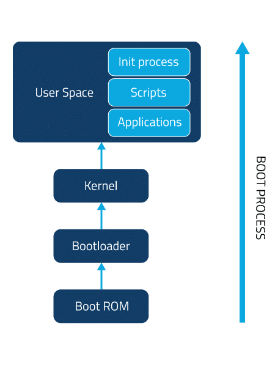


# building tools

## Buildroot

ref: https://github.com/buildroot/buildroot

repo: https://git.busybox.net/buildroot

The `make` processes in Buildroot:


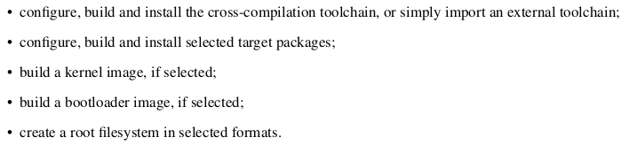

### Matrix

@joehu1500:matrix.org

```
EsTw nk5c 8QDk 4H9n zFuS hKyv f7BL KT4N ZqZF LH8R vRfc wgbR
```


## OpenWrt

ref: https://openwrt.org/

OpenWrt is an open-source Linux operating system primarily designed for embedded devices like **routers, residential gateways, and other network devices**. It provides a fully writable filesystem with package management capabilities, allowing users to customize and extend the functionality of their devices beyond what is offered by the vendor's stock firmware.


**Tina-linux** is based on OpenWrt-14.07, layered by Kernel & drivers, Libraries, System services, and Applications.

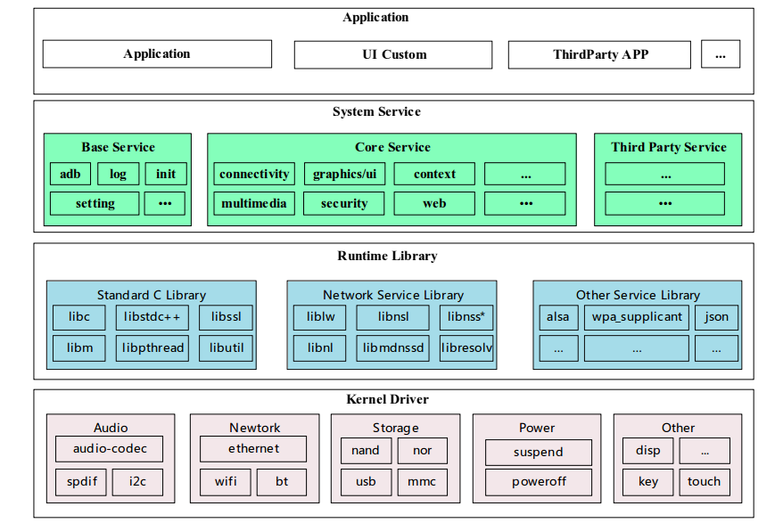

ref: https://d1.docs.aw-ol.com/study/study_1tina/


## Armbian

ref: https://github.com/150balbes/build/tree/risc-v

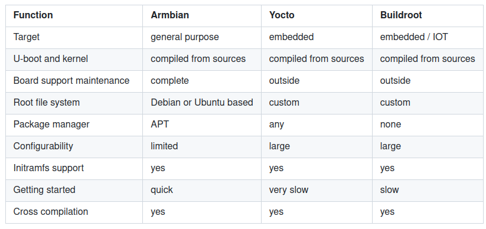


## Yocto

ref: https://docs.yoctoproject.org/2.1/yocto-project-qs/yocto-project-qs.html

The Yocto Project through the OpenEmbedded build system provides an open source development environment targeting the ARM, MIPS, PowerPC, and x86 architectures for a variety of platforms including x86-64 and emulated ones. You can use components from the Yocto Project to design, develop, build, debug, simulate, and test the complete software stack using Linux, the X Window System, GTK+ frameworks, and Qt frameworks.


