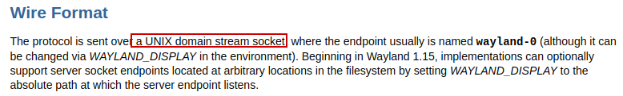
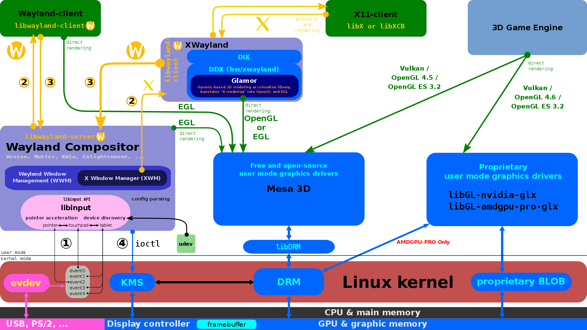
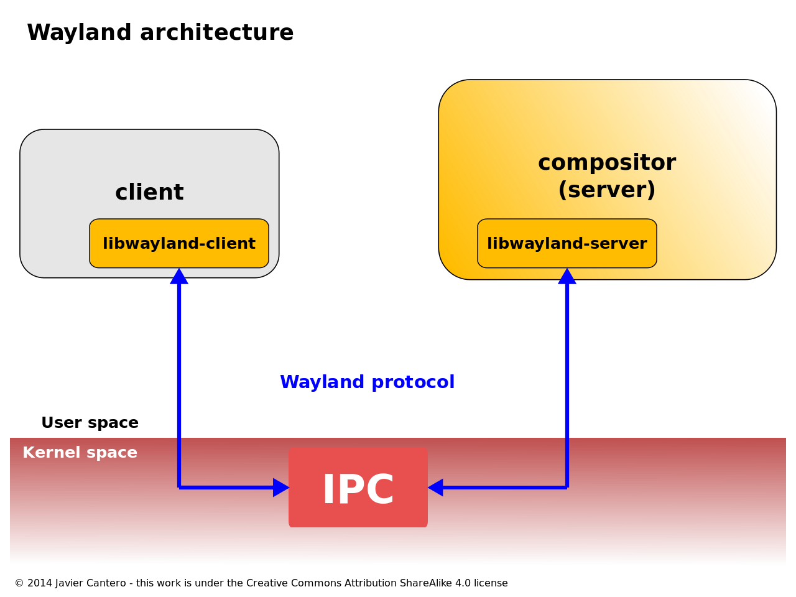
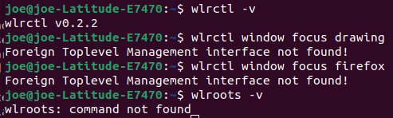
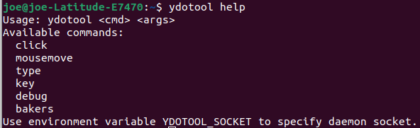
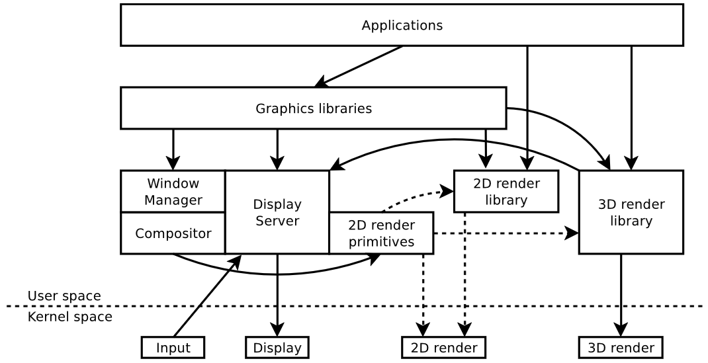

domain stream socket

## wayland

ref: https://en.wikipedia.org/wiki/Wayland_%28protocol%29

The Wayland reference implementation has been designed as a two layer protocol.

A low-level layer or wire protocol that handles the inter-process communication between the two involved processes, client and compositor, and the marshalling of the data they interchange. This layer is message-based and usually implemented using the kernel IPC services, specifically Unix domain sockets in the case of Linux and Unix-like operating systems.

A high-level layer built upon it, that handles the information that client and compositor need to exchange to implement the basic features of a window system. The layer is implemented as "an asynchronous object-oriented protocol"

While the low-level layer was written manually in C, the high-level layer is automatically generated from a description of the elements of the protocol stored in XML format. Every time the protocol description of this XML file changes, the C source code that implements such protocol can be regenerated to include the new changes, allowing a very flexible, extensible and error-proof protocol.

The reference implementation of Wayland protocol is split in two libraries: a library used by Wayland clients called `libwayland-client` and a library to be used by Wayland compositors called `libwayland-server`.

### event / request

Wayland clients request services from compositors. The compositor in turn sends the information back to the client by causing the object to emit events.

The `interfaces` and their `requests and events` are the core elements that define the Wayland protocol.

Some of the most basic `interfaces` of the Wayland protocol are:

- wl_display
- wl_registry
- wl_compositor
- wl_surface
- wl_buffer
- wl_output
- wl_pointer
- wl_seat

A typical Wayland client session starts by opening a connection to the compositor using the wl_display object. This is a special local object that represents the connection and does not live within the server. By using its interface the client can request the wl_registry global object from the compositor, where all the global object names live, and bind those that the client is interested in. Usually the client binds at least a wl_compositor object from where it will request one or more wl_surface objects to show the application output on the display.

State is broadcast on connect, events are sent out when state changes. Clients must listen for these changes and cache the state. There is no need (or mechanism) to query server state.

#### xml

The `interfaces`, `requests` and `events` are defined in `protocol/wayland.xml`. This **xml** is used to generate the function prototypes that can be used by clients and compositors.

### libinput

Libinput handles input devices like keyboards, pointers and touchpads, etc. Libinput provides device detection (via `udev`), devices handling, input device event processing and abstraction.

### libwayland-client

The open-source reference implementation of Wayland protocol is split in two C libraries, libwayland-client and libwayland-server. Their main responsibility is to handle the Inter-process communication (**IPC**) with each other, therefore guaranteeing the protocol objects marshaling and messages synchronization.

### libwayland-server

The server library is designed to work much like **libwayland-client**, although it is considerably complicated due to the server needing to support multiple versions of the protocol. It is best to learn libwayland-client first.

Often a server is also a client for another Wayland server, and thus must link with both libwayland-client and libwayland-server. This produces some type name conflicts (such as the client `wl_display` and server `wl_display`, but the duplicate-but-not-the-same types are opaque, and accessed only inside the correct library where it came from. Naturally that means that the program writer needs to always know if a pointer to a `wl_display` is for the server or client side and use the corresponding functions.

## X window

## wlrctl project

a substitute for `wmctrl` with wayland

ydotool: a substitute for `xdotool` with wayland

## Linux Graphic Stack

ref: https://bootlin.com/doc/training/graphics/graphics-slides.pdf

Window manager and compositor, composite manager are doing the same thing.

In Wayland, Window Manager, Compositor are merged in the Display Server.

### OpenGL

3D rendering API, designed for GPU **hardware acceleration**

- Generic API but **hardware-specific implementations**
- Started by Silicon Graphic 1992, but now managed by Khronos Group

OpenGL provides a **high-level approach** to 3D graphics

- Compromise between complexity and find-grained control
- Efficient abstraction, adapted to the hardware
- Leaves most memory management to the implementation

**Stateful** and **context-based** programming model

OpenGL versions evolved with hardware features

- Version 1 targeted fixed-function pipeline GPUs
- Version 2 and up allow programing **vertex and fragment shaders**
- More sharders supported with new versions (geometry, tesselation)

OpenGL comes with **GL Shading Language** (GLSL)

- Source code language for OpenGL Shaders
- C-like syntax with intrinsic functions (e.g. texture access)
- Compiled on-the-fly by the GL implementation

Supports **extensions** that can be queried, for extra features

**OpenGL ES** was introduced as a simplified version for embedded devices

OpenGL ES versions are loosely following OpenGL versions:

- Version 1 targets **fixed-function** GPUs
- Version 2 and up target **programmable** GPUs

Uses GLSL shaders and the same programming model as OpenGL

**EGL** was introduced as standardized window integration API

- Connects with the native system display server
- Replaces **GLX for X11** and adopted as default by Wayland

Supports **extensions** that can be queried, for extra platform-specific features

**Vulkan** is a **low-level** generic API for GPU access

- Started by the Khronos group in 2016 and widely adopted

Suitable for both **3D rendering** and **compute**

Uses **Standard Portable Intermediate Representation** (SPIR) shaders

- Unified intermediate representation from (adapted) GLSL/HLSL sources
- Compiled with the program instead of on-the-fly (less overhead)
- Translated to native GPU operations by implementations

**Direct programming model**, with low-level **memory management**

The API provides window system integration (WSI) for many platforms

e.g. for Wayland: vkCreateWaylandSurfaceKHR

#### Mesa 3D

Mesa is the reference free software **3D graphics implementation**

- Started back in 1993, evolved with GPU implementations
- Project works with the Khronos Group and develops extensions

Implements support for **rendering** APIs:

- **OpenGL** (up to 4.6) and **OpenGL ES** (up to 3.2)
- **Vulkan** (up to 1.1) with translation to OpenGL via **Zink**
- **Direct 3d** (version 9 only)

Unlike other devices, 3D hardware is **abstracted in userspace**

- 3D rendering is very bad fit for in-kernel abstraction
- Kernel drivers are much less complicated than GL implementations

Mesa implements driver-specific **DRM render** support

- Manages memory with the GEM and Prime DRM APIs
- Manages DRI2 to allow direct rendering

**Virtual** drivers are also supported (for virtual machines)

- **vmwgfx**: VMware bridge (proprietary virtual hardware implementation)
- **virgl**: Virtio brige (standard for Linux and QEMU)

Also provides **software backends**:

- **softpipe**: Generic reference software renderer
- **swr**: OpenSWR renderer (for x86 by Intel)
- **llvmpipe**: LLVM-based renderer (high-performance)

Classic mesa drivers have significant **code duplication**:

- API state tracking
- Compiler implementaiton

The Gallium 3D interface splits things up instead:

- **API State trackers**: maintain the current state for the API in use
- **Drivers**: implement shader compilation and hardware configuration
- **Winsys**: implement low-level kernel interfaces

Gallium drivers implement a pipe interface:

- struct pipe_screen: textures, buffers and sync management
- struct pipe_state: pipeline configuration and resources state
- struct pipe_context: rendering operation functions

Pipe loaders (DRM or software) select the right pipe driver

IR: Intermediate Representations

Shader

Internal representation pipepline

****

### rendering

In Wayland, Clients are expected to do all the rendering, while in X Window X server is doing the rendering.

Rendering means interpret information as pixels in Linux Graphic Stack.
