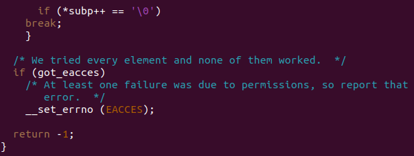
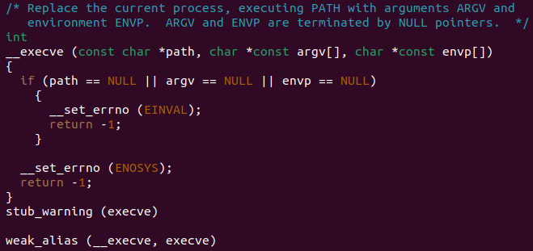
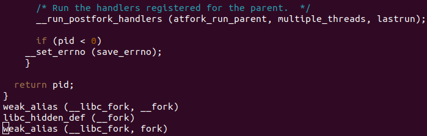
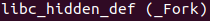
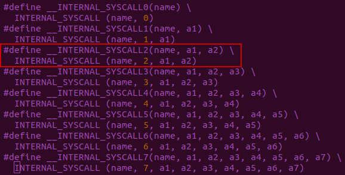
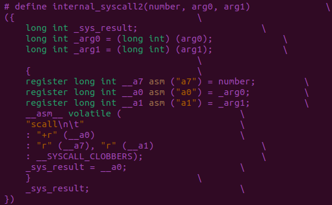

2024年3月13日

## _exit

### posix

这里的应该是备选实现，即如果相应的OS平台上没有`_exit`函数的话，就使用这个。

#### abort

### sysdeps/unix/sysv/linux

### INLINE_SYSCALL (exit_group, ...)

#### internal_syscall1

#### SYS_ify

#### `__NR_exit_group` = 94

## exit

从`exit`到`_exit`，`status`的值没有改变过。

`exit`函数在最后会调用`_exit`函数，它是terminate一个进程的原始函数。

## kill

### __kill?

### __set_errno

### libc.pdf

成功返回0，不成功返回-1

## write

weak_alias

### SYSCALL_CANCEL(write, ...)

`__VA_ARGS__` = `write, fd, buf, nbytes`，因此**n = 3**。

因此，`__INLINE_SYSCALL_NARGS(__VA_ARGS__)` = 3。

所以，此时`INLINE_SYSCALL_CALL` = `__INLINE_SYSCALL3`

### INLINE_SYSCALL

#### internal_syscall3

#### __NR_write = 64

## wait

__wait

weak_alias

### __waitpid

### __wait4

`./posix/wait4.c`

### __wait4_time64

#### SYSCALL_CANCEL(wait4, ...)

详见write函数分析

`__VA_ARGS__` = `wait4, pid, stat_lock, options, usage`，因此**n = 4**。

如果是RV32：

`__VA_ARGS__` = `waitid, idtype, pid, &info, options, usage`，因此**n = 5**。

##### internal_syscall4

./sysdeps/unix/sysv/linux/riscv/sysdep.h

##### __NR_wait4 = 260

##### internal_syscall5

##### __NR_waitid = 95

## execvp

### libc_hidden_def

所以这里的实现对外是不可见的，另外的`execvp`实现在了别的库里？

#### unistd_maybe

### __execvpe

### __execvpe_common

### __execve

这应该是个stub函数。

#### syscalls.list

在文件`sysdeps/unix/sysv/linux/syscalls.list`中：

在`sysdeps/unix/make-syscalls.sh`中

因此，所有这些没有实现的syscall，应该都是由其它的代码和脚本间接生成的。

#### __rtld_execve

#### __NR_execve = 221

### maybe_script_execute

## vfork

###  __fork

### __libc_fork

### _Fork

./posix/_Fork.c中，stub_warning代表这是个stub。

./sysdeps/nptl/_Fork.c中的，才是真正的实现。

#### INTERNAL_SYSCALL_CALL

`__VA_ARGS__` = `set_robutst_list, $self->robust_head, sizeof (struct robuts_list_head)`，因此**n = 2**。

__INTERNAL_SYSCALL2

#### internal_syscall2

