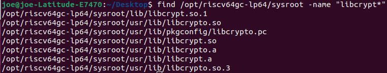
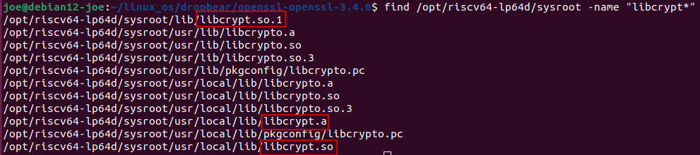
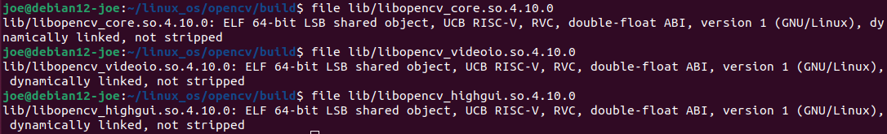
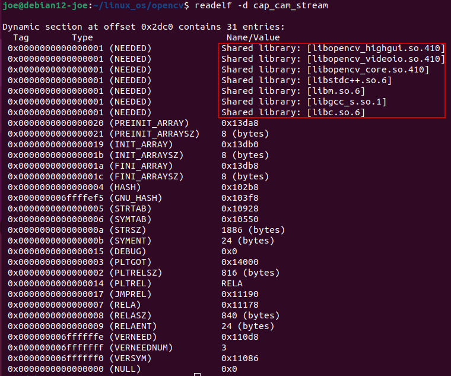

Manually compiled packages


# dropbear

Install Prerequisite first:

(1)zlib-1.2.13.tar.gz

(2)libxcrypt

(3)dropbear-2022.83.tar.bz2

##  zlib

```bash
tar -zxvf zlib-1.2.13.tar.gz
cd zlib-1.2.13/
export ARCH=riscv
export CROSS_COMPILE=/opt/riscv64-lp64d/bin/riscv64-unknown-linux-gnu-
./configure
make
emacs Makefile # Cross compilation toolchain modification, including gcc, ar, ranlib
make install DESTDIR=/opt/riscv64-lp64d/sysroot

# Move shared library to root filesystem
cp /opt/riscv64-lp64d/sysroot/usr/local/lib/libz.so.1 initrd-rv64/lib/
```


Makefile Modification:

```makefile
CROSS_COMPILE=/path/to/riscv64-linux-gnu- # gcc path prefix
CC=$(CROSS_COMPILE)gcc
LDSHARED=$(CROSS_COMPILE)gcc -shared -Wl,-soname,libz.so.1,--version-script,zlib.map
AR=$(CROSS_COMPILE)ar
RANLIB=$(CROSS_COMPILE)ranlib
```


## libgcrypt

This is not really suitable for `dropbear`

Prerequisite `libgpg-error`:

```bash
wget https://www.gnupg.org/ftp/gcrypt/libgpg-error/libgpg-error-1.51.tar.bz2
tar -xvjf libgpg-error-1.51.tar.bz2

./configure CC=/opt/riscv64-lp64d/bin/riscv64-unknown-linux-gnu-gcc --host=riscv64-unknown-linux-gnu --enable-install-gpg-error-config
make
make check
make install DESTDIR=/opt/riscv64-lp64d/sysroot
```

Then the `libgcrypt`

```bash
wget https://www.gnupg.org/ftp/gcrypt/libgcrypt/libgcrypt-1.8.11.tar.bz2
tar -xvjf libgcrypt-1.8.11.tar.bz2

./configure CC=/opt/riscv64-lp64d/bin/riscv64-unknown-linux-gnu-gcc --host=riscv64-unknown-linux-gnu --disable-amd64-as-feature-detection --with-gpg-error-prefix=/opt/riscv64-lp64d/sysroot/usr/local --enable-static

make
make install DESTDIR=/opt/riscv64-lp64d/sysroot
```


## libcrypto

`libcrypt` is a part of **OpenSSL**, so try to compile `openssl` first: (It actually compiles to libcrypto)

```bash
wget https://github.com/openssl/openssl/archive/refs/tags/openssl-3.4.0.tar.gz
#./Configure CC=/opt/riscv64-lp64d/bin/riscv64-unknown-linux-gnu-gcc linux64-riscv64
./Configure CC=/opt/riscv64-lp64d/bin/riscv64-unknown-linux-gnu-gcc  --prefix=/opt/riscv64-lp64d/sysroot/usr linux64-riscv64
# `./Configure LIST` will listout all possible targets
# `./Configure help` will show usage
CC=/opt/riscv64-lp64d/bin/riscv64-unknown-linux-gnu-gcc make
#make install DESTDIR=/opt/riscv64-lp64d/sysroot # This way is not working
make install

# Check libcrypt in compiler sysroot
find /opt/riscv64-lp64d/sysroot -name "libcrypt*"
# Not working, it's libcrypto, not libcrypt
# Currently, a libcrypt binary is copied from Tina-Linux/lichee toolchain
# Seems libxcrypt is the real library
# https://github.com/besser82/libxcrypt.git
```






## libxcrypt

ref: https://wiki.linuxfromscratch.org/lfs/ticket/5280

Glibc developers consider Glibc libcrypt implementation deprecated, and libcrypt may be disabled by default in Glibc-2.38 (a patch is under review now).

As libcrypt is security-related, it seems a bad idea to override the upstream decision and stick with the deprecated implementation. Many distros has already switched to [libxcrypt](https://github.com/besser82/libxcrypt) for providing libcrypt.so.

We can add libxcrypt immediately before shadow, which is the first package in **LFS** using libcrypt.


This is the real source code for `libcrypt`!

libxcrypt is a modern library for one-way hashing of passwords.

It provides the traditional Unix `crypt` and `crypt_r` interfaces, as well as a set of extended interfaces pioneered by Openwall Linux, `crypt_rn`, `crypt_ra`, `crypt_gensalt`, `crypt_gensalt_rn`, and `crypt_gensalt_ra`.

```bash
git clone https://github.com/besser82/libxcrypt.git
./autogen.sh
./configure CC=/opt/riscv64-lp64d/bin/riscv64-unknown-linux-gnu-gcc --host=riscv64-unknown-linux-gnu 
make
make install DESTDIR=/opt/riscv64-lp64d/sysroot
```


## dropbear

Then the `dropbear`:

```bash
tar -xvzf dropbear-DROPBEAR_2022.83.tar.gz 
cd dropbear-DROPBEAR_2022.83/
./configure --with-zlib=/usr/local CC=/opt/riscv64-lp64d/bin/riscv64-unknown-linux-gnu-gcc --host=riscv64-unknown-linux-gnu --prefix=/usr --enable-static

make PROGRAMS="dropbear dbclient dropbearkey dropbearconvert scp"
make PROGRAMS="dropbear dbclient dropbearkey dropbearconvert scp" install DESTDIR=/home/joe/linux_os/initrd-rv64
```


## Enable SSH service

### Host keys

```bash
cd /etc
mkdir dropbear      //这个名字是固定的，千万不可变动
cd dropbear

./dropbearkey -t rsa -f dropbear_rsa_host_key
./dropbearkey -t dss -f dropbear_dss_host_key
./dropbearkey -t ecdsa -f dropbear_ecdsa_host_key
./dropbearkey -t ed25519 -f dropbear_ed25519_host_key
```

Host keys are a fundamental component of the Secure Shell (SSH) protocol, serving as a means of authenticating the identity of an SSH server to clients. 

Server’s identity: Host keys are cryptographic keys that uniquely identify an SSH server. The key **fingerprints** will be stored in  `~/.ssh/known_hosts` on client side of SSH connection.

To generate host keys on building machine, just install `dropbear` on that machine too.

`sudo apt-get install dropbear`


### Launch dropbear

Manually issue `dropbear` command or using init scripts: 

```bash
cd /etc/init.d/
touch S50dropbear
 
//将下面内容加入到S50dropbear文件
#!/bin/sh
# Copyright (C) 2006 OpenWrt.org
 
START=99
start() {
	printf "Start dropbear sshd"
    cd /usr/sbin/
    ./dropbear
    cd -
}

case "$1" in
  start)
  	start
	;;
  stop)
  	stop
	;;
  restart|reload)
  	restart
	;;
  *)
	echo "Usage: $0 {start|stop|restart}"
	exit 1
esac

exit $?

// This requires calling from /etc/init.d/rcS file to be effective, which you can find examples of from buildroot projects
```


### passwd

Setting passwords for SSH users, if not having one, or adding a user:

```bash
adduser admin
passwd root
```


### Usage

On client side:

```bash
# Connect from host (client) to target (server) using SSH.# It will prompt for root's passwd.
$ ssh root@172.16.16.100
# Copy the file 'hola' from the host (client) to the directory /etc in the target (server).# It will prompt for root's passwd.
$ scp hola root@172.16.16.100:/etc/hola
```


### Issues

Possible issues when using SSH service:

1. PTY allocation request failed

`PTY` virtual devices are Pseudo TTY devices. It is needed for SSH login. The `dev/pts` device (PTY slave side?) should be mounted by `mount devpts /dev/pts -t devpts`. Add this line to the `etc/rcS` file works.


2. scp: not found

When using SSH service, it will search commands from directories specified by `PATH` environment. If the `scp` program in `rootfs` is not in the list of `PATH` environment, it won't be able to find it.

The tricky part is how this `PATH`  environment is set, at this point. When an `scp` command is issued, it connects to the SSH server on the remote host. The SSH daemon (`sshd`, here we use `dropbear`) is responsible for accepting the incoming SSH connection. For each connection, `sshd` spawns a new process to handle that specific session. So if the `PATH` environment is not added with the path of `scp`, when start the `dropbear` program, it won't inherit a `PATH` environment containing that path. Then, `scp: not found` issue will be triggered when using `scp` service. In this case, "ssh user@192.168.1.100 `which scp`" will not find the `scp` file either.

In a bigger picture, if sshd is launched by `init`, for SSH login, the calling trace will be like:

`init` -> `dropbear/sshd` -> `login` -> `shell`

See more details about TTY in `getty` part of `53_TTY_layer.md`. 


Adding `scp` path to `PATH`, before launch `dropbear`  may solve this issue. (Not having tested now)

> [!TIP]
>
> "ssh user@192.168.1.100 `echo $PATH`" can be used to check `PATH` environment at that point.


# tcpdump

cross-compile for embedded system:

1. find latest release in https://www.tcpdump.org/
2. download source code

```bash
wget https://www.tcpdump.org/release/tcpdump-4.99.5.tar.xz
wget https://www.tcpdump.org/release/libpcap-1.10.5.tar.xz
tar -xvJf libpcap-1.10.5.tar.xz
tar -xvJf tcpdump-4.99.5.tar.xz
```

## libpcap

3. compile libpcap

```bash
CC=/opt/riscv64/bin/riscv64-unknown-linux-gnu-gcc ./configure --host=riscv64-unknown-linux-gnu --prefix=/usr/riscv # default installation location is `/usr/local`
make
make install DESTDIR=/opt/riscv64/sysroot
```

## openssl

4. compile openssl if needed

```bash
git clone https://github.com/openssl/openssl.git
cd openssl
./Configure --cross-compile-prefix=/opt/riscv64/bin/riscv64-unknown-linux-gnu- --prefix=/opt/riscv64/sysroot/usr linux64-riscv64
CC=/opt/riscv64/bin/riscv64-unknown-linux-gnu-gcc make
make install
```

Depends on whether using the openssl lib, extra options may be needed to specified when compiling `tcpdump`

5. compile tcpdump

```
CC=/opt/riscv64/bin/riscv64-unknown-linux-gnu-gcc ./configure --host=riscv64-unknown-linux-gnu --with-pcap=/usr/riscv --with-openssl=/usr
make
```


# opencv

ref: https://docs.opencv.org/4.x/d7/d9f/tutorial_linux_install.html

```bash
wget https://github.com/opencv/opencv/archive/refs/tags/4.10.0.tar.gz
tar -xzvf 4.10.0.tar.gz

# Create build directory
mkdir -p build && cd build

# Configure
export PATH=/opt/riscv64-lp64d/bin:$PATH

cmake --toolchain "../opencv-4.10.0/platforms/linux/riscv64-gcc.toolchain.cmake" -DBUILD_SHARED_LIBS=ON -DWITH_OPENCL=OFF -DWITH_IPP=OFF ../opencv-4.10.0

# Or
cmake -DCMAKE_TOOLCHAIN_FILE=../opencv-4.10.0/platforms/linux/riscv64-gcc.toolchain.cmake -DBUILD_SHARED_LIBS=ON -DWITH_OPENCL=OFF -DWITH_IPP=OFF ../opencv-4.10.0
# Add CMAKE_INSTALL_PREFIX OPENCV_ENABLE_PKG_CONFIG
cmake -DCMAKE_TOOLCHAIN_FILE=../opencv-4.10.0/platforms/linux/riscv64-gcc.toolchain.cmake -DCMAKE_INSTALL_PREFIX=/opt/riscv64-lp64d/sysroot/usr/local -DOPENCV_ENABLE_PKG_CONFIG=ON -DBUILD_SHARED_LIBS=ON -DWITH_OPENCL=OFF -DWITH_IPP=OFF ../opencv-4.10.0


# Build
cmake --build .

# After successful build you will find libraries in the build/lib directory and executables (test, samples, apps) in the build/bin directory:
ls lib

make install
```




Compile a cpp file using OpenCV library

```bash
# Use pkg-config to get compilation flags (Needing to enable the PKG_CONFIG option)
PKG_CONFIG_PATH=/opt/riscv64-lp64d/sysroot/usr/local/lib/pkgconfig pkg-config --cflags --libs opencv4

/opt/riscv64-lp64d/bin/riscv64-unknown-linux-gnu-g++ -o target-name srouce-file.cpp `pkg-config --cflags --libs opencv4`

# Manually add include path and library dependency
riscv64-unknown-linux-gnu-g++ -o cap_cam_stream read_h264_stream.cpp -I/opt/riscv64-lp64d/sysroot/usr/local/include/opencv4 -lopencv_highgui -lopencv_videoio -lopencv_core
```


Checking dependent so files **recursively** and adding them to rootfs:


