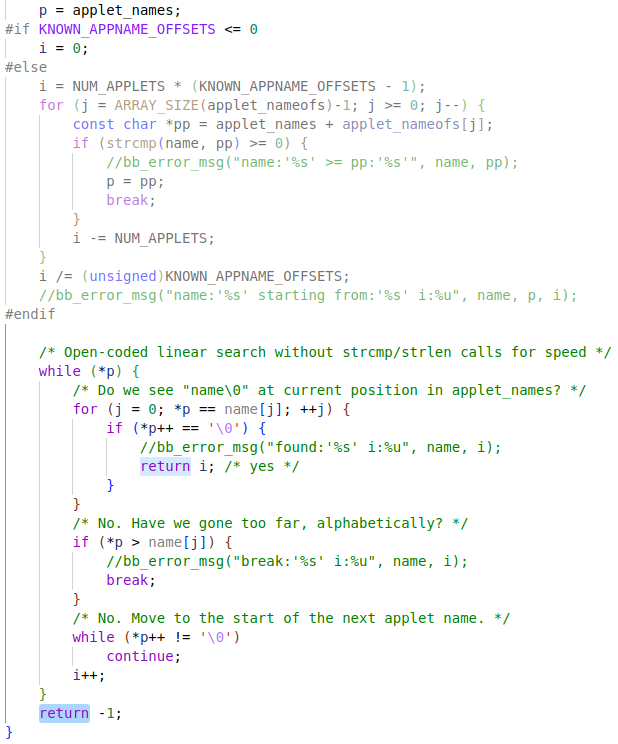
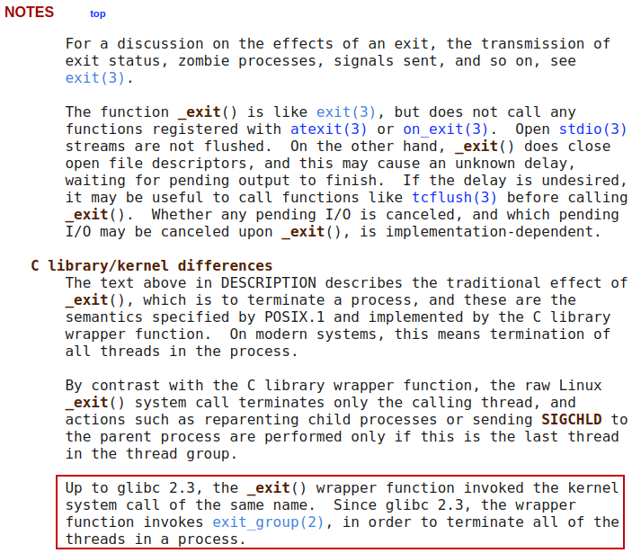
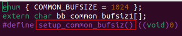
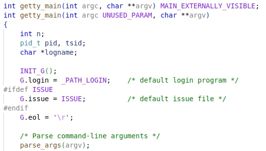
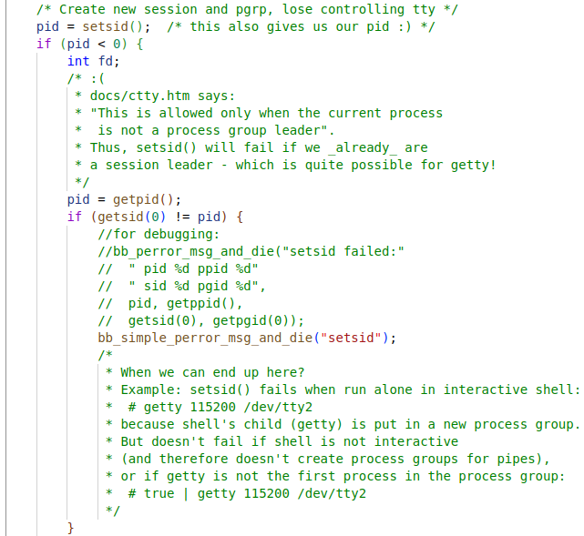
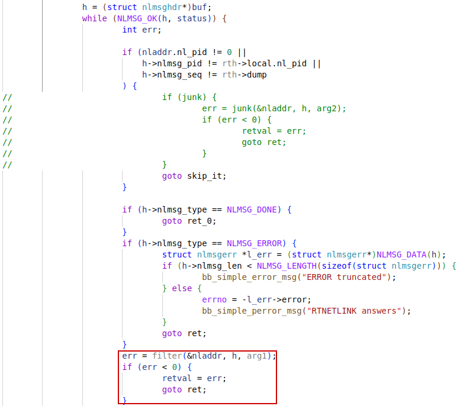
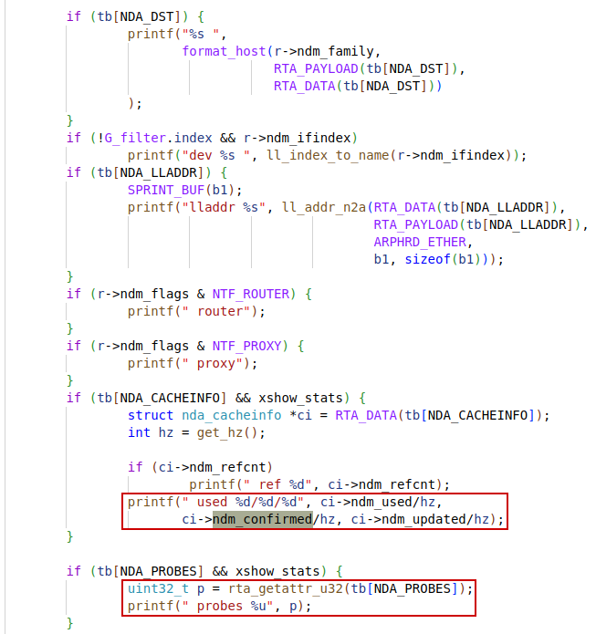
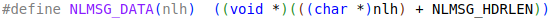

2024年4月9日

Busybox provides a collection of Unix utilities in a single executable, making it particularly useful in embedded systems and minimal environments.

# busybox

applet


大概了解busybox工程：

## applets框架

文件目录`applets`下的程序会生成`include/applet_tables`文件，其中会列出所有的applets名字及其它相关信息。然后，在执行main函数时，会根据`basename`确定要调用哪个`applet_main`。

### busybox_main


## main

根据宏`ENABLE_BUILD_LIBBUSYBOX`来决定是否将Busybox以库的方式进行构建。


### bb_basename

`strrchr`: 搜索字符最后一次出现的位置。所以这个函数的作用是去除文件路径，保留文件名。


### set_task_comm


prctl: operations on a process or thread

这里用来给当前thread命名。


### run_applet_and_exit

在这个函数中，如果执行`run_applet_no_and_exit`有返回的话，会执行exit(127)


动态链接时，将**main入口地址**传递给库函数：


.got.plt中的值需要延迟绑定，默认为动态链接器.plt段的地址。


...


.got中的默认地址为: 0x15520


#### find_applet_by_name




#### exit


#### _exit

会调用到`exit_group`这个syscall




#### EXIT_FAILURE


#### full_write2_str


##### full_write


##### safe_write


##### write

如果stderr没有打开，则errno = EBADF，n应该也为-1.


### run_applet_no_and_exit


#### xfunc_die


`applet_main`返回值会作为`status`传入`exit`函数。**查看applet_main的返回值及在applet_main执行过程中有没有调用_exit/exit函数**。

run_applet:


hush_main:


ash_main:


conspy_main:


`linuxrc`命令对应的应该是init_main。

## init_main


只有两个地方可能会返回，分别是执行kill函数（glibc库函数）和SELINUX部分。kill只会返回0或者-1，SELINUX是没有使能的。


### INIT_G

`INIT_G` is doing nothing here.





### console_init


### run_actions


#### G.init_action_list


#### run


#### init_exec


#### exec*


在toolchain中，`sysroot/usr/include/unistd.h`中有以下声明：


进程的创建分为两步，创建新进程实体和加载新进程映象。第二步就会需要exec系统函数。


ref: https://www.gnu.org/software/libc/manual/html_node/Executing-a-File.html#index-execve


### parse_inittab


#### INIT_SCRIPT


### new_init_action


## getty_main

`getty` lets you **log in** a `tty`. It is normally invoked by `init`.






# shell

When you launch a shell, it starts by reading configuration files like `/etc/profile` and `~/.bashrc` to set up the environment variables and define aliases. These files can also contain funciton definitions and shell scripts to be executed at **startup**.

Then, the shell displays a **prompt**, indicating it's ready to accept commands. When you type a command and press `Enter`, the shell parses and interprets the command line.

**How a shell works**:

Input -> Parsing -> Command Search -> Execution -> Output -> Exit status -> **Prompt**

1. **Input**: The shell displays a prompt and waits for the user to enter a command.
2. **Parsing**: Once the user enters a command and presses Enter, the shell parses the command line into <u>tokens</u> (words separated by spaces or other delimiters). It identifies the <u>command name</u> and any <u>arguments</u> or <u>options</u>.
3. **Command Search**: The shell searches for the specified command in a predetermined list of directories specified by the `PATH` environment variable. If the command is found, the shell proceeds to execute it.
4. **Execution**:
   - **Built-in Commands**: If the command is a built-in shell command (like `cd`, `echo`, etc.), the shell executes it directly <u>within the current process</u>.
   - **External Commands**: If the command is an external program or utility, the shell <u>creates a new child process</u> by forking itself, and the child process executes the command by loading the program's code into memory and running it.
5. **Output**: The command's output is displayed in the terminal window.
6. **Exit Status**: After the command finishes executing, the child process terminates and returns an <u>exit status code</u> to the parent shell process, indicating success or failure.
7. **Prompt**: The shell displays a <u>new prompt</u>, ready for the next command.

## ash_main

```c
/*
 * Main routine.  We initialize things, parse the arguments, execute
 * profiles if we're a login shell, and then call cmdloop to execute
 * commands.  The setjmp call sets up the location to jump to when an
 * exception occurs.  When an exception occurs the variable "state"
 * is used to figure out how far we had gotten.
 */
int ash_main(int argc, char **argv) MAIN_EXTERNALLY_VISIBLE;
#if NUM_SCRIPTS > 0
int ash_main(int argc, char **argv)
#else
int ash_main(int argc UNUSED_PARAM, char **argv)
#endif
/* note: 'argc' is used only if embedded scripts are enabled */
{
	volatile smallint state;
	struct jmploc jmploc;
	struct stackmark smark;
	int login_sh;

	/* Initialize global data */
	INIT_G_misc();
	INIT_G_memstack();
	INIT_G_var();
#if ENABLE_ASH_ALIAS
	INIT_G_alias();
#endif
	INIT_G_cmdtable();

#if PROFILE
	monitor(4, etext, profile_buf, sizeof(profile_buf), 50);
#endif

	state = 0;
	if (setjmp(jmploc.loc)) {
		smallint e;
		smallint s;

		exitreset();

		e = exception_type;
		s = state;
		if (e == EXEND || e == EXEXIT || s == 0 || iflag == 0 || shlvl) {
			exitshell();
		}

		reset();

		if (e == EXINT) {
			newline_and_flush(stderr);
		}

		popstackmark(&smark);
		FORCE_INT_ON; /* enable interrupts */
		if (s == 1)
			goto state1;
		if (s == 2)
			goto state2;
		if (s == 3)
			goto state3;
		goto state4;
	}
	exception_handler = &jmploc;
	rootpid = getpid();

	init();
	setstackmark(&smark);

#if NUM_SCRIPTS > 0
	if (argc < 0)
		/* Non-NULL minusc tells procargs that an embedded script is being run */
		minusc = get_script_content(-argc - 1);
#endif
	login_sh = procargs(argv);
#if DEBUG
	TRACE(("Shell args: "));
	trace_puts_args(argv);
#endif

	if (login_sh) {
		const char *hp;

		state = 1;
		read_profile("/etc/profile");
 state1:
		state = 2;
		hp = lookupvar("HOME");
		if (hp)
			read_profile("$HOME/.profile");
	}
 state2:
	state = 3;
	if (
#ifndef linux
	 getuid() == geteuid() && getgid() == getegid() &&
#endif
	 iflag
	) {
		const char *shinit = lookupvar("ENV");
		if (shinit != NULL && *shinit != '\0')
			read_profile(shinit);
	}
	popstackmark(&smark);
 state3:
	state = 4;
	if (minusc) {
		/* evalstring pushes parsefile stack.
		 * Ensure we don't falsely claim that 0 (stdin)
		 * is one of stacked source fds.
		 * Testcase: ash -c 'exec 1>&0' must not complain. */

		// if (!sflag) g_parsefile->pf_fd = -1;
		// ^^ not necessary since now we special-case fd 0
		// in save_fd_on_redirect()

		// dash: evalstring(minusc, sflag ? 0 : EV_EXIT);
		// The above makes
		//  ash -sc 'echo $-'
		// continue reading input from stdin after running 'echo'.
		// bash does not do this: it prints "hBcs" and exits.
		evalstring(minusc, EV_EXIT);
	}

	if (sflag || minusc == NULL) {
#if MAX_HISTORY > 0 && ENABLE_FEATURE_EDITING_SAVEHISTORY
		if (line_input_state) {
			const char *hp = lookupvar("HISTFILE");
			if (!hp) {
				hp = lookupvar("HOME");
				if (hp) {
					INT_OFF;
					hp = concat_path_file(hp, ".ash_history");
					setvar0("HISTFILE", hp);
					free((char*)hp);
					INT_ON;
					hp = lookupvar("HISTFILE");
				}
			}
			if (hp)
				line_input_state->hist_file = xstrdup(hp);
# if ENABLE_FEATURE_SH_HISTFILESIZE
			hp = lookupvar("HISTFILESIZE");
			line_input_state->max_history = size_from_HISTFILESIZE(hp);
# endif
		}
#endif
 state4: /* XXX ??? - why isn't this before the "if" statement */
		cmdloop(1);
	}
#if PROFILE
	monitor(0);
#endif
#ifdef GPROF
	{
		extern void _mcleanup(void);
		_mcleanup();
	}
#endif
	TRACE(("End of main reached\n"));
	exitshell();
	/* NOTREACHED */
}
```


### globals_misc

```c
struct globals_misc {
	uint8_t exitstatus;     /* exit status of last command */
	uint8_t back_exitstatus;/* exit status of backquoted command */
	smallint job_warning;   /* user was warned about stopped jobs (can be 2, 1 or 0). */
	int savestatus;         /* exit status of last command outside traps */
	int rootpid;            /* pid of main shell */
	/* shell level: 0 for the main shell, 1 for its children, and so on */
	int shlvl;
#define rootshell (!shlvl)
	int errlinno;

	char *minusc;  /* argument to -c option */

	char *curdir; // = nullstr;     /* current working directory */
	char *physdir; // = nullstr;    /* physical working directory */

	char *arg0; /* value of $0 */

	struct jmploc *exception_handler;

	volatile int suppress_int; /* counter */
	volatile /*sig_atomic_t*/ smallint pending_int; /* 1 = got SIGINT */
	volatile /*sig_atomic_t*/ smallint got_sigchld; /* 1 = got SIGCHLD */
	volatile /*sig_atomic_t*/ smallint pending_sig;	/* last pending signal */
	smallint exception_type; /* kind of exception: */
#define EXINT 0         /* SIGINT received */
#define EXERROR 1       /* a generic error */
#define EXEND 3         /* exit the shell */
#define EXEXIT 4        /* exit the shell via exitcmd */

	char nullstr[1];        /* zero length string */

	char optlist[NOPTS];
#define eflag optlist[0]
#define fflag optlist[1]
#define Iflag optlist[2]
#define iflag optlist[3]
#define mflag optlist[4]
#define nflag optlist[5]
#define sflag optlist[6]
#define cflag optlist[7]
#define xflag optlist[8]
#define vflag optlist[9]
#define Cflag optlist[10]
#define aflag optlist[11]
#define bflag optlist[12]
#define uflag optlist[13]
#define viflag optlist[14]
#if BASH_PIPEFAIL
# define pipefail optlist[15]
#else
# define pipefail 0
#endif
#if DEBUG
# define nolog optlist[15 + BASH_PIPEFAIL]
# define debug optlist[16 + BASH_PIPEFAIL]
#endif

	/* trap handler commands */
	/*
	 * Sigmode records the current value of the signal handlers for the various
	 * modes.  A value of zero means that the current handler is not known.
	 * S_HARD_IGN indicates that the signal was ignored on entry to the shell.
	 */
	char sigmode[NSIG - 1];
#define S_DFL      1            /* default signal handling (SIG_DFL) */
#define S_CATCH    2            /* signal is caught */
#define S_IGN      3            /* signal is ignored (SIG_IGN) */
#define S_HARD_IGN 4            /* signal is ignored permanently (it was SIG_IGN on entry to shell) */

	/* indicates specified signal received */
	uint8_t gotsig[NSIG - 1]; /* offset by 1: "signal" 0 is meaningless */
	uint8_t may_have_traps; /* 0: definitely no traps are set, 1: some traps may be set */
	char *trap[NSIG];
	char **trap_ptr;        /* used only by "trap hack" */

	/* Rarely referenced stuff */
#if ENABLE_ASH_RANDOM_SUPPORT
	random_t random_gen;
#endif
	pid_t backgndpid;        /* pid of last background process */
};
```

#### ash_ptr_to_globals_misc

```c
extern struct globals_misc *BB_GLOBAL_CONST ash_ptr_to_globals_misc;
#define G_misc (*ash_ptr_to_globals_misc)
#define exitstatus        (G_misc.exitstatus )
#define back_exitstatus   (G_misc.back_exitstatus )
#define job_warning       (G_misc.job_warning)
#define savestatus  (G_misc.savestatus )
#define rootpid     (G_misc.rootpid    )
#define shlvl       (G_misc.shlvl      )
#define errlinno    (G_misc.errlinno   )
#define minusc      (G_misc.minusc     )
#define curdir      (G_misc.curdir     )
#define physdir     (G_misc.physdir    )
#define arg0        (G_misc.arg0       )
#define exception_handler (G_misc.exception_handler)
#define exception_type    (G_misc.exception_type   )
#define suppress_int      (G_misc.suppress_int     )
#define pending_int       (G_misc.pending_int      )
#define got_sigchld       (G_misc.got_sigchld      )
#define pending_sig       (G_misc.pending_sig      )
#define nullstr     (G_misc.nullstr    )
#define optlist     (G_misc.optlist    )
#define sigmode     (G_misc.sigmode    )
#define gotsig      (G_misc.gotsig     )
#define may_have_traps    (G_misc.may_have_traps   )
#define trap        (G_misc.trap       )
#define trap_ptr    (G_misc.trap_ptr   )
#define random_gen  (G_misc.random_gen )
#define backgndpid  (G_misc.backgndpid )
#define INIT_G_misc() do { \
	(*(struct globals_misc**)not_const_pp(&ash_ptr_to_globals_misc)) = xzalloc(sizeof(G_misc)); \
	barrier(); \
	savestatus = -1; \
	curdir = nullstr; \
	physdir = nullstr; \
	trap_ptr = trap; \
} while (0)
```

#### Shell Options

Shell options are settings that modify the behavior of the **shell environment**. They allow you to customize and control various aspects of how the shell operates.

Shell options are **flags** or switches that can be enabled or disabled to change the default behavior of the shell. They are essentially configuration parameters that alter the way the shell interprets and executes commands, scripts, and other operations.

There are two main categories of shell options:

1. **Old Options**: These are the original options inherited from the Bourne shell, the predecessor of Bash. Old options are typically set or unset using the `set` command with the `-o` or `+o` switches.
2. **New Options**: These are additional options introduced in Bash. New options are managed using the `shopt` (shell option) command.

To **enable or disable** a shell option, you can use the following syntax:

- For old options:
  - `set -o option_name` to enable the option
  - `set +o option_name` to disable the option
- For new options:
  - `shopt -s option_name` to enable the option
  - `shopt -u option_name` to disable the option

 To **display** the current state of shell options, you can use the following commands:

- For old options: `set +o` or `shopt -o`
- For new options: `shopt`

*Bash options are flags like* `-a`*,* `-b`*,* `-i`*, and* `-b`*. They are used to modify the behavior of your Bash shell. For instance, the* `'-i'` *option starts Bash in **interactive** mode and the* `'-b'` *option reads commands in script, but does not execute them (syntax check).*

ref: https://ioflood.com/blog/bash-options/

```c
/* If login_sh is not NULL, we are called to parse command line opts,
 * not "set -opts"
 */
static int
options(int *login_sh)
{
	char *p;
	int val;
	int c;

	if (login_sh)
		minusc = NULL;
	while ((p = *argptr) != NULL) {
		c = *p++;
		if (c != '-' && c != '+')
			break;
		argptr++;
		val = 0; /* val = 0 if c == '+' */
		if (c == '-') {
			val = 1;
			if (p[0] == '\0' || LONE_DASH(p)) {
				if (!login_sh) {
					/* "-" means turn off -x and -v */
					if (p[0] == '\0')
						xflag = vflag = 0;
					/* "--" means reset params */
					else if (*argptr == NULL)
						setparam(argptr);
				}
				break;    /* "-" or "--" terminates options */
			}
		}
		/* first char was + or - */
		while ((c = *p++) != '\0') {
			if (login_sh) {
				/* bash 3.2 indeed handles -c CMD and +c CMD the same */
				if (c == 'c') {
					minusc = p; /* command is after shell args */
					cflag = 1;
					continue;
				}
				if (c == 's') { /* -s, +s */
					sflag = 1;
					continue;
				}
				if (c == 'i') { /* -i, +i */
					iflag = 1;
					continue;
				}
				if (c == 'l') {
					*login_sh = 1; /* -l or +l == --login */
					continue;
				}
				/* bash does not accept +-login, we also won't */
				if (val && (c == '-')) { /* long options */
					if (strcmp(p, "login") == 0) {
						*login_sh = 1;
					}
					break;
				}
			}
			if (c == 'o') {
				if (plus_minus_o(*argptr, val)) {
					/* it already printed err message */
					return 1; /* error */
				}
				if (*argptr)
					argptr++;
			} else {
				setoption(c, val);
			}
		}
	}
	return 0;
}
```


### cmdloop

This is how a shell works after initialization. It loops forever before leaving the shell.

```c
/*
 * Read and execute commands.
 * "Top" is nonzero for the top level command loop;
 * it turns on prompting if the shell is interactive.
 */
static int
cmdloop(int top)
{
	union node *n;
	struct stackmark smark;
	int inter;
	int status = 0;
	int numeof = 0;

	TRACE(("cmdloop(%d) called\n", top));
	for (;;) {
		int skip;

		setstackmark(&smark);
#if JOBS
		if (doing_jobctl)
			showjobs(SHOW_CHANGED|SHOW_STDERR);
#endif
		inter = 0;
		if (iflag && top) {
			inter++;
			chkmail();
		}
		n = parsecmd(inter);
#if DEBUG
		if (DEBUG > 2 && debug && (n != NODE_EOF))
			showtree(n);
#endif
		if (n == NODE_EOF) {
			if (!top || numeof >= 50)
				break;
			if (!stoppedjobs()) {
				if (!Iflag) {
					if (iflag) {
						newline_and_flush(stderr);
					}
					break;
				}
				out2str("\nUse \"exit\" to leave shell.\n");
			}
			numeof++;
		} else if (nflag == 0) {
			int i;

			/* job_warning can only be 2,1,0. Here 2->1, 1/0->0 */
			job_warning >>= 1;
			numeof = 0;
			i = evaltree(n, 0);
			if (n)
				status = i;
		}
		popstackmark(&smark);
		skip = evalskip;

		if (skip) {
			evalskip &= ~(SKIPFUNC | SKIPFUNCDEF);
			break;
		}
	}
	return status;
}
```


#### setstackmark

```c
static void
setstackmark(struct stackmark *mark)
{
	pushstackmark(mark, g_stacknxt == g_stackp->space && g_stackp != &stackbase);
}

static void
pushstackmark(struct stackmark *mark, size_t len)
{
	mark->stackp = g_stackp;
	mark->stacknxt = g_stacknxt;
	mark->stacknleft = g_stacknleft;
	grabstackblock(len);
}

static ALWAYS_INLINE void
grabstackblock(size_t len)
{
	stalloc(len);
}

/*
 * Parse trees for commands are allocated in lifo order, so we use a stack
 * to make this more efficient, and also to avoid all sorts of exception
 * handling code to handle interrupts in the middle of a parse.
 *
 * The size 504 was chosen because the Ultrix malloc handles that size
 * well.
 */
static void *
stalloc(size_t nbytes)
{
	char *p;
	size_t aligned;

	aligned = SHELL_ALIGN(nbytes);
	if (aligned > g_stacknleft) {
		size_t len;
		size_t blocksize;
		struct stack_block *sp;

		blocksize = aligned;
		if (blocksize < MINSIZE)
			blocksize = MINSIZE;
		len = sizeof(struct stack_block) - MINSIZE + blocksize;
		if (len < blocksize)
			ash_msg_and_raise_error(bb_msg_memory_exhausted);
		INT_OFF;
		sp = ckmalloc(len);
		sp->prev = g_stackp;
		g_stacknxt = sp->space;
		g_stacknleft = blocksize;
		sstrend = g_stacknxt + blocksize;
		g_stackp = sp;
		INT_ON;
	}
	p = g_stacknxt;
	g_stacknxt += aligned;
	g_stacknleft -= aligned;
	return p;
}
```


#### popstackmark

```c
static void
popstackmark(struct stackmark *mark)
{
	struct stack_block *sp;

	if (!mark->stackp)
		return;

	INT_OFF;
	while (g_stackp != mark->stackp) {
		sp = g_stackp;
		g_stackp = sp->prev;
		free(sp);
	}
	g_stacknxt = mark->stacknxt;
	g_stacknleft = mark->stacknleft;
	sstrend = mark->stacknxt + mark->stacknleft;
	INT_ON;
}
```

#### chkmail

```bash
include/autoconf.h:7620:#define ENABLE_ASH_MAIL 1
```

Mailing system enabled.

```c
#if ENABLE_ASH_MAIL
static void chkmail(void);
static void changemail(const char *var_value) FAST_FUNC;
#else
# define chkmail()  ((void)0)
#endif

/*
 * Print appropriate message(s) if mail has arrived.
 * If mail_var_path_changed is set,
 * then the value of MAIL has mail_var_path_changed,
 * so we just update the values.
 */
static void
chkmail(void)
{
	const char *mpath;
	char *p;
	char *q;
	unsigned new_hash;
	struct stackmark smark;
	struct stat statb;

	setstackmark(&smark);
	mpath = mpathset() ? mpathval() : mailval();
	new_hash = 0;
	for (;;) {
		int len;

		len = padvance_magic(&mpath, nullstr, 2);
		if (!len)
			break;
		p = stackblock();
			break;
		if (*p == '\0')
			continue;
		for (q = p; *q; q++)
			continue;
#if DEBUG
		if (q[-1] != '/')
			abort();
#endif
		q[-1] = '\0';                   /* delete trailing '/' */
		if (stat(p, &statb) < 0) {
			continue;
		}
		/* Very simplistic "hash": just a sum of all mtimes */
		new_hash += (unsigned)statb.st_mtime;
	}
	if (!mail_var_path_changed && mailtime_hash != new_hash) {
		if (mailtime_hash != 0)
			out2str("you have mail\n");
		mailtime_hash = new_hash;
	}
	mail_var_path_changed = 0;
	popstackmark(&smark);
}

static void FAST_FUNC
changemail(const char *val UNUSED_PARAM)
{
	mail_var_path_changed = 1;
}
```


### parsecmd

Normally, will do a `PS1` **prompt** before reading and parsing a command. The `list` function will return a **list** of command **tokens** stored in **nodes**.

```c
/*
 * Read and parse a command.  Returns NODE_EOF on end of file.
 * (NULL is a valid parse tree indicating a blank line.)
 */
static union node *
parsecmd(int interact)
{
	tokpushback = 0;
	checkkwd = 0;
	heredoclist = 0;
	doprompt = interact;
	setprompt_if(doprompt, doprompt);
	needprompt = 0;
	return list(1);
}
```


#### setprompt_if

```c
/*
 * called by editline -- any expansions to the prompt should be added here.
 */
static void
setprompt_if(smallint do_set, int whichprompt)
{
	const char *prompt;
	IF_ASH_EXPAND_PRMT(struct stackmark smark;)

	if (!do_set)
		return;

	needprompt = 0;

	switch (whichprompt) {
	case 1:
		prompt = ps1val();
		break;
	case 2:
		prompt = ps2val();
		break;
	default:                        /* 0 */
		prompt = nullstr;
	}
#if ENABLE_ASH_EXPAND_PRMT
	pushstackmark(&smark, stackblocksize());
	putprompt(expandstr(prompt, PSSYNTAX));
	popstackmark(&smark);
#else
	putprompt(prompt);
#endif
}
```

```bash
include/autoconf.h:7604:#define ENABLE_ASH_EXPAND_PRMT 1
```


##### expandstr

```c
static const char *
expandstr(const char *ps, int syntax_type)
{
	union node n;
	int saveprompt;
	struct parsefile *file_stop = g_parsefile;
	volatile int saveint;
	struct jmploc *volatile savehandler = exception_handler;
	struct jmploc jmploc;
	const char *volatile result;
	int err;

	/* XXX Fix (char *) cast. */
	setinputstring((char *)ps);

	saveprompt = doprompt;
	doprompt = 0;
	result = ps;

	SAVE_INT(saveint);
	err = setjmp(jmploc.loc);
	if (err)
		goto out;

	/* readtoken1() might die horribly.
	 * Try a prompt with syntactically wrong command:
	 * PS1='$(date "+%H:%M:%S) > '
	 */
	exception_handler = &jmploc;
	readtoken1(pgetc(), syntax_type, FAKEEOFMARK, 0);

	n.narg.type = NARG;
	n.narg.next = NULL;
	n.narg.text = wordtext;
	n.narg.backquote = backquotelist;

	/* expandarg() might fail too:
	 * PS1='$((123+))'
	 */
	expandarg(&n, NULL, EXP_QUOTED);
	result = stackblock();

out:
	exception_handler = savehandler;
	if (err && exception_type != EXERROR)
		longjmp(exception_handler->loc, 1);
	RESTORE_INT(saveint);

	doprompt = saveprompt;
	/* Try: PS1='`xxx(`' */
	unwindfiles(file_stop);

	return result;
}
```


#### putprompt

```bash
include/autoconf.h:536:#define ENABLE_FEATURE_EDITING 1

include/autoconf.h:7604:#define ENABLE_ASH_EXPAND_PRMT 1
```

Depending on autoconf definition, `cmdedit_prompt` are stored with the actual command prompt string.

```c
#if ENABLE_FEATURE_EDITING
static line_input_t *line_input_state;
static const char *cmdedit_prompt;
static void
putprompt(const char *s)
{
	if (ENABLE_ASH_EXPAND_PRMT) {
		free((char*)cmdedit_prompt);
		cmdedit_prompt = ckstrdup(s);
		return;
	}
	cmdedit_prompt = s;
}
#else
static void
putprompt(const char *s)
{
	out2str(s);
}
#endif

static void
out2str(const char *p)
{
	outstr(p, stderr);
	flush_stdout_stderr();
}

static void
outstr(const char *p, FILE *file)
{
	INT_OFF;
	fputs(p, file);
	INT_ON;
}

# define ckstrdup  xstrdup
// Die if we can't copy a string to freshly allocated memory.
char* FAST_FUNC xstrdup(const char *s)
{
	char *t;

	if (s == NULL)
		return NULL;

	t = strdup(s);

	if (t == NULL)
		bb_die_memory_exhausted();

	return t;
}
```

##### preadfd: cmdedit_prompt

`preadfd` function is called from `pgetc ` -> `preadbuffer` -> `preadfd`.

```c
static int
preadfd(void)
{
...
		nr = read_line_input(line_input_state, cmdedit_prompt, buf, IBUFSIZ);
...
	return nr;
}
```

#### read_line_input

Use `man readline` to get manpage of the `readline` library.

`readline`  offers  editing capabilities while the user is <u>entering the line</u>.  By default, the **line editing commands** are similar to those of `emacs`.  A vi-style line editing interface is also available.

`readline`  returns  the  text  of the line read.  A blank line returns the <u>empty string</u>.  If **EOF** is encountered while reading a line, and the line is empty, NULL is returned.  If an EOF is read with a non-empty line, it is treated as a newline.

```bash
include/autoconf.h:536:#define ENABLE_FEATURE_EDITING 1
```


```c
/* maxsize must be >= 2.
 * Returns:
 * -1 on read errors or EOF, or on bare Ctrl-D,
 * 0  on ctrl-C (the line entered is still returned in 'command'),
 * (in both cases the cursor remains on the input line, '\n' is not printed)
 * >0 length of input string, including terminating '\n'
 */
int FAST_FUNC read_line_input(line_input_t *st, const char *prompt, char *command, int maxsize)
{
	int len, n;
	int timeout;
#if ENABLE_FEATURE_TAB_COMPLETION
	smallint lastWasTab = 0;
#endif
	smallint break_out = 0;
#if ENABLE_FEATURE_EDITING_VI
	smallint vi_cmdmode = 0;
#endif
	struct termios initial_settings;
	struct termios new_settings;
	char read_key_buffer[KEYCODE_BUFFER_SIZE];

	INIT_S();
	//command_len = 0; - done by INIT_S()
	//cmdedit_y = 0;  /* quasireal y, not true if line > xt*yt */
	cmdedit_termw = 80;
	IF_USERNAME_OR_HOMEDIR(home_pwd_buf = (char*)null_str;)
	IF_FEATURE_EDITING_VI(delptr = delbuf;)

	n = get_termios_and_make_raw(STDIN_FILENO, &new_settings, &initial_settings, 0
		| TERMIOS_CLEAR_ISIG /* turn off INTR (ctrl-C), QUIT, SUSP */
	);
	if (n != 0 || (initial_settings.c_lflag & (ECHO|ICANON)) == ICANON) {
		/* Happens when e.g. stty -echo was run before.
		 * But if ICANON is not set, we don't come here.
		 * (example: interactive python ^Z-backgrounded,
		 * tty is still in "raw mode").
		 */
		parse_and_put_prompt(prompt);
		fflush_all();
		if (fgets(command, maxsize, stdin) == NULL)
			len = -1; /* EOF or error */
		else
			len = strlen(command);
		DEINIT_S();
		return len;
	}

	init_unicode();

// FIXME: audit & improve this
	if (maxsize > MAX_LINELEN)
		maxsize = MAX_LINELEN;
	S.maxsize = maxsize;

	timeout = -1;
	/* Make state->flags == 0 if st is NULL.
	 * With zeroed flags, no other fields are ever referenced.
	 */
	state = (line_input_t*) &const_int_0;
	if (st) {
		state = st;
		timeout = st->timeout;
	}
#if MAX_HISTORY > 0
	if (state->flags & DO_HISTORY) {
# if ENABLE_FEATURE_EDITING_SAVEHISTORY
		if (state->hist_file)
			if (state->cnt_history == 0)
				load_history(state);
# endif
		state->cur_history = state->cnt_history;
	}
#endif

	/* prepare before init handlers */
#if ENABLE_UNICODE_SUPPORT
	command_ps = xzalloc(maxsize * sizeof(command_ps[0]));
#else
	command_ps = command;
	command[0] = '\0';
#endif
#define command command_must_not_be_used

	tcsetattr_stdin_TCSANOW(&new_settings);

#if ENABLE_USERNAME_OR_HOMEDIR
	{
		struct passwd *entry;

		entry = getpwuid(geteuid());
		if (entry) {
			user_buf = xstrdup(entry->pw_name);
			home_pwd_buf = xstrdup(entry->pw_dir);
		}
	}
#endif

#if 0
	for (i = 0; i <= state->max_history; i++)
		bb_error_msg("history[%d]:'%s'", i, state->history[i]);
	bb_error_msg("cur_history:%d cnt_history:%d", state->cur_history, state->cnt_history);
#endif

	/* Get width (before printing prompt) */
	cmdedit_termw = get_terminal_width(STDIN_FILENO);
	/* Print out the command prompt, optionally ask where cursor is */
	parse_and_put_prompt(prompt);
	ask_terminal();

#if ENABLE_FEATURE_EDITING_WINCH
	/* Install window resize handler (NB: after *all* init is complete) */
	S.SIGWINCH_handler.sa_handler = win_changed;
	S.SIGWINCH_handler.sa_flags = SA_RESTART;
	sigaction2(SIGWINCH, &S.SIGWINCH_handler);
#endif
	read_key_buffer[0] = 0;
	while (1) {
		/*
		 * The emacs and vi modes share much of the code in the big
		 * command loop.  Commands entered when in vi's command mode
		 * (aka "escape mode") get an extra bit added to distinguish
		 * them - this keeps them from being self-inserted. This
		 * clutters the big switch a bit, but keeps all the code
		 * in one place.
		 */
		int32_t ic, ic_raw;
#if ENABLE_FEATURE_EDITING_WINCH
		unsigned count;

		count = S.SIGWINCH_count;
		if (S.SIGWINCH_saved != count) {
			S.SIGWINCH_saved = count;
			cmdedit_setwidth();
		}
#endif
		ic = ic_raw = lineedit_read_key(read_key_buffer, timeout);

#if ENABLE_FEATURE_REVERSE_SEARCH
 again:
#endif
#if ENABLE_FEATURE_EDITING_VI
		newdelflag = 1;
		if (vi_cmdmode) {
			/* btw, since KEYCODE_xxx are all < 0, this doesn't
			 * change ic if it contains one of them: */
			ic |= VI_CMDMODE_BIT;
		}
#endif

		switch (ic) {
		case '\n':
		case '\r':
		vi_case('\n'|VI_CMDMODE_BIT:)
		vi_case('\r'|VI_CMDMODE_BIT:)
			/* Enter */
			goto_new_line();
			break_out = 1;
			break;
		case CTRL('A'):
		vi_case('0'|VI_CMDMODE_BIT:)
			/* Control-a -- Beginning of line */
			input_backward(cursor);
			break;
		case CTRL('B'):
		vi_case('h'|VI_CMDMODE_BIT:)
		vi_case('\b'|VI_CMDMODE_BIT:) /* ^H */
		vi_case('\x7f'|VI_CMDMODE_BIT:) /* DEL */
			input_backward(1); /* Move back one character */
			break;
		case CTRL('E'):
		vi_case('$'|VI_CMDMODE_BIT:)
			/* Control-e -- End of line */
			put_till_end_and_adv_cursor();
			break;
		case CTRL('F'):
		vi_case('l'|VI_CMDMODE_BIT:)
		vi_case(' '|VI_CMDMODE_BIT:)
			input_forward(); /* Move forward one character */
			break;
		case '\b':   /* ^H */
		case '\x7f': /* DEL */
			if (!isrtl_str())
				input_backspace();
			else
				input_delete(0);
			break;
		case KEYCODE_DELETE:
			if (!isrtl_str())
				input_delete(0);
			else
				input_backspace();
			break;
#if ENABLE_FEATURE_TAB_COMPLETION
		case '\t':
			input_tab(&lastWasTab);
			break;
#endif
		case CTRL('K'):
			/* Control-k -- clear to end of line */
			command_ps[cursor] = BB_NUL;
			command_len = cursor;
			printf(SEQ_CLEAR_TILL_END_OF_SCREEN);
			break;
		case CTRL('L'):
		vi_case(CTRL('L')|VI_CMDMODE_BIT:)
			/* Control-l -- clear screen */
			/* cursor to top,left; clear to the end of screen */
			printf(ESC"[H" ESC"[J");
			draw_full(command_len - cursor);
			break;
#if MAX_HISTORY > 0
		case CTRL('N'):
		vi_case(CTRL('N')|VI_CMDMODE_BIT:)
		vi_case('j'|VI_CMDMODE_BIT:)
			/* Control-n -- Get next command in history */
			if (get_next_history())
				goto rewrite_line;
			break;
		case CTRL('P'):
		vi_case(CTRL('P')|VI_CMDMODE_BIT:)
		vi_case('k'|VI_CMDMODE_BIT:)
			/* Control-p -- Get previous command from history */
			if (get_previous_history())
				goto rewrite_line;
			break;
#endif
		case CTRL('U'):
		vi_case(CTRL('U')|VI_CMDMODE_BIT:)
			/* Control-U -- Clear line before cursor */
			if (cursor) {
				command_len -= cursor;
				memmove(command_ps, command_ps + cursor,
					(command_len + 1) * sizeof(command_ps[0]));
				redraw(cmdedit_y, command_len);
			}
			break;
		case CTRL('W'):
		vi_case(CTRL('W')|VI_CMDMODE_BIT:)
			/* Control-W -- Remove the last word */
			while (cursor > 0 && BB_isspace(command_ps[cursor-1]))
				input_backspace();
			while (cursor > 0 && !BB_isspace(command_ps[cursor-1]))
				input_backspace();
			break;
		case KEYCODE_ALT_D: {
			/* Delete word forward */
			int nc, sc = cursor;
			ctrl_right();
			nc = cursor - sc;
			input_backward(nc);
			while (--nc >= 0)
				input_delete(1);
			break;
		}
		case KEYCODE_ALT_BACKSPACE: {
			/* Delete word backward */
			int sc = cursor;
			ctrl_left();
			while (sc-- > cursor)
				input_delete(1);
			break;
		}
#if ENABLE_FEATURE_REVERSE_SEARCH
		case CTRL('R'):
			ic = ic_raw = reverse_i_search(timeout);
			goto again;
#endif

#if ENABLE_FEATURE_EDITING_VI
		case 'i'|VI_CMDMODE_BIT:
			vi_cmdmode = 0;
			break;
		case 'I'|VI_CMDMODE_BIT:
			input_backward(cursor);
			vi_cmdmode = 0;
			break;
		case 'a'|VI_CMDMODE_BIT:
			input_forward();
			vi_cmdmode = 0;
			break;
		case 'A'|VI_CMDMODE_BIT:
			put_till_end_and_adv_cursor();
			vi_cmdmode = 0;
			break;
		case 'x'|VI_CMDMODE_BIT:
			input_delete(1);
			break;
		case 'X'|VI_CMDMODE_BIT:
			if (cursor > 0) {
				input_backward(1);
				input_delete(1);
			}
			break;
		case 'W'|VI_CMDMODE_BIT:
			vi_Word_motion(1);
			break;
		case 'w'|VI_CMDMODE_BIT:
			vi_word_motion(1);
			break;
		case 'E'|VI_CMDMODE_BIT:
			vi_End_motion();
			break;
		case 'e'|VI_CMDMODE_BIT:
			vi_end_motion();
			break;
		case 'B'|VI_CMDMODE_BIT:
			vi_Back_motion();
			break;
		case 'b'|VI_CMDMODE_BIT:
			vi_back_motion();
			break;
		case 'C'|VI_CMDMODE_BIT:
			vi_cmdmode = 0;
			/* fall through */
		case 'D'|VI_CMDMODE_BIT:
			goto clear_to_eol;

		case 'c'|VI_CMDMODE_BIT:
			vi_cmdmode = 0;
			/* fall through */
		case 'd'|VI_CMDMODE_BIT: {
			int nc, sc;

			ic = lineedit_read_key(read_key_buffer, timeout);
			if (errno) /* error */
				goto return_error_indicator;
			if (ic == ic_raw) { /* "cc", "dd" */
				input_backward(cursor);
				goto clear_to_eol;
				break;
			}

			sc = cursor;
			switch (ic) {
			case 'w':
			case 'W':
			case 'e':
			case 'E':
				switch (ic) {
				case 'w':   /* "dw", "cw" */
					vi_word_motion(vi_cmdmode);
					break;
				case 'W':   /* 'dW', 'cW' */
					vi_Word_motion(vi_cmdmode);
					break;
				case 'e':   /* 'de', 'ce' */
					vi_end_motion();
					input_forward();
					break;
				case 'E':   /* 'dE', 'cE' */
					vi_End_motion();
					input_forward();
					break;
				}
				nc = cursor;
				input_backward(cursor - sc);
				while (nc-- > cursor)
					input_delete(1);
				break;
			case 'b':  /* "db", "cb" */
			case 'B':  /* implemented as B */
				if (ic == 'b')
					vi_back_motion();
				else
					vi_Back_motion();
				while (sc-- > cursor)
					input_delete(1);
				break;
			case ' ':  /* "d ", "c " */
				input_delete(1);
				break;
			case '$':  /* "d$", "c$" */
 clear_to_eol:
				while (cursor < command_len)
					input_delete(1);
				break;
			}
			break;
		}
		case 'p'|VI_CMDMODE_BIT:
			input_forward();
			/* fallthrough */
		case 'P'|VI_CMDMODE_BIT:
			put();
			break;
		case 'r'|VI_CMDMODE_BIT:
//FIXME: unicode case?
			ic = lineedit_read_key(read_key_buffer, timeout);
			if (errno) /* error */
				goto return_error_indicator;
			if (ic < ' ' || ic > 255) {
				beep();
			} else {
				command_ps[cursor] = ic;
				bb_putchar(ic);
				bb_putchar('\b');
			}
			break;
		case '\x1b': /* ESC */
			if (state->flags & VI_MODE) {
				/* insert mode --> command mode */
				vi_cmdmode = 1;
				input_backward(1);
			}
			break;
#endif /* FEATURE_COMMAND_EDITING_VI */

#if MAX_HISTORY > 0
		case KEYCODE_UP:
			if (get_previous_history())
				goto rewrite_line;
			beep();
			break;
		case KEYCODE_DOWN:
			if (!get_next_history())
				break;
 rewrite_line:
			/* Rewrite the line with the selected history item */
			/* change command */
			command_len = load_string(state->history[state->cur_history] ?
					state->history[state->cur_history] : "");
			/* redraw and go to eol (bol, in vi) */
			redraw(cmdedit_y, (state->flags & VI_MODE) ? 9999 : 0);
			break;
#endif
		case KEYCODE_RIGHT:
			input_forward();
			break;
		case KEYCODE_LEFT:
			input_backward(1);
			break;
		case KEYCODE_CTRL_LEFT:
		case KEYCODE_ALT_LEFT: /* bash doesn't do it */
			ctrl_left();
			break;
		case KEYCODE_CTRL_RIGHT:
		case KEYCODE_ALT_RIGHT: /* bash doesn't do it */
			ctrl_right();
			break;
		case KEYCODE_HOME:
			input_backward(cursor);
			break;
		case KEYCODE_END:
			put_till_end_and_adv_cursor();
			break;

		default:
			if (initial_settings.c_cc[VINTR] != 0
			 && ic_raw == initial_settings.c_cc[VINTR]
			) {
				/* Ctrl-C (usually) - stop gathering input */
				command_len = 0;
				break_out = -1; /* "do not append '\n'" */
				break;
			}
			if (initial_settings.c_cc[VEOF] != 0
			 && ic_raw == initial_settings.c_cc[VEOF]
			) {
				/* Ctrl-D (usually) - delete one character,
				 * or exit if len=0 and no chars to delete */
				if (command_len == 0) {
					errno = 0;

		case -1: /* error (e.g. EIO when tty is destroyed) */
 IF_FEATURE_EDITING_VI(return_error_indicator:)
					break_out = command_len = -1;
					break;
				}
				input_delete(0);
				break;
			}
//			/* Control-V -- force insert of next char */
//			if (c == CTRL('V')) {
//				if (safe_read(STDIN_FILENO, &c, 1) < 1)
//					goto return_error_indicator;
//				if (c == 0) {
//					beep();
//					break;
//				}
//			}
			if (ic < ' '
			 || (!ENABLE_UNICODE_SUPPORT && ic >= 256)
			 || (ENABLE_UNICODE_SUPPORT && ic >= VI_CMDMODE_BIT)
			) {
				/* If VI_CMDMODE_BIT is set, ic is >= 256
				 * and vi mode ignores unexpected chars.
				 * Otherwise, we are here if ic is a
				 * control char or an unhandled ESC sequence,
				 * which is also ignored.
				 */
				break;
			}
			if ((int)command_len >= (maxsize - 2)) {
				/* Not enough space for the char and EOL */
				break;
			}

			command_len++;
			if (cursor == (command_len - 1)) {
				/* We are at the end, append */
				command_ps[cursor] = ic;
				command_ps[cursor + 1] = BB_NUL;
				put_cur_glyph_and_inc_cursor();
				if (unicode_bidi_isrtl(ic))
					input_backward(1);
			} else {
				/* In the middle, insert */
				int sc = cursor;

				memmove(command_ps + sc + 1, command_ps + sc,
					(command_len - sc) * sizeof(command_ps[0]));
				command_ps[sc] = ic;
				/* is right-to-left char, or neutral one (e.g. comma) was just added to rtl text? */
				if (!isrtl_str())
					sc++; /* no */
				put_till_end_and_adv_cursor();
				/* to prev x pos + 1 */
				input_backward(cursor - sc);
			}
			break;
		} /* switch (ic) */

		if (break_out)
			break;

#if ENABLE_FEATURE_TAB_COMPLETION
		if (ic_raw != '\t')
			lastWasTab = 0;
#endif
	} /* while (1) */

#if ENABLE_FEATURE_EDITING_ASK_TERMINAL
	if (S.sent_ESC_br6n) {
		/* "sleep 1; busybox ash" + hold [Enter] to trigger.
		 * We sent "ESC [ 6 n", but got '\n' first, and
		 * KEYCODE_CURSOR_POS response is now buffered from terminal.
		 * It's bad already and not much can be done with it
		 * (it _will_ be visible for the next process to read stdin),
		 * but without this delay it even shows up on the screen
		 * as garbage because we restore echo settings with tcsetattr
		 * before it comes in. UGLY!
		 */
		usleep(20*1000);
// MAYBE? tcflush(STDIN_FILENO, TCIFLUSH); /* flushes data received but not read */
	}
#endif

/* End of bug-catching "command_must_not_be_used" trick */
#undef command

#if ENABLE_UNICODE_SUPPORT
	command[0] = '\0';
	if (command_len > 0)
		command_len = save_string(command, maxsize - 1);
	free(command_ps);
#endif

	if (command_len > 0) {
		remember_in_history(command);
	}

	if (break_out > 0) {
		command[command_len++] = '\n';
		command[command_len] = '\0';
	}

#if ENABLE_FEATURE_TAB_COMPLETION
	free_tab_completion_data();
#endif

	/* restore initial_settings */
	tcsetattr_stdin_TCSANOW(&initial_settings);
#if ENABLE_FEATURE_EDITING_WINCH
	/* restore SIGWINCH handler */
	sigaction_set(SIGWINCH, &S.SIGWINCH_handler);
#endif
	fflush_all();

	len = command_len;
	DEINIT_S();

	return len; /* can't return command_len, DEINIT_S() destroys it */
}
```

##### INIT_S

```bash
include/autoconf.h:600:#define ENABLE_FEATURE_EDITING_FANCY_PROMPT 1
```


```c
#define INIT_S() do { \
	(*(struct lineedit_statics**)not_const_pp(&lineedit_ptr_to_statics)) = xzalloc(sizeof(S)); \
	barrier(); \
} while (0)

#define ENABLE_USERNAME_OR_HOMEDIR \
	(ENABLE_FEATURE_USERNAME_COMPLETION || ENABLE_FEATURE_EDITING_FANCY_PROMPT)

#define DEINIT_S() deinit_S()
static void deinit_S(void)
{
#if ENABLE_FEATURE_EDITING_FANCY_PROMPT
	/* This one is allocated only if FANCY_PROMPT is on
	 * (otherwise it points to verbatim prompt (NOT malloced)) */
	free((char*)cmdedit_prompt);
#endif
#if ENABLE_USERNAME_OR_HOMEDIR
	free(user_buf);
	if (home_pwd_buf != null_str)
		free(home_pwd_buf);
#endif
	free(lineedit_ptr_to_statics);
}
```

##### lineedit_read_key

```c
static int lineedit_read_key(char *read_key_buffer, int timeout)
{
	int64_t ic;
#if ENABLE_UNICODE_SUPPORT
	char unicode_buf[MB_CUR_MAX + 1];
	int unicode_idx = 0;
#endif

	fflush_all();
	while (1) {
		/* Wait for input. TIMEOUT = -1 makes read_key wait even
		 * on nonblocking stdin, TIMEOUT = 50 makes sure we won't
		 * insist on full MB_CUR_MAX buffer to declare input like
		 * "\xff\n",pause,"ls\n" invalid and thus won't lose "ls".
		 *
		 * Note: read_key sets errno to 0 on success.
		 */
		IF_FEATURE_EDITING_WINCH(S.ok_to_redraw = 1;)
		ic = read_key(STDIN_FILENO, read_key_buffer, timeout);
		IF_FEATURE_EDITING_WINCH(S.ok_to_redraw = 0;)
		if (errno) {
#if ENABLE_UNICODE_SUPPORT
			if (errno == EAGAIN && unicode_idx != 0)
				goto pushback;
#endif
			break;
		}

#if ENABLE_FEATURE_EDITING_ASK_TERMINAL
		if ((int32_t)ic == KEYCODE_CURSOR_POS
		 && S.sent_ESC_br6n
		) {
			S.sent_ESC_br6n = 0;
			if (cursor == 0) { /* otherwise it may be bogus */
				int col = ((ic >> 32) & 0x7fff) - 1;
				/*
				 * Is col > cmdedit_prmt_len?
				 * If yes (terminal says cursor is farther to the right
				 * of where we think it should be),
				 * the prompt wasn't printed starting at col 1,
				 * there was additional text before it.
				 */
				if ((int)(col - cmdedit_prmt_len) > 0) {
					/* Fix our understanding of current x position */
					cmdedit_x += (col - cmdedit_prmt_len);
					while (cmdedit_x >= cmdedit_termw) {
						cmdedit_x -= cmdedit_termw;
						cmdedit_y++;
					}
				}
			}
			continue;
		}
#endif

#if ENABLE_UNICODE_SUPPORT
		if (unicode_status == UNICODE_ON) {
			wchar_t wc;

			if ((int32_t)ic < 0) /* KEYCODE_xxx */
				break;
			// TODO: imagine sequence like: 0xff,<left-arrow>: we are currently losing 0xff...

			unicode_buf[unicode_idx++] = ic;
			unicode_buf[unicode_idx] = '\0';
			if (mbstowcs(&wc, unicode_buf, 1) != 1) {
				/* Not (yet?) a valid unicode char */
				if (unicode_idx < MB_CUR_MAX) {
					timeout = 50;
					continue;
				}
 pushback:
				/* Invalid sequence. Save all "bad bytes" except first */
				read_key_ungets(read_key_buffer, unicode_buf + 1, unicode_idx - 1);
# if !ENABLE_UNICODE_PRESERVE_BROKEN
				ic = CONFIG_SUBST_WCHAR;
# else
				ic = unicode_mark_raw_byte(unicode_buf[0]);
# endif
			} else {
				/* Valid unicode char, return its code */
				ic = wc;
			}
		}
#endif
		break;
	}

	return ic;
}
```

##### read_key

```c
int64_t FAST_FUNC read_key(int fd, char *buffer, int timeout)
{
	struct pollfd pfd;
	const char *seq;
	int n;

	/* Known escape sequences for cursor and function keys.
	 * See "Xterm Control Sequences"
	 * http://invisible-island.net/xterm/ctlseqs/ctlseqs.html
	 * Array should be sorted from shortest to longest.
	 */
	static const char esccmds[] ALIGN1 = {
		'\x7f'         |0x80,KEYCODE_ALT_BACKSPACE,
		'\b'           |0x80,KEYCODE_ALT_BACKSPACE,
		'd'            |0x80,KEYCODE_ALT_D   ,
	/* lineedit mimics bash: Alt-f and Alt-b are forward/backward
	 * word jumps. We cheat here and make them return ALT_LEFT/RIGHT
	 * keycodes. This way, lineedit need no special code to handle them.
	 * If we'll need to distinguish them, introduce new ALT_F/B keycodes,
	 * and update lineedit to react to them.
	 */
		'f'            |0x80,KEYCODE_ALT_RIGHT,
		'b'            |0x80,KEYCODE_ALT_LEFT,
		'O','A'        |0x80,KEYCODE_UP      ,
		'O','B'        |0x80,KEYCODE_DOWN    ,
		'O','C'        |0x80,KEYCODE_RIGHT   ,
		'O','D'        |0x80,KEYCODE_LEFT    ,
		'O','H'        |0x80,KEYCODE_HOME    ,
		'O','F'        |0x80,KEYCODE_END     ,
#if 0
		'O','P'        |0x80,KEYCODE_FUN1    ,
		/* [ESC] ESC O [2] P - [Alt-][Shift-]F1 */
		/* ESC [ O 1 ; 2 P - Shift-F1 */
		/* ESC [ O 1 ; 3 P - Alt-F1 */
		/* ESC [ O 1 ; 4 P - Alt-Shift-F1 */
		/* ESC [ O 1 ; 5 P - Ctrl-F1 */
		/* ESC [ O 1 ; 6 P - Ctrl-Shift-F1 */
		'O','Q'        |0x80,KEYCODE_FUN2    ,
		'O','R'        |0x80,KEYCODE_FUN3    ,
		'O','S'        |0x80,KEYCODE_FUN4    ,
#endif
		'[','A'        |0x80,KEYCODE_UP      ,
		'[','B'        |0x80,KEYCODE_DOWN    ,
		'[','C'        |0x80,KEYCODE_RIGHT   ,
		'[','D'        |0x80,KEYCODE_LEFT    ,
		/* ESC [ 1 ; 2 x, where x = A/B/C/D: Shift-<arrow> */
		/* ESC [ 1 ; 3 x, where x = A/B/C/D: Alt-<arrow> - implemented below */
		/* ESC [ 1 ; 4 x, where x = A/B/C/D: Alt-Shift-<arrow> */
		/* ESC [ 1 ; 5 x, where x = A/B/C/D: Ctrl-<arrow> - implemented below */
		/* ESC [ 1 ; 6 x, where x = A/B/C/D: Ctrl-Shift-<arrow> */
		/* ESC [ 1 ; 7 x, where x = A/B/C/D: Ctrl-Alt-<arrow> */
		/* ESC [ 1 ; 8 x, where x = A/B/C/D: Ctrl-Alt-Shift-<arrow> */
		'[','H'        |0x80,KEYCODE_HOME    , /* xterm */
		'[','F'        |0x80,KEYCODE_END     , /* xterm */
		/* [ESC] ESC [ [2] H - [Alt-][Shift-]Home (End similarly?) */
		/* '[','Z'        |0x80,KEYCODE_SHIFT_TAB, */
		'[','1','~'    |0x80,KEYCODE_HOME    , /* vt100? linux vt? or what? */
		'[','2','~'    |0x80,KEYCODE_INSERT  ,
		/* ESC [ 2 ; 3 ~ - Alt-Insert */
		'[','3','~'    |0x80,KEYCODE_DELETE  ,
		/* [ESC] ESC [ 3 [;2] ~ - [Alt-][Shift-]Delete */
		/* ESC [ 3 ; 3 ~ - Alt-Delete */
		/* ESC [ 3 ; 5 ~ - Ctrl-Delete */
		'[','4','~'    |0x80,KEYCODE_END     , /* vt100? linux vt? or what? */
		'[','5','~'    |0x80,KEYCODE_PAGEUP  ,
		/* ESC [ 5 ; 3 ~ - Alt-PgUp */
		/* ESC [ 5 ; 5 ~ - Ctrl-PgUp */
		/* ESC [ 5 ; 7 ~ - Ctrl-Alt-PgUp */
		'[','6','~'    |0x80,KEYCODE_PAGEDOWN,
		'[','7','~'    |0x80,KEYCODE_HOME    , /* vt100? linux vt? or what? */
		'[','8','~'    |0x80,KEYCODE_END     , /* vt100? linux vt? or what? */
#if 0
		'[','1','1','~'|0x80,KEYCODE_FUN1    , /* old xterm, deprecated by ESC O P */
		'[','1','2','~'|0x80,KEYCODE_FUN2    , /* old xterm... */
		'[','1','3','~'|0x80,KEYCODE_FUN3    , /* old xterm... */
		'[','1','4','~'|0x80,KEYCODE_FUN4    , /* old xterm... */
		'[','1','5','~'|0x80,KEYCODE_FUN5    ,
		/* [ESC] ESC [ 1 5 [;2] ~ - [Alt-][Shift-]F5 */
		'[','1','7','~'|0x80,KEYCODE_FUN6    ,
		'[','1','8','~'|0x80,KEYCODE_FUN7    ,
		'[','1','9','~'|0x80,KEYCODE_FUN8    ,
		'[','2','0','~'|0x80,KEYCODE_FUN9    ,
		'[','2','1','~'|0x80,KEYCODE_FUN10   ,
		'[','2','3','~'|0x80,KEYCODE_FUN11   ,
		'[','2','4','~'|0x80,KEYCODE_FUN12   ,
		/* ESC [ 2 4 ; 2 ~ - Shift-F12 */
		/* ESC [ 2 4 ; 3 ~ - Alt-F12 */
		/* ESC [ 2 4 ; 4 ~ - Alt-Shift-F12 */
		/* ESC [ 2 4 ; 5 ~ - Ctrl-F12 */
		/* ESC [ 2 4 ; 6 ~ - Ctrl-Shift-F12 */
#endif
		/* '[','1',';','5','A' |0x80,KEYCODE_CTRL_UP   , - unused */
		/* '[','1',';','5','B' |0x80,KEYCODE_CTRL_DOWN , - unused */
		'[','1',';','5','C' |0x80,KEYCODE_CTRL_RIGHT,
		'[','1',';','5','D' |0x80,KEYCODE_CTRL_LEFT ,
		/* '[','1',';','3','A' |0x80,KEYCODE_ALT_UP    , - unused */
		/* '[','1',';','3','B' |0x80,KEYCODE_ALT_DOWN  , - unused */
		'[','1',';','3','C' |0x80,KEYCODE_ALT_RIGHT,
		'[','1',';','3','D' |0x80,KEYCODE_ALT_LEFT ,
		/* '[','3',';','3','~' |0x80,KEYCODE_ALT_DELETE, - unused */
		0
	};

	pfd.fd = fd;
	pfd.events = POLLIN;

	buffer++; /* saved chars counter is in buffer[-1] now */

 start_over:
	errno = 0;
	n = (unsigned char)buffer[-1];
	if (n == 0) {
		/* If no data, wait for input.
		 * If requested, wait TIMEOUT ms. TIMEOUT = -1 is useful
		 * if fd can be in non-blocking mode.
		 */
		if (timeout >= -1) {
			if (safe_poll(&pfd, 1, timeout) == 0) {
				/* Timed out */
				errno = EAGAIN;
				return -1;
			}
		}
		/* It is tempting to read more than one byte here,
		 * but it breaks pasting. Example: at shell prompt,
		 * user presses "c","a","t" and then pastes "\nline\n".
		 * When we were reading 3 bytes here, we were eating
		 * "li" too, and cat was getting wrong input.
		 */
		n = safe_read(fd, buffer, 1);
		if (n <= 0)
			return -1;
	}

	{
		unsigned char c = buffer[0];
		n--;
		if (n)
			memmove(buffer, buffer + 1, n);
		/* Only ESC starts ESC sequences */
		if (c != 27) {
			buffer[-1] = n;
			return c;
		}
	}

	/* Loop through known ESC sequences */
	seq = esccmds;
	while (*seq != '\0') {
		/* n - position in sequence we did not read yet */
		int i = 0; /* position in sequence to compare */

		/* Loop through chars in this sequence */
		while (1) {
			/* So far escape sequence matched up to [i-1] */
			if (n <= i) {
				/* Need more chars, read another one if it wouldn't block.
				 * Note that escape sequences come in as a unit,
				 * so if we block for long it's not really an escape sequence.
				 * Timeout is needed to reconnect escape sequences
				 * split up by transmission over a serial console. */
				if (safe_poll(&pfd, 1, 50) == 0) {
					/* No more data!
					 * Array is sorted from shortest to longest,
					 * we can't match anything later in array -
					 * anything later is longer than this seq.
					 * Break out of both loops. */
					goto got_all;
				}
				errno = 0;
				if (safe_read(fd, buffer + n, 1) <= 0) {
					/* If EAGAIN, then fd is O_NONBLOCK and poll lied:
					 * in fact, there is no data. */
					if (errno != EAGAIN) {
						/* otherwise: it's EOF/error */
						buffer[-1] = 0;
						return -1;
					}
					goto got_all;
				}
				n++;
			}
			if (buffer[i] != (seq[i] & 0x7f)) {
				/* This seq doesn't match, go to next */
				seq += i;
				/* Forward to last char */
				while (!(*seq & 0x80))
					seq++;
				/* Skip it and the keycode which follows */
				seq += 2;
				break;
			}
			if (seq[i] & 0x80) {
				/* Entire seq matched */
				n = 0;
				/* n -= i; memmove(...);
				 * would be more correct,
				 * but we never read ahead that much,
				 * and n == i here. */
				buffer[-1] = 0;
				return (signed char)seq[i+1];
			}
			i++;
		}
	}
	/* We did not find matching sequence.
	 * We possibly read and stored more input in buffer[] by now.
	 * n = bytes read. Try to read more until we time out.
	 */
	while (n < KEYCODE_BUFFER_SIZE-1) { /* 1 for count byte at buffer[-1] */
		if (safe_poll(&pfd, 1, 50) == 0) {
			/* No more data! */
			break;
		}
		errno = 0;
		if (safe_read(fd, buffer + n, 1) <= 0) {
			/* If EAGAIN, then fd is O_NONBLOCK and poll lied:
			 * in fact, there is no data. */
			if (errno != EAGAIN) {
				/* otherwise: it's EOF/error */
				buffer[-1] = 0;
				return -1;
			}
			break;
		}
		n++;
		/* Try to decipher "ESC [ NNN ; NNN R" sequence */
		if ((ENABLE_FEATURE_EDITING_ASK_TERMINAL
		    || ENABLE_FEATURE_VI_ASK_TERMINAL
		    || ENABLE_FEATURE_LESS_ASK_TERMINAL
		    )
		 && n >= 5
		 && buffer[0] == '['
		 && buffer[n-1] == 'R'
		 && isdigit(buffer[1])
		) {
			char *end;
			unsigned long row, col;

			row = strtoul(buffer + 1, &end, 10);
			if (*end != ';' || !isdigit(end[1]))
				continue;
			col = strtoul(end + 1, &end, 10);
			if (*end != 'R')
				continue;
			if (row < 1 || col < 1 || (row | col) > 0x7fff)
				continue;

			buffer[-1] = 0;
			/* Pack into "1 <row15bits> <col16bits>" 32-bit sequence */
			row |= ((unsigned)(-1) << 15);
			col |= (row << 16);
			/* Return it in high-order word */
			return ((int64_t) col << 32) | (uint32_t)KEYCODE_CURSOR_POS;
		}
	}
 got_all:

	if (n <= 1) {
		/* Alt-x is usually returned as ESC x.
		 * Report ESC, x is remembered for the next call.
		 */
		buffer[-1] = n;
		return 27;
	}

	/* We were doing "buffer[-1] = n; return c;" here, but this results
	 * in unknown key sequences being interpreted as ESC + garbage.
	 * This was not useful. Pretend there was no key pressed,
	 * go and wait for a new keypress:
	 */
	buffer[-1] = 0;
	goto start_over;
}
```

##### safe_poll

```c
/* Wrapper which restarts poll on EINTR or ENOMEM.
 * On other errors does perror("poll") and returns.
 * Warning! May take longer than timeout_ms to return! */
int FAST_FUNC safe_poll(struct pollfd *ufds, nfds_t nfds, int timeout)
{
	while (1) {
		int n = poll(ufds, nfds, timeout);
		if (n >= 0)
			return n;
		/* Make sure we inch towards completion */
		if (timeout > 0)
			timeout--;
		/* E.g. strace causes poll to return this */
		if (errno == EINTR)
			continue;
		/* Kernel is very low on memory. Retry. */
		/* I doubt many callers would handle this correctly! */
		if (errno == ENOMEM)
			continue;
		bb_simple_perror_msg("poll");
		return n;
	}
}

__fortify_function __fortified_attr_access (__write_only__, 1, 2) int
poll (struct pollfd *__fds, nfds_t __nfds, int __timeout)
{
  return __glibc_fortify (poll, __nfds, sizeof (*__fds),
			  __glibc_objsize (__fds),
			  __fds, __nfds, __timeout);
}
```

ref: [libc, poll](https://man7.org/linux/man-pages/man2/poll.2.html)

##### ask_terminal

```bash
include/autoconf.h:616:#define ENABLE_FEATURE_EDITING_ASK_TERMINAL 0
```

So, this function is equal to NULL.

```c
/*
 * read_line_input and its helpers
 */

#if ENABLE_FEATURE_EDITING_ASK_TERMINAL
static void ask_terminal(void)
{
	/* Ask terminal where is the cursor now.
	 * lineedit_read_key handles response and corrects
	 * our idea of current cursor position.
	 * Testcase: run "echo -n long_line_long_line_long_line",
	 * then type in a long, wrapping command and try to
	 * delete it using backspace key.
	 * Note: we print it _after_ prompt, because
	 * prompt may contain CR. Example: PS1='\[\r\n\]\w '
	 */
	/* Problem: if there is buffered input on stdin,
	 * the response will be delivered later,
	 * possibly to an unsuspecting application.
	 * Testcase: "sleep 1; busybox ash" + press and hold [Enter].
	 * Result:
	 * ~/srcdevel/bbox/fix/busybox.t4 #
	 * ~/srcdevel/bbox/fix/busybox.t4 #
	 * ^[[59;34~/srcdevel/bbox/fix/busybox.t4 #  <-- garbage
	 * ~/srcdevel/bbox/fix/busybox.t4 #
	 *
	 * Checking for input with poll only makes the race narrower,
	 * I still can trigger it. Strace:
	 *
	 * write(1, "~/srcdevel/bbox/fix/busybox.t4 # ", 33) = 33
	 * poll([{fd=0, events=POLLIN}], 1, 0) = 0 (Timeout)  <-- no input exists
	 * write(1, "\33[6n", 4) = 4  <-- send the ESC sequence, quick!
	 * poll([{fd=0, events=POLLIN}], 1, -1) = 1 ([{fd=0, revents=POLLIN}])
	 * read(0, "\n", 1)      = 1  <-- oh crap, user's input got in first
	 */
	struct pollfd pfd;

	pfd.fd = STDIN_FILENO;
	pfd.events = POLLIN;
	if (safe_poll(&pfd, 1, 0) == 0) {
		S.sent_ESC_br6n = 1;
		fputs(ESC"[6n", stdout);
		fflush_all(); /* make terminal see it ASAP! */
	}
}
#else
#define ask_terminal() ((void)0)
#endif
```

#### parse_and_put_prompt

```bash
include/autoconf.h:600:#define ENABLE_FEATURE_EDITING_FANCY_PROMPT 1
```


```c
/* Note about multi-line PS1 (e.g. "\n\w \u@\h\n> ") and prompt redrawing:
 *
 * If the prompt has any newlines, after we print it once we use only its last
 * line to redraw in-place, which makes it simpler to calculate how many lines
 * we should move the cursor up to align the redraw (cmdedit_y). The earlier
 * prompt lines just stay on screen and we redraw below them.
 *
 * Use cases for all prompt lines beyond the initial draw:
 * - After clear-screen (^L) or after displaying tab-completion choices, we
 *   print the full prompt, as it isn't redrawn in-place.
 * - During terminal resize we could try to redraw all lines, but we don't,
 *   because it requires delicate alignment, it's good enough with only the
 *   last line, and doing it wrong is arguably worse than not doing it at all.
 *
 * Terminology wise, if it doesn't mention "full", then it means the last/sole
 * prompt line. We use the prompt (last/sole line) while redrawing in-place,
 * and the full where we need a fresh one unrelated to an earlier position.
 *
 * If PS1 is not multiline, the last/sole line and the full are the same string.
 */

/* Called just once at read_line_input() init time */
#if !ENABLE_FEATURE_EDITING_FANCY_PROMPT
static void parse_and_put_prompt(const char *prmt_ptr)
{
	const char *p;
	cmdedit_prompt = prompt_last_line = prmt_ptr;
	p = strrchr(prmt_ptr, '\n');
	if (p)
		prompt_last_line = p + 1;
	cmdedit_prmt_len = unicode_strwidth(prompt_last_line);
	put_prompt();
}
#else
static void parse_and_put_prompt(const char *prmt_ptr)
{
	int prmt_size = 0;
	char *prmt_mem_ptr = xzalloc(1);
	char *cwd_buf = NULL;
	char flg_not_length = '[';
	char cbuf[2];

	/*cmdedit_prmt_len = 0; - already is */

	cbuf[1] = '\0'; /* never changes */

	while (*prmt_ptr) {
		char timebuf[sizeof("HH:MM:SS")];
		char *free_me = NULL;
		char *pbuf;
		char c;

		pbuf = cbuf;
		c = *prmt_ptr++;
		if (c == '\\') {
			const char *cp;
			int l;
/*
 * Supported via bb_process_escape_sequence:
 * \a	ASCII bell character (07)
 * \e	ASCII escape character (033)
 * \n	newline
 * \r	carriage return
 * \\	backslash
 * \nnn	char with octal code nnn
 * Supported:
 * \$	if the effective UID is 0, a #, otherwise a $
 * \w	current working directory, with $HOME abbreviated with a tilde
 *	Note: we do not support $PROMPT_DIRTRIM=n feature
 * \W	basename of the current working directory, with $HOME abbreviated with a tilde
 * \h	hostname up to the first '.'
 * \H	hostname
 * \u	username
 * \[	begin a sequence of non-printing characters
 * \]	end a sequence of non-printing characters
 * \T	current time in 12-hour HH:MM:SS format
 * \@	current time in 12-hour am/pm format
 * \A	current time in 24-hour HH:MM format
 * \t	current time in 24-hour HH:MM:SS format
 *	(all of the above work as \A)
 * Not supported:
 * \!	history number of this command
 * \#	command number of this command
 * \j	number of jobs currently managed by the shell
 * \l	basename of the shell's terminal device name
 * \s	name of the shell, the basename of $0 (the portion following the final slash)
 * \V	release of bash, version + patch level (e.g., 2.00.0)
 * \d	date in "Weekday Month Date" format (e.g., "Tue May 26")
 * \D{format}
 *	format is passed to strftime(3).
 *	An empty format results in a locale-specific time representation.
 *	The braces are required.
 * Mishandled by bb_process_escape_sequence:
 * \v	version of bash (e.g., 2.00)
 */
			cp = prmt_ptr;
			c = *cp;
			if (c != 't') /* don't treat \t as tab */
				c = bb_process_escape_sequence(&prmt_ptr);
			if (prmt_ptr == cp) {
				if (*cp == '\0')
					break;
				c = *prmt_ptr++;

				switch (c) {
				case 'u':
					pbuf = user_buf ? user_buf : (char*)"";
					break;
				case 'H':
				case 'h':
					pbuf = free_me = safe_gethostname();
					if (c == 'h')
						strchrnul(pbuf, '.')[0] = '\0';
					break;
				case '$':
					c = (geteuid() == 0 ? '#' : '$');
					break;
				case 'T': /* 12-hour HH:MM:SS format */
				case '@': /* 12-hour am/pm format */
				case 'A': /* 24-hour HH:MM format */
				case 't': /* 24-hour HH:MM:SS format */
					/* We show all of them as 24-hour HH:MM */
					strftime_HHMMSS(timebuf, sizeof(timebuf), NULL)[-3] = '\0';
					pbuf = timebuf;
					break;
				case 'w': /* current dir */
				case 'W': /* basename of cur dir */
					if (!cwd_buf) {
						cwd_buf = xrealloc_getcwd_or_warn(NULL);
						if (!cwd_buf)
							cwd_buf = (char *)bb_msg_unknown;
						else if (home_pwd_buf[0]) {
							char *after_home_user;

							/* /home/user[/something] -> ~[/something] */
							after_home_user = is_prefixed_with(cwd_buf, home_pwd_buf);
							if (after_home_user
							 && (*after_home_user == '/' || *after_home_user == '\0')
							) {
								cwd_buf[0] = '~';
								overlapping_strcpy(cwd_buf + 1, after_home_user);
							}
						}
					}
					pbuf = cwd_buf;
					if (c == 'w')
						break;
					cp = strrchr(pbuf, '/');
					if (cp)
						pbuf = (char*)cp + 1;
					break;
// bb_process_escape_sequence does this now:
//				case 'e': case 'E':     /* \e \E = \033 */
//					c = '\033';
//					break;
				case 'x': case 'X': {
					char buf2[4];
					for (l = 0; l < 3;) {
						unsigned h;
						buf2[l++] = *prmt_ptr;
						buf2[l] = '\0';
						h = strtoul(buf2, &pbuf, 16);
						if (h > UCHAR_MAX || (pbuf - buf2) < l) {
							buf2[--l] = '\0';
							break;
						}
						prmt_ptr++;
					}
					c = (char)strtoul(buf2, NULL, 16);
					if (c == 0)
						c = '?';
					pbuf = cbuf;
					break;
				}
				case '[': case ']':
					if (c == flg_not_length) {
						/* Toggle '['/']' hex 5b/5d */
						flg_not_length ^= 6;
						continue;
					}
					break;
				} /* switch */
			} /* if */
		} /* if */
		cbuf[0] = c;
		{
			int n = strlen(pbuf);
			prmt_size += n;
			if (c == '\n')
				cmdedit_prmt_len = 0;
			else if (flg_not_length != ']') {
#if ENABLE_UNICODE_SUPPORT
				if (n == 1) {
					/* Only count single-byte characters and the first of multi-byte characters */
					if ((unsigned char)*pbuf < 0x80  /* single byte character */
					 || (unsigned char)*pbuf >= 0xc0 /* first of multi-byte characters */
					) {
						cmdedit_prmt_len += n;
					}
				} else {
					cmdedit_prmt_len += unicode_strwidth(pbuf);
				}
#else
				cmdedit_prmt_len += n;
#endif
			}
		}
		prmt_mem_ptr = strcat(xrealloc(prmt_mem_ptr, prmt_size+1), pbuf);
		free(free_me);
	} /* while */

	if (cwd_buf != (char *)bb_msg_unknown)
		free(cwd_buf);
	/* see comment (above this function) about multiline prompt redrawing */
	cmdedit_prompt = prompt_last_line = prmt_mem_ptr;
	prmt_ptr = strrchr(cmdedit_prompt, '\n');
	if (prmt_ptr)
		prompt_last_line = prmt_ptr + 1;
	put_prompt();
}
#endif /* FEATURE_EDITING_FANCY_PROMPT */
```

##### put_prompt

```c
#define put_prompt()           put_prompt_custom(1)

/* Full or last/sole prompt line, reset edit cursor, calculate terminal cursor.
 * cmdedit_y is always calculated for the last/sole prompt line.
 */
static void put_prompt_custom(bool is_full)
{
	fputs((is_full ? cmdedit_prompt : prompt_last_line), stdout);
	cursor = 0;
	cmdedit_y = cmdedit_prmt_len / cmdedit_termw; /* new quasireal y */
	cmdedit_x = cmdedit_prmt_len % cmdedit_termw;
}
```


##### cmdedit_setwidth

```bash
include/autoconf.h:608:#define ENABLE_FEATURE_EDITING_WINCH 1
```


```c
#if ENABLE_FEATURE_EDITING_WINCH
static void cmdedit_setwidth(void)
{
	int new_y;

	cmdedit_termw = get_terminal_width(STDIN_FILENO);
	/* new y for current cursor */
	new_y = (cursor + cmdedit_prmt_len) / cmdedit_termw;
	/* redraw */
	redraw((new_y >= cmdedit_y ? new_y : cmdedit_y), command_len - cursor);
}

int FAST_FUNC get_terminal_width(int fd)
{
	unsigned width;
	get_terminal_width_height(fd, &width, NULL);
	return width;
}

/* It is perfectly ok to pass in a NULL for either width or for
 * height, in which case that value will not be set.  */
int FAST_FUNC get_terminal_width_height(int fd, unsigned *width, unsigned *height)
{
	struct winsize win;
	int err;
	int close_me = -1;

	if (fd == -1) {
		if (isatty(STDOUT_FILENO))
			fd = STDOUT_FILENO;
		else
		if (isatty(STDERR_FILENO))
			fd = STDERR_FILENO;
		else
		if (isatty(STDIN_FILENO))
			fd = STDIN_FILENO;
		else
			close_me = fd = open("/dev/tty", O_RDONLY);
	}

	win.ws_row = 0;
	win.ws_col = 0;
	/* I've seen ioctl returning 0, but row/col is (still?) 0.
	 * We treat that as an error too.  */
	err = ioctl(fd, TIOCGWINSZ, &win) != 0 || win.ws_row == 0;
	if (height)
		*height = wh_helper(win.ws_row, 24, "LINES", &err);
	if (width)
		*width = wh_helper(win.ws_col, 80, "COLUMNS", &err);

	if (close_me >= 0)
		close(close_me);

	return err;
}
```

#### goto_new_line


##### put_till_end_adv_cursor


##### put_cur_glylph_and_inc_cursor


#### ps1val

```c
#define ps1val()        (vps1.var_text + 4)
#define ps2val()        (vps2.var_text + 4)

#define vps1      varinit[VAR_OFFSET1 + 2]
#define vps2      varinit[VAR_OFFSET1 + 3]

#define varinit       (G_var.varinit      )

struct globals_var {
	struct shparam shellparam;      /* $@ current positional parameters */
	struct redirtab *redirlist;
	int preverrout_fd;   /* stderr fd: usually 2, unless redirect moved it */
	struct var *vartab[VTABSIZE];
	struct var varinit[ARRAY_SIZE(varinit_data)];
	int lineno;
	char linenovar[sizeof("LINENO=") + sizeof(int)*3];
};
extern struct globals_var *BB_GLOBAL_CONST ash_ptr_to_globals_var;
#define G_var (*ash_ptr_to_globals_var)

struct var {
	struct var *next;               /* next entry in hash list */
	int flags;                      /* flags are defined above */
	const char *var_text;           /* name=value */
	void (*var_func)(const char *) FAST_FUNC; /* function to be called when  */
					/* the variable gets set/unset */
};

static const struct {
	int flags;
	const char *var_text;
	void (*var_func)(const char *) FAST_FUNC;
} varinit_data[] ALIGN_PTR = {
	/*
	 * Note: VEXPORT would not work correctly here for NOFORK applets:
	 * some environment strings may be constant.
	 */
	{ VSTRFIXED|VTEXTFIXED       , defifsvar   , NULL            },
#if ENABLE_ASH_MAIL
	{ VSTRFIXED|VTEXTFIXED|VUNSET, "MAIL"      , changemail      },
	{ VSTRFIXED|VTEXTFIXED|VUNSET, "MAILPATH"  , changemail      },
#endif
	{ VSTRFIXED|VTEXTFIXED       , bb_PATH_root_path, changepath },
	{ VSTRFIXED|VTEXTFIXED       , "PS1=$ "    , NULL            },
	{ VSTRFIXED|VTEXTFIXED       , "PS2=> "    , NULL            },
	{ VSTRFIXED|VTEXTFIXED       , "PS4=+ "    , NULL            },
#if ENABLE_ASH_GETOPTS
	{ VSTRFIXED|VTEXTFIXED       , defoptindvar, getoptsreset    },
#endif
	{ VSTRFIXED|VTEXTFIXED       , NULL /* inited to linenovar */, NULL },
#if ENABLE_ASH_RANDOM_SUPPORT
	{ VSTRFIXED|VTEXTFIXED|VUNSET|VDYNAMIC, "RANDOM", change_random },
#endif
#if BASH_EPOCH_VARS
	{ VSTRFIXED|VTEXTFIXED|VUNSET|VDYNAMIC, "EPOCHSECONDS", change_seconds },
	{ VSTRFIXED|VTEXTFIXED|VUNSET|VDYNAMIC, "EPOCHREALTIME", change_realtime },
#endif
#if ENABLE_LOCALE_SUPPORT
	{ VSTRFIXED|VTEXTFIXED|VUNSET, "LC_ALL"    , change_lc_all   },
	{ VSTRFIXED|VTEXTFIXED|VUNSET, "LC_CTYPE"  , change_lc_ctype },
#endif
#if ENABLE_FEATURE_EDITING_SAVEHISTORY
	{ VSTRFIXED|VTEXTFIXED|VUNSET, "HISTFILE"  , NULL            },
#endif
};

#define INIT_G_var() do { \
	unsigned i; \
	(*(struct globals_var**)not_const_pp(&ash_ptr_to_globals_var)) = xzalloc(sizeof(G_var)); \
	barrier(); \
	for (i = 0; i < ARRAY_SIZE(varinit_data); i++) { \
		varinit[i].flags    = varinit_data[i].flags; \
		varinit[i].var_text = varinit_data[i].var_text; \
		varinit[i].var_func = varinit_data[i].var_func; \
	} \
	strcpy(linenovar, "LINENO="); \
	vlineno.var_text = linenovar; \
} while (0)

#define varinit       (G_var.varinit      )
```

#### parsefile

```c
/*
 * The parsefile structure pointed to by the global variable parsefile
 * contains information about the current file being read.
 */
struct parsefile {
	struct parsefile *prev; /* preceding file on stack */
	int linno;              /* current line */
	int pf_fd;              /* file descriptor (or -1 if string) */
	int left_in_line;       /* number of chars left in this line */
	int left_in_buffer;     /* number of chars left in this buffer past the line */
	char *next_to_pgetc;    /* next char in buffer */
	char *buf;              /* input buffer */
	struct strpush *strpush; /* for pushing strings at this level */
	struct strpush basestrpush; /* so pushing one is fast */

	/* Remember last two characters for pungetc. */
	int lastc[2];

	/* Number of outstanding calls to pungetc. */
	int unget;
};

static struct parsefile basepf;        /* top level input file */
static struct parsefile *g_parsefile = &basepf;  /* current input file */

/*
 * To handle the "." command, a stack of input files is used.  Pushfile
 * adds a new entry to the stack and popfile restores the previous level.
 */
static void
pushfile(void)
{
	struct parsefile *pf;

	pf = ckzalloc(sizeof(*pf));
	pf->prev = g_parsefile;
	pf->pf_fd = -1;
	/*pf->strpush = NULL; - ckzalloc did it */
	/*pf->basestrpush.prev = NULL;*/
	/*pf->unget = 0;*/
	g_parsefile = pf;
}

static void
popfile(void)
{
	struct parsefile *pf = g_parsefile;

	if (pf == &basepf)
		return;

	INT_OFF;
	if (pf->pf_fd >= 0)
		close(pf->pf_fd);
	free(pf->buf);
	while (pf->strpush)
		popstring();
	g_parsefile = pf->prev;
	free(pf);
	INT_ON;
}
```


##### strpush

```c
struct strpush {
	struct strpush *prev;   /* preceding string on stack */
	char *prev_string;
	int prev_left_in_line;
#if ENABLE_ASH_ALIAS
	struct alias *ap;       /* if push was associated with an alias */
#endif
	char *string;           /* remember the string since it may change */

	/* Remember last two characters for pungetc. */
	int lastc[2];

	/* Number of outstanding calls to pungetc. */
	int unget;
};
```


### list

Reading and Parsing command to a **list** of tokens, which will be stored in a **list** of nodes.

```c
/* parsing is heavily cross-recursive, need these forward decls */
static union node *andor(void);
static union node *pipeline(void);
static union node *parse_command(void);
static void parseheredoc(void);
static int peektoken(void);
static int readtoken(void);

static union node *
list(int nlflag)
{
	union node *n1, *n2, *n3;
	int tok;

	n1 = NULL;
	for (;;) {
		switch (readtoken()) {
		case TNL:
			if (!(nlflag & 1))
				break;
			parseheredoc();
			return n1;

		case TEOF:
			if (!n1 && (nlflag & 1))
				n1 = NODE_EOF;
			parseheredoc();
			tokpushback++;
			lasttoken = TEOF;
			return n1;
		}

		tokpushback++;
		checkkwd = CHKNL | CHKKWD | CHKALIAS;
		if (nlflag == 2 && ((1 << peektoken()) & tokendlist))
			return n1;
		nlflag |= 2;

		n2 = andor();
		tok = readtoken();
		if (tok == TBACKGND) {
			if (n2->type == NPIPE) {
				n2->npipe.pipe_backgnd = 1;
			} else {
				if (n2->type != NREDIR) {
					n3 = stzalloc(sizeof(struct nredir));
					n3->nredir.n = n2;
					/*n3->nredir.redirect = NULL; - stzalloc did it */
					n2 = n3;
				}
				n2->type = NBACKGND;
			}
		}
		if (n1 == NULL) {
			n1 = n2;
		} else {
			n3 = stzalloc(sizeof(struct nbinary));
			n3->type = NSEMI;
			n3->nbinary.ch1 = n1;
			n3->nbinary.ch2 = n2;
			n1 = n3;
		}
		switch (tok) {
		case TNL:
		case TEOF:
			tokpushback = 1;
			/* fall through */
		case TBACKGND:
		case TSEMI:
			break;
		default:
			if ((nlflag & 1))
				raise_error_unexpected_syntax(-1);
			tokpushback = 1;
			return n1;
		}
	}
}
```


#### readtoken

```c
static int
readtoken(void)
{
	int t;
	int kwd = checkkwd;
#if DEBUG
	smallint alreadyseen = tokpushback;
#endif

#if ENABLE_ASH_ALIAS
 top:
#endif

	t = xxreadtoken();

	/*
	 * eat newlines
	 */
	if (kwd & CHKNL) {
		while (t == TNL) {
			parseheredoc();
			t = xxreadtoken();
		}
	}

	if (t != TWORD || quoteflag) {
		goto out;
	}

	/*
	 * check for keywords
	 */
	if (kwd & CHKKWD) {
		const char *const *pp;

		pp = findkwd(wordtext);
		if (pp) {
			lasttoken = t = pp - tokname_array;
			TRACE(("keyword '%s' recognized\n", tokname_array[t]));
			goto out;
		}
	}

	if (checkkwd & CHKALIAS) {
#if ENABLE_ASH_ALIAS
		struct alias *ap;
		ap = lookupalias(wordtext, 1);
		if (ap != NULL) {
			if (*ap->val) {
				pushstring(ap->val, ap);
			}
			goto top;
		}
#endif
	}
 out:
	checkkwd = 0;
#if DEBUG
	if (!alreadyseen)
		TRACE(("token '%s' %s\n", tokname_array[t], t == TWORD ? wordtext : ""));
	else
		TRACE(("reread token '%s' %s\n", tokname_array[t], t == TWORD ? wordtext : ""));
#endif
	return t;
}
```

#### xxreadtoken

```c
static int
xxreadtoken(void)
{
	int c;

	if (tokpushback) {
		tokpushback = 0;
		return lasttoken;
	}
	setprompt_if(needprompt, 2);
	for (;;) {                      /* until token or start of word found */
		c = pgetc_eatbnl();
		if (c == ' ' || c == '\t' IF_ASH_ALIAS( || c == PEOA))
			continue;

		if (c == '#') {
			while ((c = pgetc()) != '\n' && c != PEOF)
				continue;
			pungetc();
		} else if (c == '\\') {
			break; /* return readtoken1(...) */
		} else {
			const char *p;

			p = xxreadtoken_chars + sizeof(xxreadtoken_chars) - 1;
			if (c != PEOF) {
				if (c == '\n') {
					nlnoprompt();
				}

				p = strchr(xxreadtoken_chars, c);
				if (p == NULL)
					break; /* return readtoken1(...) */

				if ((int)(p - xxreadtoken_chars) >= xxreadtoken_singles) {
					int cc = pgetc_eatbnl();
					if (cc == c) {    /* double occurrence? */
						p += xxreadtoken_doubles + 1;
					} else {
						pungetc();
#if BASH_REDIR_OUTPUT
						if (c == '&' && cc == '>') /* &> */
							break; /* return readtoken1(...) */
#endif
					}
				}
			}
			lasttoken = xxreadtoken_tokens[p - xxreadtoken_chars];
			return lasttoken;
		}
	} /* for (;;) */

	return readtoken1(c, BASESYNTAX, (char *) NULL, 0);
}
```

##### pget_eatbnl

```c
/* This one eats backslash+newline */
static int
pgetc_eatbnl(void)
{
	int c;

	while ((c = pgetc()) == '\\') {
		if (pgetc() != '\n') {
			pungetc();
			break;
		}

		nlprompt();
	}

	return c;
}
```

##### nlprompt

```c
static void
nlprompt(void)
{
	g_parsefile->linno++;
	setprompt_if(doprompt, 2);
}
```


#### readtoken1

```c
/*
 * If eofmark is NULL, read a word or a redirection symbol.  If eofmark
 * is not NULL, read a here document.  In the latter case, eofmark is the
 * word which marks the end of the document and striptabs is true if
 * leading tabs should be stripped from the document.  The argument c
 * is the first character of the input token or document.
 *
 * Because C does not have internal subroutines, I have simulated them
 * using goto's to implement the subroutine linkage.  The following macros
 * will run code that appears at the end of readtoken1.
 */
#define CHECKEND()      {goto checkend; checkend_return:;}
#define PARSEREDIR()    {goto parseredir; parseredir_return:;}
#define PARSESUB()      {goto parsesub; parsesub_return:;}
#define PARSEBACKQOLD() {oldstyle = 1; goto parsebackq; parsebackq_oldreturn:;}
#define PARSEBACKQNEW() {oldstyle = 0; goto parsebackq; parsebackq_newreturn:;}
#define PARSEARITH()    {goto parsearith; parsearith_return:;}
```

```c
static int
readtoken1(int c, int syntax, char *eofmark, int striptabs)
{
	/* NB: syntax parameter fits into smallint */
	/* c parameter is an unsigned char or PEOF or PEOA */
	char *out;
	size_t len;
	struct nodelist *bqlist;
	smallint quotef;
	smallint oldstyle;
	smallint pssyntax;   /* we are expanding a prompt string */
	IF_BASH_DOLLAR_SQUOTE(smallint bash_dollar_squote = 0;)
	/* syntax stack */
	struct synstack synbase = { };
	struct synstack *synstack = &synbase;

#if ENABLE_ASH_EXPAND_PRMT
	pssyntax = (syntax == PSSYNTAX);
	if (pssyntax)
		syntax = DQSYNTAX;
#else
	pssyntax = 0; /* constant */
#endif
	synstack->syntax = syntax;

	if (syntax == DQSYNTAX)
		synstack->dblquote = 1;
	quotef = 0;
	bqlist = NULL;

	STARTSTACKSTR(out);
```

##### loop:

```c

 loop:
	/* For each line, until end of word */
	CHECKEND();     /* set c to PEOF if at end of here document */
	for (;;) {      /* until end of line or end of word */
		CHECKSTRSPACE(4, out);  /* permit 4 calls to USTPUTC */
		switch (SIT(c, synstack->syntax)) {
		case CNL:       /* '\n' */
			if (synstack->syntax == BASESYNTAX
			 && !synstack->varnest
			) {
				goto endword;   /* exit outer loop */
			}
			USTPUTC(c, out);
			nlprompt();
			c = pgetc_top(synstack);
			goto loop;              /* continue outer loop */
		case CWORD:
			USTPUTC(c, out);
			break;
		case CCTL:
#if BASH_DOLLAR_SQUOTE
			if (c == '\\' && bash_dollar_squote) {
				c = decode_dollar_squote();
				if (c == '\0') {
					/* skip $'\000', $'\x00' (like bash) */
					break;
				}
				if (c & 0x100) {
					/* Unknown escape. Encode as '\z' */
					c = (unsigned char)c;
					if (eofmark == NULL || synstack->dblquote)
						USTPUTC(CTLESC, out);
					USTPUTC('\\', out);
				}
			}
#endif
			if (!eofmark || synstack->dblquote || synstack->varnest)
				USTPUTC(CTLESC, out);
			USTPUTC(c, out);
			break;
		case CBACK:     /* backslash */
			c = pgetc_without_PEOA();
			if (c == PEOF) {
				USTPUTC(CTLESC, out);
				USTPUTC('\\', out);
				pungetc();
			} else {
				if (pssyntax && c == '$') {
					USTPUTC(CTLESC, out);
					USTPUTC('\\', out);
				}
				/* Backslash is retained if we are in "str"
				 * and next char isn't dquote-special.
				 */
				if (synstack->dblquote
				 && c != '\\'
				 && c != '`'
				 && c != '$'
				 && (c != '"' || (eofmark != NULL && !synstack->varnest))
				 && (c != '}' || !synstack->varnest)
				) {
					USTPUTC(CTLESC, out); /* protect '\' from glob */
					USTPUTC('\\', out);
				}
				USTPUTC(CTLESC, out);
				USTPUTC(c, out);
				quotef = 1;
			}
			break;
		case CSQUOTE:
			synstack->syntax = SQSYNTAX;
 quotemark:
			if (eofmark == NULL) {
				USTPUTC(CTLQUOTEMARK, out);
			}
			break;
		case CDQUOTE:
			synstack->syntax = DQSYNTAX;
			synstack->dblquote = 1;
 toggledq:
			if (synstack->varnest)
				synstack->innerdq ^= 1;
			goto quotemark;
		case CENDQUOTE:
			IF_BASH_DOLLAR_SQUOTE(bash_dollar_squote = 0;)
			if (eofmark != NULL && synstack->varnest == 0) {
				USTPUTC(c, out);
				break;
			}

			if (synstack->dqvarnest == 0) {
				synstack->syntax = BASESYNTAX;
				synstack->dblquote = 0;
			}

			quotef = 1;

			if (c == '"')
				goto toggledq;

			goto quotemark;
		case CVAR:      /* '$' */
			PARSESUB();             /* parse substitution */
			break;
		case CENDVAR:   /* '}' */
			if (!synstack->innerdq && synstack->varnest > 0) {
				if (!--synstack->varnest && synstack->varpushed)
					synstack_pop(&synstack);
				else if (synstack->dqvarnest > 0)
					synstack->dqvarnest--;
				c = CTLENDVAR;
			}
			USTPUTC(c, out);
			break;
#if ENABLE_FEATURE_SH_MATH
		case CLP:       /* '(' in arithmetic */
			synstack->parenlevel++;
			USTPUTC(c, out);
			break;
		case CRP:       /* ')' in arithmetic */
			if (synstack->parenlevel > 0) {
				synstack->parenlevel--;
			} else {
				if (pgetc_eatbnl() == ')') {
					c = CTLENDARI;
					synstack_pop(&synstack);
				} else {
					/*
					 * unbalanced parens
					 * (don't 2nd guess - no error)
					 */
					pungetc();
				}
			}
			USTPUTC(c, out);
			break;
#endif
		case CBQUOTE:   /* '`' */
			if (checkkwd & CHKEOFMARK) {
				quotef = 1;
				USTPUTC('`', out);
				break;
			}

			PARSEBACKQOLD();
			break;
		case CENDFILE:
			goto endword;           /* exit outer loop */
		case CIGN:
			break;
		default:
			if (synstack->varnest == 0) {
#if BASH_REDIR_OUTPUT
				if (c == '&') {
//Can't call pgetc_eatbnl() here, this requires three-deep pungetc()
					if (pgetc() == '>')
						c = 0x100 + '>'; /* flag &> */
					pungetc();
				}
#endif
				goto endword;   /* exit outer loop */
			}
			IF_ASH_ALIAS(if (c != PEOA))
				USTPUTC(c, out);
		}
		c = pgetc_top(synstack);
	} /* for (;;) */
 endword:

#if ENABLE_FEATURE_SH_MATH
	if (synstack->syntax == ARISYNTAX)
		raise_error_syntax("missing '))'");
#endif
	if (synstack->syntax != BASESYNTAX && eofmark == NULL)
		raise_error_syntax("unterminated quoted string");
	if (synstack->varnest != 0) {
		/* { */
		raise_error_syntax("missing '}'");
	}
	USTPUTC('\0', out);
	len = out - (char *)stackblock();
	out = stackblock();
	if (eofmark == NULL) {
		if ((c == '>' || c == '<' IF_BASH_REDIR_OUTPUT( || c == 0x100 + '>'))
		 && quotef == 0
		) {
			if (isdigit_str9(out)) {
				PARSEREDIR(); /* passed as params: out, c */
				lasttoken = TREDIR;
				return lasttoken;
			}
			/* else: non-number X seen, interpret it
			 * as "NNNX>file" = "NNNX >file" */
		}
		pungetc();
	}
	quoteflag = quotef;
	backquotelist = bqlist;
	grabstackblock(len);
	wordtext = out;
	lasttoken = TWORD;
	return lasttoken;
/* end of readtoken routine */

```

##### checkend:

```c
/*
 * Check to see whether we are at the end of the here document.  When this
 * is called, c is set to the first character of the next input line.  If
 * we are at the end of the here document, this routine sets the c to PEOF.
 */
checkend: {
	if (realeofmark(eofmark)) {
		int markloc;
		char *p;

#if ENABLE_ASH_ALIAS
		if (c == PEOA)
			c = pgetc_without_PEOA();
#endif
		if (striptabs) {
			while (c == '\t') {
				c = pgetc_without_PEOA();
			}
		}

		markloc = out - (char *)stackblock();
		for (p = eofmark; STPUTC(c, out), *p; p++) {
			if (c != *p)
				goto more_heredoc;
			/* FIXME: fails for backslash-newlined terminator:
			 * cat <<EOF
			 * ...
			 * EO\
			 * F
			 * (see heredoc_bkslash_newline2.tests)
			 */
			c = pgetc_without_PEOA();
		}

		if (c == '\n' || c == PEOF) {
			c = PEOF;
			g_parsefile->linno++;
			needprompt = doprompt;
		} else {
			int len_here;

 more_heredoc:
			p = (char *)stackblock() + markloc + 1;
			len_here = out - p;

			if (len_here) {
				len_here -= (c >= PEOF);
				c = p[-1];

				if (len_here) {
					char *str;

					str = alloca(len_here + 1);
					*(char *)mempcpy(str, p, len_here) = '\0';

					pushstring(str, NULL);
				}
			}
		}

		STADJUST((char *)stackblock() + markloc - out, out);
	}
	goto checkend_return;
}
```

##### parseredir:

```c
/*
 * Parse a redirection operator.  The variable "out" points to a string
 * specifying the fd to be redirected.  The variable "c" contains the
 * first character of the redirection operator.
 */
parseredir: {
	/* out is already checked to be a valid number or "" */
	int fd = (*out == '\0' ? -1 : atoi(out));
	union node *np;

	np = stzalloc(sizeof(struct nfile));
	if (c == '>') {
		np->nfile.fd = 1;
		c = pgetc_eatbnl();
		if (c == '>')
			np->type = NAPPEND;
		else if (c == '|')
			np->type = NCLOBBER;
		else if (c == '&')
			np->type = NTOFD;
			/* it also can be NTO2 (>&file), but we can't figure it out yet */
		else {
			np->type = NTO;
			pungetc();
		}
	}
#if BASH_REDIR_OUTPUT
	else if (c == 0x100 + '>') { /* this flags &> redirection */
		np->nfile.fd = 1;
		pgetc(); /* this is '>', no need to check */
		np->type = NTO2;
	}
#endif
	else { /* c == '<' */
		/*np->nfile.fd = 0; - stzalloc did it */
		c = pgetc_eatbnl();
		switch (c) {
		case '<':
			if (sizeof(struct nfile) != sizeof(struct nhere)) {
				np = stzalloc(sizeof(struct nhere));
				/*np->nfile.fd = 0; - stzalloc did it */
			}
			np->type = NHERE;
			heredoc = stzalloc(sizeof(struct heredoc));
			heredoc->here = np;
			c = pgetc_eatbnl();
			if (c == '-') {
				heredoc->striptabs = 1;
			} else {
				/*heredoc->striptabs = 0; - stzalloc did it */
				pungetc();
			}
			break;

		case '&':
			np->type = NFROMFD;
			break;

		case '>':
			np->type = NFROMTO;
			break;

		default:
			np->type = NFROM;
			pungetc();
			break;
		}
	}
	if (fd >= 0)
		np->nfile.fd = fd;
	redirnode = np;
	goto parseredir_return;
}
```

##### parsesub:

```c
/*
 * Parse a substitution.  At this point, we have read the dollar sign
 * and nothing else.
 */

/* is_special(c) evaluates to 1 for c in "!#$*-0123456789?@"; 0 otherwise
 * (assuming ascii char codes, as the original implementation did) */
#define is_special(c) \
	(((unsigned)(c) - 33 < 32) \
			&& ((0xc1ff920dU >> ((unsigned)(c) - 33)) & 1))
parsesub: {
	unsigned char subtype;
	int typeloc;

	c = pgetc_eatbnl();
	if ((checkkwd & CHKEOFMARK)
	 || c > 255 /* PEOA or PEOF */
	 || (c != '(' && c != '{' && !is_name(c) && !is_special(c))
	) {
#if BASH_DOLLAR_SQUOTE
		if (synstack->syntax != DQSYNTAX && c == '\'')
			bash_dollar_squote = 1;
		else
#endif
			USTPUTC('$', out);
		pungetc();
	} else if (c == '(') {
		/* $(command) or $((arith)) */
		if (pgetc_eatbnl() == '(') {
#if ENABLE_FEATURE_SH_MATH
			PARSEARITH();
#else
			raise_error_syntax("support for $((arith)) is disabled");
#endif
		} else {
			pungetc();
			PARSEBACKQNEW();
		}
	} else {
		/* $VAR, $<specialchar>, ${...}, or PEOA/PEOF */
		smalluint newsyn = synstack->syntax;

		USTPUTC(CTLVAR, out);
		typeloc = out - (char *)stackblock();
		STADJUST(1, out);
		subtype = VSNORMAL;
		if (c == '{') {
			c = pgetc_eatbnl();
			subtype = 0;
		}
 varname:
		if (is_name(c)) {
			/* $[{[#]]NAME[}] */
			do {
				STPUTC(c, out);
				c = pgetc_eatbnl();
			} while (is_in_name(c));
		} else if (isdigit(c)) {
			/* $[{[#]]NUM[}] */
			do {
				STPUTC(c, out);
				c = pgetc_eatbnl();
			} while ((subtype == 0 || subtype == VSLENGTH) && isdigit(c));
		} else if (c != '}') {
			/* $[{[#]]<specialchar>[}] */
			int cc = c;

			c = pgetc_eatbnl();
			if (!subtype && cc == '#') {
				subtype = VSLENGTH;
				if (c == '_' || isalnum(c))
					goto varname;
				cc = c;
				c = pgetc_eatbnl();
				if (cc == '}' || c != '}') {
					pungetc();
					subtype = 0;
					c = cc;
					cc = '#';
				}
			}

			if (!is_special(cc)) {
				if (subtype == VSLENGTH)
					subtype = 0;
				goto badsub;
			}

			USTPUTC(cc, out);
		} else
			goto badsub;

		if (subtype == 0) {
			static const char types[] ALIGN1 = "}-+?=";
			/* ${VAR...} but not $VAR or ${#VAR} */
			/* c == first char after VAR */
			int cc = c;

			switch (c) {
			case ':':
				c = pgetc_eatbnl();
#if BASH_SUBSTR
				/* This check is only needed to not misinterpret
				 * ${VAR:-WORD}, ${VAR:+WORD}, ${VAR:=WORD}, ${VAR:?WORD}
				 * constructs.
				 */
				if (!strchr(types, c)) {
					subtype = VSSUBSTR;
					pungetc();
					break; /* "goto badsub" is bigger (!) */
				}
#endif
				subtype = VSNUL;
				/*FALLTHROUGH*/
			default: {
				const char *p = strchr(types, c);
				if (p == NULL)
					break;
				subtype |= p - types + VSNORMAL;
				break;
			}
			case '%':
			case '#':
				subtype = (c == '#' ? VSTRIMLEFT : VSTRIMRIGHT);
				c = pgetc_eatbnl();
				if (c == cc)
					subtype++;
				else
					pungetc();

				newsyn = BASESYNTAX;
				break;
#if BASH_PATTERN_SUBST
			case '/':
				/* ${v/[/]pattern/repl} */
//TODO: encode pattern and repl separately.
// Currently cases like: v=1;echo ${v/$((1/1))/ONE}
// are broken (should print "ONE")
				subtype = VSREPLACE;
				newsyn = BASESYNTAX;
				c = pgetc_eatbnl();
				if (c != '/')
					goto badsub;
				subtype++; /* VSREPLACEALL */
				break;
#endif
			}
		} else {
			if (subtype == VSLENGTH && c != '}')
				subtype = 0;
 badsub:
			pungetc();
		}

		if (newsyn == ARISYNTAX)
			newsyn = DQSYNTAX;

		if ((newsyn != synstack->syntax || synstack->innerdq)
		 && subtype != VSNORMAL
		) {
			synstack_push(&synstack,
				synstack->prev ?: alloca(sizeof(*synstack)),
				newsyn);

			synstack->varpushed = 1;
			synstack->dblquote = newsyn != BASESYNTAX;
		}

		((unsigned char *)stackblock())[typeloc] = subtype;
		if (subtype != VSNORMAL) {
			synstack->varnest++;
			if (synstack->dblquote)
				synstack->dqvarnest++;
		}
		STPUTC('=', out);
	}
	goto parsesub_return;
}
```

##### parsebackq:

```c
/*
 * Called to parse command substitutions.  Newstyle is set if the command
 * is enclosed inside $(...); nlpp is a pointer to the head of the linked
 * list of commands (passed by reference), and savelen is the number of
 * characters on the top of the stack which must be preserved.
 */
parsebackq: {
	struct nodelist **nlpp;
	union node *n;
	char *str;
	size_t savelen;
	struct heredoc *saveheredoclist;
	smallint saveprompt = 0;

	str = NULL;
	savelen = out - (char *)stackblock();
	if (savelen > 0) {
		/*
		 * FIXME: this can allocate very large block on stack and SEGV.
		 * Example:
		 * echo "..<100kbytes>..`true` $(true) `true` ..."
		 * allocates 100kb for every command subst. With about
		 * a hundred command substitutions stack overflows.
		 * With larger prepended string, SEGV happens sooner.
		 */
		str = alloca(savelen);
		memcpy(str, stackblock(), savelen);
	}

	if (oldstyle) {
		/* We must read until the closing backquote, giving special
		 * treatment to some slashes, and then push the string and
		 * reread it as input, interpreting it normally.
		 */
		char *pout;
		size_t psavelen;
		char *pstr;

		STARTSTACKSTR(pout);
		for (;;) {
			int pc;

			setprompt_if(needprompt, 2);
			pc = pgetc_eatbnl();
			switch (pc) {
			case '`':
				goto done;

			case '\\':
				pc = pgetc(); /* not pgetc_eatbnl! */
				if (pc != '\\' && pc != '`' && pc != '$'
				 && (!synstack->dblquote || pc != '"')
				) {
					STPUTC('\\', pout);
				}
				if (pc <= 255 /* not PEOA or PEOF */) {
					break;
				}
				/* fall through */

			case PEOF:
			IF_ASH_ALIAS(case PEOA:)
				raise_error_syntax("EOF in backquote substitution");

			case '\n':
				nlnoprompt();
				break;

			default:
				break;
			}
			STPUTC(pc, pout);
		}
 done:
		STPUTC('\0', pout);
		psavelen = pout - (char *)stackblock();
		if (psavelen > 0) {
			pstr = grabstackstr(pout);
			setinputstring(pstr);
		}
	}
	nlpp = &bqlist;
	while (*nlpp)
		nlpp = &(*nlpp)->next;
	*nlpp = stzalloc(sizeof(**nlpp));
	/* (*nlpp)->next = NULL; - stzalloc did it */

	saveheredoclist = heredoclist;
	heredoclist = NULL;

	if (oldstyle) {
		saveprompt = doprompt;
		doprompt = 0;
	}

	n = list(2);

	if (oldstyle)
		doprompt = saveprompt;
	else {
		if (readtoken() != TRP)
			raise_error_unexpected_syntax(TRP);
		setinputstring(nullstr);
	}

	parseheredoc();
	heredoclist = saveheredoclist;

	(*nlpp)->n = n;
	/* Start reading from old file again. */
	popfile();
	/* Ignore any pushed back tokens left from the backquote parsing. */
	if (oldstyle)
		tokpushback = 0;
	out = growstackto(savelen + 1);
	if (str) {
		memcpy(out, str, savelen);
		STADJUST(savelen, out);
	}
	USTPUTC(CTLBACKQ, out);
	if (oldstyle)
		goto parsebackq_oldreturn;
	goto parsebackq_newreturn;
}
```

##### parsearith:

```c
#if ENABLE_FEATURE_SH_MATH
/*
 * Parse an arithmetic expansion (indicate start of one and set state)
 */
parsearith: {

	synstack_push(&synstack,
			synstack->prev ?: alloca(sizeof(*synstack)),
			ARISYNTAX);
	synstack->dblquote = 1;
	USTPUTC(CTLARI, out);
	goto parsearith_return;
}
#endif
} /* end of readtoken */

```


#### parseheredoc

```c
/*
 * Input any here documents.
 */
static void
parseheredoc(void)
{
	struct heredoc *here;
	union node *n;

	here = heredoclist;
	heredoclist = NULL;

	while (here) {
		tokpushback = 0;
		setprompt_if(needprompt, 2);
		if (here->here->type == NHERE)
			readtoken1(pgetc(), SQSYNTAX, here->eofmark, here->striptabs);
		else
			readtoken1(pgetc_eatbnl(), DQSYNTAX, here->eofmark, here->striptabs);
		n = stzalloc(sizeof(struct narg));
		n->narg.type = NARG;
		/*n->narg.next = NULL; - stzalloc did it */
		n->narg.text = wordtext;
		n->narg.backquote = backquotelist;
		here->here->nhere.doc = n;
		here = here->next;
	}
}
```

#### pgetc

```c
static int
pgetc(void)
{
	int c;

	pgetc_debug("pgetc at %d:%p'%s'",
			g_parsefile->left_in_line,
			g_parsefile->next_to_pgetc,
			g_parsefile->next_to_pgetc);
	if (g_parsefile->unget)
		return g_parsefile->lastc[--g_parsefile->unget];

	if (--g_parsefile->left_in_line >= 0)
		c = (unsigned char)*g_parsefile->next_to_pgetc++;
	else
		c = preadbuffer();

	g_parsefile->lastc[1] = g_parsefile->lastc[0];
	g_parsefile->lastc[0] = c;

	return c;
}
```

##### pungetc

```c
/*
 * Undo a call to pgetc.  Only two characters may be pushed back.
 * PEOF may be pushed back.
 */
static void
pungetc(void)
{
	g_parsefile->unget++;
}
```


##### preadbuffer

```c
/*
 * Refill the input buffer and return the next input character:
 *
 * 1) If a string was pushed back on the input, pop it;
 * 2) If an EOF was pushed back (g_parsefile->left_in_line < -BIGNUM)
 *    or we are reading from a string so we can't refill the buffer,
 *    return EOF.
 * 3) If there is more stuff in this buffer, use it else call read to fill it.
 * 4) Process input up to the next newline, deleting nul characters.
 */
//#define pgetc_debug(...) bb_error_msg(__VA_ARGS__)
#define pgetc_debug(...) ((void)0)
static int pgetc(void);
static int
preadbuffer(void)
{
	char *q;
	int more;

	if (g_parsefile->strpush) {
#if ENABLE_ASH_ALIAS
		if (g_parsefile->left_in_line == -1
		 && g_parsefile->strpush->ap
		 && g_parsefile->next_to_pgetc[-1] != ' '
		 && g_parsefile->next_to_pgetc[-1] != '\t'
		) {
			pgetc_debug("preadbuffer PEOA");
			return PEOA;
		}
#endif
		popstring();
		return pgetc();
	}
	/* on both branches above g_parsefile->left_in_line < 0.
	 * "pgetc" needs refilling.
	 */

	/* -90 is our -BIGNUM. Below we use -99 to mark "EOF on read",
	 * pungetc() may increment it a few times.
	 * Assuming it won't increment it to less than -90.
	 */
	if (g_parsefile->left_in_line < -90 || g_parsefile->buf == NULL) {
		pgetc_debug("preadbuffer PEOF1");
		/* even in failure keep left_in_line and next_to_pgetc
		 * in lock step, for correct multi-layer pungetc.
		 * left_in_line was decremented before preadbuffer(),
		 * must inc next_to_pgetc: */
		g_parsefile->next_to_pgetc++;
		return PEOF;
	}

	more = g_parsefile->left_in_buffer;
	if (more <= 0) {
		flush_stdout_stderr();
 again:
		more = preadfd();
		if (more <= 0) {
			/* don't try reading again */
			g_parsefile->left_in_line = -99;
			pgetc_debug("preadbuffer PEOF2");
			g_parsefile->next_to_pgetc++;
			return PEOF;
		}
	}

	/* Find out where's the end of line.
	 * Set g_parsefile->left_in_line
	 * and g_parsefile->left_in_buffer acordingly.
	 * NUL chars are deleted.
	 */
	q = g_parsefile->next_to_pgetc;
	for (;;) {
		char c;

		more--;

		c = *q;
		if (c == '\0') {
			memmove(q, q + 1, more);
		} else {
			q++;
			if (c == '\n') {
				g_parsefile->left_in_line = q - g_parsefile->next_to_pgetc - 1;
				break;
			}
		}

		if (more <= 0) {
			g_parsefile->left_in_line = q - g_parsefile->next_to_pgetc - 1;
			if (g_parsefile->left_in_line < 0)
				goto again;
			break;
		}
	}
	g_parsefile->left_in_buffer = more;

	if (vflag) {
		char save = *q;
		*q = '\0';
		out2str(g_parsefile->next_to_pgetc);
		*q = save;
	}

	pgetc_debug("preadbuffer at %d:%p'%s'",
			g_parsefile->left_in_line,
			g_parsefile->next_to_pgetc,
			g_parsefile->next_to_pgetc);
	return (unsigned char)*g_parsefile->next_to_pgetc++;
}
```

##### preadfd

```c
static int
preadfd(void)
{
	int nr;
	char *buf = g_parsefile->buf;

	g_parsefile->next_to_pgetc = buf;
#if ENABLE_FEATURE_EDITING
 /* retry: */
	if (!iflag || g_parsefile->pf_fd != STDIN_FILENO)
		nr = nonblock_immune_read(g_parsefile->pf_fd, buf, IBUFSIZ - 1);
	else {
# if ENABLE_ASH_IDLE_TIMEOUT
		int timeout = -1;
		const char *tmout_var = lookupvar("TMOUT");
		if (tmout_var) {
			timeout = atoi(tmout_var) * 1000;
			if (timeout <= 0)
				timeout = -1;
		}
		line_input_state->timeout = timeout;
# endif
# if ENABLE_FEATURE_TAB_COMPLETION
		line_input_state->path_lookup = pathval();
# endif
		reinit_unicode_for_ash();
		nr = read_line_input(line_input_state, cmdedit_prompt, buf, IBUFSIZ);
		if (nr == 0) {
			/* ^C pressed, "convert" to SIGINT */
			write(STDOUT_FILENO, "^C", 2);
			raise(SIGINT);
			if (trap[SIGINT]) {
				buf[0] = '\n';
				buf[1] = '\0';
				return 1;
			}
			exitstatus = 128 + SIGINT;
			return -1;
		}
		if (nr < 0) {
			if (errno == 0) {
				/* Ctrl+D pressed */
				nr = 0;
			}
# if ENABLE_ASH_IDLE_TIMEOUT
			else if (errno == EAGAIN && timeout > 0) {
				puts("\007timed out waiting for input: auto-logout");
				exitshell();
			}
# endif
		}
	}
#else
	nr = nonblock_immune_read(g_parsefile->pf_fd, buf, IBUFSIZ - 1);
#endif

#if 0 /* disabled: nonblock_immune_read() handles this problem */
	if (nr < 0) {
		if (parsefile->fd == 0 && errno == EWOULDBLOCK) {
			int flags = fcntl(0, F_GETFL);
			if (flags >= 0 && (flags & O_NONBLOCK)) {
				flags &= ~O_NONBLOCK;
				if (fcntl(0, F_SETFL, flags) >= 0) {
					out2str("sh: turning off NDELAY mode\n");
					goto retry;
				}
			}
		}
	}
#endif
	return nr;
}
```

#### *union* node

```c
union node {
	smallint type;
	struct ncmd ncmd;
	struct npipe npipe;
	struct nredir nredir;
	struct nbinary nbinary;
	struct nif nif;
	struct nfor nfor;
	struct ncase ncase;
	struct nclist nclist;
	struct ndefun ndefun;
	struct narg narg;
	struct nfile nfile;
	struct ndup ndup;
	struct nhere nhere;
	struct nnot nnot;
};
```

##### node.type

```c
#define NCMD      0
#define NPIPE     1
#define NREDIR    2
#define NBACKGND  3
#define NSUBSHELL 4
#define NAND      5
#define NOR       6
#define NSEMI     7
#define NIF       8
#define NWHILE    9
#define NUNTIL   10
#define NFOR     11
#define NCASE    12
#define NCLIST   13
#define NDEFUN   14
#define NARG     15
#define NTO      16
#if BASH_REDIR_OUTPUT
#define NTO2     17
#endif
#define NCLOBBER 18
#define NFROM    19
#define NFROMTO  20
#define NAPPEND  21
#define NTOFD    22
#define NFROMFD  23
#define NHERE    24
#define NXHERE   25
#define NNOT     26
#define N_NUMBER 27
```


##### *struct* ncmd

A command will have progam name, arguments and redirect following.

```c
struct ncmd {
	smallint type; /* Nxxxx */
	int linno;
	union node *assign;
	union node *args;
	union node *redirect;
};
```

##### *struct* npipe

A pipe (`|`) is followed by another **list** of command nodes.

```c
struct npipe {
	smallint type;
	smallint pipe_backgnd;
	struct nodelist *cmdlist;
};
```

...

##### *struct* nnot

```c
struct nnot {
	smallint type;
	union node *com;
};
```


### evaltree

`evaltree` will execute the commands passed in by the `node` list.

```c
/*
 * Evaluate a parse tree.  The value is left in the global variable
 * exitstatus.
 */
static int
evaltree(union node *n, int flags)
{
	int checkexit = 0;
	int (*evalfn)(union node *, int);
	struct stackmark smark;
	int status = 0;

	setstackmark(&smark);

	if (n == NULL) {
		TRACE(("evaltree(NULL) called\n"));
		goto out;
	}
	TRACE(("evaltree(%p: %d, %d) called\n", n, n->type, flags));

	dotrap();

	switch (n->type) {
	default:
#if DEBUG
		out1fmt("Node type = %d\n", n->type);
		fflush_all();
		break;
#endif
	case NNOT:
		status = !evaltree(n->nnot.com, EV_TESTED);
		goto setstatus;
	case NREDIR:
		errlinno = lineno = n->nredir.linno;
		if (funcline)
			lineno -= funcline - 1;
		expredir(n->nredir.redirect);
		pushredir(n->nredir.redirect);
		status = redirectsafe(n->nredir.redirect, REDIR_PUSH);
		if (!status) {
			status = evaltree(n->nredir.n, flags & EV_TESTED);
		}
		if (n->nredir.redirect)
			popredir(/*drop:*/ 0);
		goto setstatus;
	case NCMD:
		evalfn = evalcommand;
 checkexit:
		if (eflag && !(flags & EV_TESTED))
			checkexit = ~0;
		goto calleval;
	case NFOR:
		evalfn = evalfor;
		goto calleval;
	case NWHILE:
	case NUNTIL:
		evalfn = evalloop;
		goto calleval;
	case NSUBSHELL:
	case NBACKGND:
		evalfn = evalsubshell;
		goto checkexit;
	case NPIPE:
		evalfn = evalpipe;
		goto checkexit;
	case NCASE:
		evalfn = evalcase;
		goto calleval;
	case NAND:
	case NOR:
	case NSEMI: {

#if NAND + 1 != NOR
#error NAND + 1 != NOR
#endif
#if NOR + 1 != NSEMI
#error NOR + 1 != NSEMI
#endif
		unsigned is_or = n->type - NAND;
		status = evaltree(
			n->nbinary.ch1,
			(flags | ((is_or >> 1) - 1)) & EV_TESTED
		);
		if ((!status) == is_or || evalskip)
			break;
		n = n->nbinary.ch2;
 evaln:
		evalfn = evaltree;
 calleval:
		status = evalfn(n, flags);
		goto setstatus;
	}
	case NIF:
		status = evaltree(n->nif.test, EV_TESTED);
		if (evalskip)
			break;
		if (!status) {
			n = n->nif.ifpart;
			goto evaln;
		}
		if (n->nif.elsepart) {
			n = n->nif.elsepart;
			goto evaln;
		}
		status = 0;
		goto setstatus;
	case NDEFUN:
		defun(n);
		/* Not necessary. To test it:
		 * "false; f() { qwerty; }; echo $?" should print 0.
		 */
		/* status = 0; */
 setstatus:
		exitstatus = status;
		break;
	}
 out:
	/* Order of checks below is important:
	 * signal handlers trigger before exit caused by "set -e".
	 */
	dotrap();

	if (checkexit & status)
		raise_exception(EXEND);
	if (flags & EV_EXIT)
		raise_exception(EXEND);

	popstackmark(&smark);
	TRACE(("leaving evaltree (no interrupts)\n"));
	return exitstatus;
}
```

##### raise_exception

```c
/*
 * Called to raise an exception.  Since C doesn't include exceptions, we
 * just do a longjmp to the exception handler.  The type of exception is
 * stored in the global variable "exception_type".
 */
static void raise_exception(int) NORETURN;
static void
raise_exception(int e)
{
#if DEBUG
	if (exception_handler == NULL)
		abort();
#endif
	INT_OFF;
	exception_type = e;
	longjmp(exception_handler->loc, 1);
}
#if DEBUG
#define raise_exception(e) do { \
	TRACE(("raising exception %d on line %d\n", (e), __LINE__)); \
	raise_exception(e); \
} while (0)
#endif

#define exception_handler (G_misc.exception_handler)

```

##### setjmp / longjmp

The `_setjmp`() function saves a stack environment that can subsequently be restored by `_longjmp`(). The `_setjmp`() and `_longjmp`() functions provide a way to perform a **nonlocal** `goto`. They are often used in signal handlers.

A call to _setjmp() causes it to save the current stack environment in *env*. A subsequent call to _longjmp() restores the saved environment and returns control to a point corresponding to the _setjmp() call. The values of all variables, except register variables, and except nonvolatile automatic variables, accessible to the function receiving control contain the values they had when _longjmp() was called. The values of register variables are unpredictable. Nonvolatile *auto* variables that are changed between calls to _setjmp() and _longjmp() are also unpredictable.

```c
/* Do not save the signal mask.  This is equivalent to the `_setjmp'
   BSD function.  */
#define setjmp(env)	_setjmp (env)

/* Store the calling environment in ENV, not saving the signal mask.
   Return 0.  */
extern int _setjmp (struct __jmp_buf_tag __env[1]) __THROWNL;

/* Jump to the environment saved in ENV, making the
   `setjmp' call there return VAL, or 1 if VAL is 0.  */
extern void longjmp (struct __jmp_buf_tag __env[1], int __val)
     __THROWNL __attribute__ ((__noreturn__));
```

ref: [nonlocal goto](https://www.ibm.com/docs/en/zos/2.4.0?topic=functions-setjmp-set-jump-point-nonlocal-goto)

An invocation of _setjmp() must appear in one of the following contexts only:

1. The entire controlling expression of a selection or iteration statement.
2. One operand of a relational or equality operator with the other operand an integral constant expression, with the resulting expression being the entire controlling expression of a selection or iteration statement.
3. The operand of a unary "!" operator with the resulting expression being the entire controlling expression of a selection or iteration.
4. The entire expression of an expression statement (possibly cast to void).

#### evalcommand

```c
static int
evalcommand(union node *cmd, int flags)
{
	static const struct builtincmd null_bltin = {
		BUILTIN_REGULAR "", bltincmd
	};
	struct localvar_list *localvar_stop;
	struct parsefile *file_stop;
	struct redirtab *redir_stop;
	union node *argp;
	struct arglist arglist;
	struct arglist varlist;
	char **argv;
	int argc;
	struct strlist *osp;
	const struct strlist *sp;
	struct cmdentry cmdentry;
	struct job *jp;
	char *lastarg;
	const char *path;
	int spclbltin;
	int cmd_flag;
	int status;
	char **nargv;
	smallint cmd_is_exec;
	int vflags;
	int vlocal;

	errlinno = lineno = cmd->ncmd.linno;
	if (funcline)
		lineno -= funcline - 1;

	/* First expand the arguments. */
	TRACE(("evalcommand(0x%lx, %d) called\n", (long)cmd, flags));
	file_stop = g_parsefile;
	back_exitstatus = 0;

	cmdentry.cmdtype = CMDBUILTIN;
	cmdentry.u.cmd = &null_bltin;
	varlist.lastp = &varlist.list;
	*varlist.lastp = NULL;
	arglist.lastp = &arglist.list;
	*arglist.lastp = NULL;

	cmd_flag = 0;
	cmd_is_exec = 0;
	spclbltin = -1;
	vflags = 0;
	vlocal = 0;
	path = NULL;

	argc = 0;
	argp = cmd->ncmd.args;
	osp = fill_arglist(&arglist, &argp);
	if (osp) {
		int pseudovarflag = 0;

		for (;;) {
			find_command(arglist.list->text, &cmdentry,
					cmd_flag | DO_REGBLTIN, pathval());

			vlocal++;

			/* implement bltin and command here */
			if (cmdentry.cmdtype != CMDBUILTIN)
				break;

			pseudovarflag = IS_BUILTIN_ASSIGN(cmdentry.u.cmd);
			if (spclbltin < 0) {
				spclbltin = IS_BUILTIN_SPECIAL(cmdentry.u.cmd);
				vlocal = !spclbltin;
			}
			cmd_is_exec = cmdentry.u.cmd == EXECCMD;
#if ENABLE_ASH_CMDCMD
			if (cmdentry.u.cmd != COMMANDCMD)
				break;

			cmd_flag = parse_command_args(&arglist, &argp, &path);
			if (!cmd_flag)
#endif
				break;
		}

		for (; argp; argp = argp->narg.next)
			expandarg(argp, &arglist,
					pseudovarflag &&
					isassignment(argp->narg.text) ?
					EXP_VARTILDE : EXP_FULL | EXP_TILDE);

		for (sp = arglist.list; sp; sp = sp->next)
			argc++;

		if (cmd_is_exec && argc > 1)
			vflags = VEXPORT;
	}

	localvar_stop = pushlocalvars(vlocal);

	/* Reserve one extra spot at the front for shellexec. */
	nargv = stalloc(sizeof(char *) * (argc + 2));
	argv = ++nargv;
	for (sp = arglist.list; sp; sp = sp->next) {
		TRACE(("evalcommand arg: %s\n", sp->text));
		*nargv++ = sp->text;
	}
	*nargv = NULL;

	lastarg = NULL;
	if (iflag && funcline == 0 && argc > 0)
		lastarg = nargv[-1];

	expredir(cmd->ncmd.redirect);
	redir_stop = pushredir(cmd->ncmd.redirect);
	preverrout_fd = 2;
	if (BASH_XTRACEFD && xflag) {
		/* NB: bash closes fd == $BASH_XTRACEFD when it is changed.
		 * we do not emulate this. We only use its value.
		 */
		const char *xtracefd = lookupvar("BASH_XTRACEFD");
		if (xtracefd && is_number(xtracefd))
			preverrout_fd = atoi(xtracefd);

	}
	status = redirectsafe(cmd->ncmd.redirect, REDIR_PUSH | REDIR_SAVEFD2);

	if (status) {
 bail:
		exitstatus = status;

		/* We have a redirection error. */
		if (spclbltin > 0)
			raise_exception(EXERROR);

		goto out;
	}

	for (argp = cmd->ncmd.assign; argp; argp = argp->narg.next) {
		struct strlist **spp;

		spp = varlist.lastp;
		expandarg(argp, &varlist, EXP_VARTILDE);

		if (vlocal)
			mklocal((*spp)->text, VEXPORT);
		else
			setvareq((*spp)->text, vflags);
	}

	/* Print the command if xflag is set. */
	if (xflag) {
		const char *pfx = "";

		fdprintf(preverrout_fd, "%s", expandstr(ps4val(), DQSYNTAX));

		sp = varlist.list;
		while (sp) {
			char *varval = sp->text;
			char *eq = strchrnul(varval, '=');
			if (*eq)
				eq++;
			fdprintf(preverrout_fd, "%s%.*s%s",
				pfx,
				(int)(eq - varval), varval,
				maybe_single_quote(eq)
			);
			sp = sp->next;
			pfx = " ";
		}

		sp = arglist.list;
		while (sp) {
			fdprintf(preverrout_fd, "%s%s",
				pfx,
				/* always quote if matches reserved word: */
				findkwd(sp->text)
				? single_quote(sp->text)
				: maybe_single_quote(sp->text)
			);
			sp = sp->next;
			pfx = " ";
		}
		safe_write(preverrout_fd, "\n", 1);
	}

	/* Now locate the command. */
	if (cmdentry.cmdtype != CMDBUILTIN
	 || !(IS_BUILTIN_REGULAR(cmdentry.u.cmd))
	) {
		path = path ? path : pathval();
		find_command(argv[0], &cmdentry, cmd_flag | DO_ERR, path);
	}

	jp = NULL;

	/* Execute the command. */
	switch (cmdentry.cmdtype) {
	case CMDUNKNOWN:
		status = 127;
		flush_stdout_stderr();
		goto bail;

	default: {

#if ENABLE_FEATURE_SH_STANDALONE \
 && ENABLE_FEATURE_SH_NOFORK \
 && NUM_APPLETS > 1
/* (1) BUG: if variables are set, we need to fork, or save/restore them
 *     around run_nofork_applet() call.
 * (2) Should this check also be done in forkshell()?
 *     (perhaps it should, so that "VAR=VAL nofork" at least avoids exec...)
 */
		/* find_command() encodes applet_no as (-2 - applet_no) */
		int applet_no = (- cmdentry.u.index - 2);
		if (applet_no >= 0 && APPLET_IS_NOFORK(applet_no)) {
			char **sv_environ;

			INT_OFF;
			sv_environ = environ;
			environ = listvars(VEXPORT, VUNSET, varlist.list, /*end:*/ NULL);
			/*
			 * Run <applet>_main().
			 * Signals (^C) can't interrupt here.
			 * Otherwise we can mangle stdio or malloc internal state.
			 * This makes applets which can run for a long time
			 * and/or wait for user input ineligible for NOFORK:
			 * for example, "yes" or "rm" (rm -i waits for input).
			 */
			exitstatus = run_nofork_applet(applet_no, argv);
			environ = sv_environ;
			/*
			 * Try enabling NOFORK for "yes" applet.
			 * ^C _will_ stop it (write returns EINTR),
			 * but this causes stdout FILE to be stuck
			 * and needing clearerr(). What if other applets
			 * also can get EINTRs? Do we need to switch
			 * our signals to SA_RESTART?
			 */
			/*clearerr(stdout);*/
			INT_ON;
			break;
		}
#endif
		/* Can we avoid forking? For example, very last command
		 * in a script or a subshell does not need forking,
		 * we can just exec it.
		 */
		if (!(flags & EV_EXIT) || may_have_traps) {
			/* No, forking off a child is necessary */
			INT_OFF;
			get_tty_state();
			jp = makejob(/*cmd,*/ 1);
			if (forkshell(jp, cmd, FORK_FG) != 0) {
				/* parent */
				break;
			}
			/* child */
			FORCE_INT_ON;
			/* fall through to exec'ing external program */
		}
		shellexec(argv[0], argv, path, cmdentry.u.index);
		/* NOTREACHED */
	} /* default */
	case CMDBUILTIN:
		if (evalbltin(cmdentry.u.cmd, argc, argv, flags)
		 && !(exception_type == EXERROR && spclbltin <= 0)
		) {
 raise:
			longjmp(exception_handler->loc, 1);
		}
		break;

	case CMDFUNCTION:
		if (evalfun(cmdentry.u.func, argc, argv, flags))
			goto raise;
		break;
	} /* switch */

	status = waitforjob(jp);
	if (jp)
		TRACE(("forked child exited with %d\n", status));
	FORCE_INT_ON;

 out:
	if (cmd->ncmd.redirect)
		popredir(/*drop:*/ cmd_is_exec);
	unwindredir(redir_stop);
	unwindfiles(file_stop);
	unwindlocalvars(localvar_stop);
	if (lastarg) {
		/* dsl: I think this is intended to be used to support
		 * '_' in 'vi' command mode during line editing...
		 * However I implemented that within libedit itself.
		 */
		setvar0("_", lastarg);
	}

	return status;
}
```

##### find_command

```c
/* ============ find_command inplementation */

/*
 * Resolve a command name.  If you change this routine, you may have to
 * change the shellexec routine as well.
 */
static void
find_command(char *name, struct cmdentry *entry, int act, const char *path)
{
	struct tblentry *cmdp;
	int idx;
	int prev;
	char *fullname;
	struct stat statb;
	int e;
	int updatetbl;
	struct builtincmd *bcmd;
	int len;

	/* If name contains a slash, don't use PATH or hash table */
	if (strchr(name, '/') != NULL) {
		entry->u.index = -1;
		if (act & DO_ABS) {
			while (stat(name, &statb) < 0) {
#ifdef SYSV
				if (errno == EINTR)
					continue;
#endif
				entry->cmdtype = CMDUNKNOWN;
				return;
			}
		}
		entry->cmdtype = CMDNORMAL;
		return;
	}

/* #if ENABLE_FEATURE_SH_STANDALONE... moved after builtin check */

	updatetbl = (path == pathval());
	if (!updatetbl)
		act |= DO_ALTPATH;

	/* If name is in the table, check answer will be ok */
	cmdp = cmdlookup(name, 0);
	if (cmdp != NULL) {
		int bit;

		switch (cmdp->cmdtype) {
		default:
#if DEBUG
			abort();
#endif
		case CMDNORMAL:
			bit = DO_ALTPATH | DO_REGBLTIN;
			break;
		case CMDFUNCTION:
			bit = DO_NOFUNC;
			break;
		case CMDBUILTIN:
			bit = IS_BUILTIN_REGULAR(cmdp->param.cmd) ? 0 : DO_REGBLTIN;
			break;
		}
		if (act & bit) {
			if (act & bit & DO_REGBLTIN)
				goto fail;

			updatetbl = 0;
			cmdp = NULL;
		} else if (cmdp->rehash == 0)
			/* if not invalidated by cd, we're done */
			goto success;
	}

	/* If %builtin not in path, check for builtin next */
	bcmd = find_builtin(name);
	if (bcmd) {
		if (IS_BUILTIN_REGULAR(bcmd))
			goto builtin_success;
		if (act & DO_ALTPATH)
			goto builtin_success;
		if (builtinloc <= 0)
			goto builtin_success;
	}

	if (act & DO_REGBLTIN)
		goto fail;

#if ENABLE_FEATURE_SH_STANDALONE
	{
		int applet_no = find_applet_by_name(name);
		if (applet_no >= 0) {
			entry->cmdtype = CMDNORMAL;
			entry->u.index = -2 - applet_no;
			return;
		}
	}
#endif

	/* We have to search path. */
	prev = -1;              /* where to start */
	if (cmdp && cmdp->rehash) {     /* doing a rehash */
		if (cmdp->cmdtype == CMDBUILTIN)
			prev = builtinloc;
		else
			prev = cmdp->param.index;
	}

	e = ENOENT;
	idx = -1;
 loop:
	while ((len = padvance(&path, name)) >= 0) {
		const char *lpathopt = pathopt;

		fullname = stackblock();
		idx++;
		if (lpathopt) {
			if (*lpathopt == 'b') {
				if (bcmd)
					goto builtin_success;
				continue;
			} else if (!(act & DO_NOFUNC)) {
				/* handled below */
			} else {
				/* ignore unimplemented options */
				continue;
			}
		}
		/* if rehash, don't redo absolute path names */
		if (fullname[0] == '/' && idx <= prev) {
			if (idx < prev)
				continue;
			TRACE(("searchexec \"%s\": no change\n", name));
			goto success;
		}
		while (stat(fullname, &statb) < 0) {
#ifdef SYSV
			if (errno == EINTR)
				continue;
#endif
			if (errno != ENOENT && errno != ENOTDIR)
				e = errno;
			goto loop;
		}
		e = EACCES;     /* if we fail, this will be the error */
		if (!S_ISREG(statb.st_mode))
			continue;
		if (lpathopt) {          /* this is a %func directory */
			stalloc(len);
			/* NB: stalloc will return space pointed by fullname
			 * (because we don't have any intervening allocations
			 * between stunalloc above and this stalloc) */
			readcmdfile(fullname);
			cmdp = cmdlookup(name, 0);
			if (cmdp == NULL || cmdp->cmdtype != CMDFUNCTION)
				ash_msg_and_raise_error("%s not defined in %s", name, fullname);
			stunalloc(fullname);
			goto success;
		}
		TRACE(("searchexec \"%s\" returns \"%s\"\n", name, fullname));
		if (!updatetbl) {
			entry->cmdtype = CMDNORMAL;
			entry->u.index = idx;
			return;
		}
		INT_OFF;
		cmdp = cmdlookup(name, 1);
		cmdp->cmdtype = CMDNORMAL;
		cmdp->param.index = idx;
		INT_ON;
		goto success;
	}

	/* We failed.  If there was an entry for this command, delete it */
	if (cmdp && updatetbl)
		delete_cmd_entry();
	if (act & DO_ERR) {
#if ENABLE_ASH_BASH_NOT_FOUND_HOOK
		struct tblentry *hookp = cmdlookup("command_not_found_handle", 0);
		if (hookp && hookp->cmdtype == CMDFUNCTION) {
			char *argv[3];
			argv[0] = (char*) "command_not_found_handle";
			argv[1] = name;
			argv[2] = NULL;
			evalfun(hookp->param.func, 2, argv, 0);
			entry->cmdtype = CMDUNKNOWN;
			return;
		}
#endif
		ash_msg("%s: %s", name, errmsg(e, "not found"));
	}
 fail:
	entry->cmdtype = CMDUNKNOWN;
	return;

 builtin_success:
	if (!updatetbl) {
		entry->cmdtype = CMDBUILTIN;
		entry->u.cmd = bcmd;
		return;
	}
	INT_OFF;
	cmdp = cmdlookup(name, 1);
	cmdp->cmdtype = CMDBUILTIN;
	cmdp->param.cmd = bcmd;
	INT_ON;
 success:
	cmdp->rehash = 0;
	entry->cmdtype = cmdp->cmdtype;
	entry->u = cmdp->param;
}
```

##### struct cmdentry

```c
struct cmdentry {
	smallint cmdtype;       /* CMDxxx */
	union param {
		int index;
		/* index >= 0 for commands without path (slashes) */
		/* (TODO: what exactly does the value mean? PATH position?) */
		/* index == -1 for commands with slashes */
		/* index == (-2 - applet_no) for NOFORK applets */
		const struct builtincmd *cmd;
		struct funcnode *func;
	} u;
};
/* values of cmdtype */
#define CMDUNKNOWN      -1      /* no entry in table for command */
#define CMDNORMAL       0       /* command is an executable program */
#define CMDFUNCTION     1       /* command is a shell function */
#define CMDBUILTIN      2       /* command is a shell builtin */

/* action to find_command() */
#define DO_ERR          0x01    /* prints errors */
#define DO_ABS          0x02    /* checks absolute paths */
#define DO_NOFUNC       0x04    /* don't return shell functions, for command */
#define DO_ALTPATH      0x08    /* using alternate path */
#define DO_REGBLTIN     0x10    /* regular built-ins and functions only */
```

##### evalbltin

```c
static int
evalbltin(const struct builtincmd *cmd, int argc, char **argv, int flags)
{
	char *volatile savecmdname;
	struct jmploc *volatile savehandler;
	struct jmploc jmploc;
	int status;
	int i;

	savecmdname = commandname;
	savehandler = exception_handler;
	i = setjmp(jmploc.loc);
	if (i)
		goto cmddone;
	exception_handler = &jmploc;
	commandname = argv[0];
	argptr = argv + 1;
	optptr = NULL;                  /* initialize nextopt */
	if (cmd == EVALCMD)
		status = evalcmd(argc, argv, flags);
	else
		status = (*cmd->builtin)(argc, argv);
	flush_stdout_stderr();
	status |= ferror(stdout);
	exitstatus = status;
 cmddone:
	clearerr(stdout);
	commandname = savecmdname;
	exception_handler = savehandler;

	return i;
}
```

##### evalfun

```c
static int
evalfun(struct funcnode *func, int argc, char **argv, int flags)
{
	volatile struct shparam saveparam;
	struct jmploc *volatile savehandler;
	struct jmploc jmploc;
	int e;
	int savefuncline;

	saveparam = shellparam;
	savefuncline = funcline;
	savehandler = exception_handler;
	e = setjmp(jmploc.loc);
	if (e) {
		goto funcdone;
	}
	INT_OFF;
	exception_handler = &jmploc;
	shellparam.malloced = 0;
	func->count++;
	funcline = func->n.ndefun.linno;
	INT_ON;
	shellparam.nparam = argc - 1;
	shellparam.p = argv + 1;
#if ENABLE_ASH_GETOPTS
	shellparam.optind = 1;
	shellparam.optoff = -1;
#endif
	evaltree(func->n.ndefun.body, flags & EV_TESTED);
 funcdone:
	INT_OFF;
	funcline = savefuncline;
	freefunc(func);
	freeparam(&shellparam);
	shellparam = saveparam;
	exception_handler = savehandler;
	INT_ON;
	evalskip &= ~(SKIPFUNC | SKIPFUNCDEF);
	return e;
}

```

##### evalcmd

```c
/*
 * The eval command.
 */
static int FAST_FUNC
evalcmd(int argc UNUSED_PARAM, char **argv, int flags)
{
	char *p;
	char *concat;

	if (argv[1]) {
		p = argv[1];
		argv += 2;
		if (argv[0]) {
			STARTSTACKSTR(concat);
			for (;;) {
				concat = stack_putstr(p, concat);
				p = *argv++;
				if (p == NULL)
					break;
				STPUTC(' ', concat);
			}
			STPUTC('\0', concat);
			p = grabstackstr(concat);
		}
		return evalstring(p, flags & EV_TESTED);
	}
	return 0;
}
```

##### evalstring

```c
/*
 * Execute a command or commands contained in a string.
 */
static int
evalstring(char *s, int flags)
{
	struct jmploc *volatile savehandler;
	struct jmploc jmploc;
	int ex;

	union node *n;
	struct stackmark smark;
	int status;

	s = sstrdup(s);
	setinputstring(s);
	setstackmark(&smark);

	status = 0;
	/* On exception inside execution loop, we must popfile().
	 * Try interactively:
	 *	readonly a=a
	 *	command eval "a=b"  # throws "is read only" error
	 * "command BLTIN" is not supposed to abort (even in non-interactive use).
	 * But if we skip popfile(), we hit EOF in eval's string, and exit.
	 */
	savehandler = exception_handler;
	ex = setjmp(jmploc.loc);
	if (ex)
		goto out;
	exception_handler = &jmploc;

	while ((n = parsecmd(0)) != NODE_EOF) {
		int i;

		i = evaltree(n, flags & ~(parser_eof() ? 0 : EV_EXIT));
		if (n)
			status = i;
		popstackmark(&smark);
		if (evalskip)
			break;
	}
 out:
	popstackmark(&smark);
	popfile();
	stunalloc(s);

	exception_handler = savehandler;
	if (ex)
		longjmp(exception_handler->loc, ex);

	return status;
}
```


##### waitforjob

```c
/*
 * Wait for job to finish.
 *
 * Under job control we have the problem that while a child process
 * is running interrupts generated by the user are sent to the child
 * but not to the shell.  This means that an infinite loop started by
 * an interactive user may be hard to kill.  With job control turned off,
 * an interactive user may place an interactive program inside a loop.
 * If the interactive program catches interrupts, the user doesn't want
 * these interrupts to also abort the loop.  The approach we take here
 * is to have the shell ignore interrupt signals while waiting for a
 * foreground process to terminate, and then send itself an interrupt
 * signal if the child process was terminated by an interrupt signal.
 * Unfortunately, some programs want to do a bit of cleanup and then
 * exit on interrupt; unless these processes terminate themselves by
 * sending a signal to themselves (instead of calling exit) they will
 * confuse this approach.
 *
 * Called with interrupts off.
 */
static int
waitforjob(struct job *jp)
{
	int st;

	TRACE(("waitforjob(%%%d) called\n", jp ? jobno(jp) : 0));

	/* In non-interactive shells, we _can_ get
	 * a keyboard signal here and be EINTRed, but we just loop
	 * inside dowait(), waiting for command to complete.
	 *
	 * man bash:
	 * "If bash is waiting for a command to complete and receives
	 * a signal for which a trap has been set, the trap
	 * will not be executed until the command completes."
	 *
	 * Reality is that even if trap is not set, bash
	 * will not act on the signal until command completes.
	 * Try this. sleep5intoff.c:
	 * #include <signal.h>
	 * #include <unistd.h>
	 * int main() {
	 *         sigset_t set;
	 *         sigemptyset(&set);
	 *         sigaddset(&set, SIGINT);
	 *         sigaddset(&set, SIGQUIT);
	 *         sigprocmask(SIG_BLOCK, &set, NULL);
	 *         sleep(5);
	 *         return 0;
	 * }
	 * $ bash -c './sleep5intoff; echo hi'
	 * ^C^C^C^C <--- pressing ^C once a second
	 * $ _
	 * $ bash -c './sleep5intoff; echo hi'
	 * ^\^\^\^\hi <--- pressing ^\ (SIGQUIT)
	 * $ _
	 */
	dowait(jp ? DOWAIT_BLOCK : DOWAIT_NONBLOCK, jp);
	if (!jp)
		return exitstatus;

	st = getstatus(jp);
#if JOBS
	if (jp->jobctl) {
		xtcsetpgrp(ttyfd, rootpid);
		restore_tty_if_stopped_or_signaled(jp);

		/*
		 * This is truly gross.
		 * If we're doing job control, then we did a TIOCSPGRP which
		 * caused us (the shell) to no longer be in the controlling
		 * session -- so we wouldn't have seen any ^C/SIGINT.  So, we
		 * intuit from the subprocess exit status whether a SIGINT
		 * occurred, and if so interrupt ourselves.  Yuck.  - mycroft
		 */
		if (jp->sigint) /* TODO: do the same with all signals */
			raise(SIGINT); /* ... by raise(jp->sig) instead? */
	}
	if (jp->state == JOBDONE)
#endif
		freejob(jp);
	return st;
}
```


#### forkshell

```c
/* jp and n are NULL when called by openhere() for heredoc support */
static int
forkshell(struct job *jp, union node *n, int mode)
{
	int pid;

	TRACE(("forkshell(%%%d, %p, %d) called\n", jobno(jp), n, mode));
	pid = fork();
	if (pid < 0) {
		TRACE(("Fork failed, errno=%d", errno));
		if (jp)
			freejob(jp);
		ash_msg_and_raise_perror("can't fork");
	}
	if (pid == 0) {
		CLEAR_RANDOM_T(&random_gen); /* or else $RANDOM repeats in child */
		forkchild(jp, n, mode);
	} else {
		forkparent(jp, n, mode, pid);
	}
	return pid;
}

/* Mode argument to forkshell.  Don't change FORK_FG or FORK_BG. */
#define FORK_FG    0
#define FORK_BG    1
#define FORK_NOJOB 2
```

##### forkchild

```c
/* Called after fork(), in child */
/* jp and n are NULL when called by openhere() for heredoc support */
static NOINLINE void
forkchild(struct job *jp, union node *n, int mode)
{
	int oldlvl;

	TRACE(("Child shell %d\n", getpid()));
	oldlvl = shlvl;
	shlvl++;

	/* man bash: "Non-builtin commands run by bash have signal handlers
	 * set to the values inherited by the shell from its parent".
	 * Do we do it correctly? */

	closescript();

	if (mode == FORK_NOJOB          /* is it `xxx` ? */
	 && n && n->type == NCMD        /* is it single cmd? */
	/* && n->ncmd.args->type == NARG - always true? */
	 && n->ncmd.args && strcmp(n->ncmd.args->narg.text, "trap") == 0
	 && n->ncmd.args->narg.next == NULL /* "trap" with no arguments */
	/* && n->ncmd.args->narg.backquote == NULL - do we need to check this? */
	) {
		TRACE(("Trap hack\n"));
		/* Awful hack for `trap` or $(trap).
		 *
		 * http://www.opengroup.org/onlinepubs/009695399/utilities/trap.html
		 * contains an example where "trap" is executed in a subshell:
		 *
		 * save_traps=$(trap)
		 * ...
		 * eval "$save_traps"
		 *
		 * Standard does not say that "trap" in subshell shall print
		 * parent shell's traps. It only says that its output
		 * must have suitable form, but then, in the above example
		 * (which is not supposed to be normative), it implies that.
		 *
		 * bash (and probably other shell) does implement it
		 * (traps are reset to defaults, but "trap" still shows them),
		 * but as a result, "trap" logic is hopelessly messed up:
		 *
		 * # trap
		 * trap -- 'echo Ho' SIGWINCH  <--- we have a handler
		 * # (trap)        <--- trap is in subshell - no output (correct, traps are reset)
		 * # true | trap   <--- trap is in subshell - no output (ditto)
		 * # echo `true | trap`    <--- in subshell - output (but traps are reset!)
		 * trap -- 'echo Ho' SIGWINCH
		 * # echo `(trap)`         <--- in subshell in subshell - output
		 * trap -- 'echo Ho' SIGWINCH
		 * # echo `true | (trap)`  <--- in subshell in subshell in subshell - output!
		 * trap -- 'echo Ho' SIGWINCH
		 *
		 * The rules when to forget and when to not forget traps
		 * get really complex and nonsensical.
		 *
		 * Our solution: ONLY bare $(trap) or `trap` is special.
		 */
		/* Save trap handler strings for trap builtin to print */
		trap_ptr = xmemdup(trap, sizeof(trap));
		/* Fall through into clearing traps */
	}
	clear_traps();
#if JOBS
	/* do job control only in root shell */
	doing_jobctl = 0;
	if (mode != FORK_NOJOB && jp->jobctl && oldlvl == 0) {
		pid_t pgrp;

		if (jp->nprocs == 0)
			pgrp = getpid();
		else
			pgrp = jp->ps[0].ps_pid;
		/* this can fail because we are doing it in the parent also */
		setpgid(0, pgrp);
		if (mode == FORK_FG)
			xtcsetpgrp(ttyfd, pgrp);
		setsignal(SIGTSTP);
		setsignal(SIGTTOU);
	} else
#endif
	if (mode == FORK_BG) {
		/* man bash: "When job control is not in effect,
		 * asynchronous commands ignore SIGINT and SIGQUIT" */
		ignoresig(SIGINT);
		ignoresig(SIGQUIT);
		if (jp->nprocs == 0) {
			close(0);
			if (open(bb_dev_null, O_RDONLY) != 0)
				ash_msg_and_raise_perror("can't open '%s'", bb_dev_null);
		}
	}
	if (oldlvl == 0) {
		if (iflag) { /* why if iflag only? */
			setsignal(SIGINT);
			setsignal(SIGTERM);
		}
		/* man bash:
		 * "In all cases, bash ignores SIGQUIT. Non-builtin
		 * commands run by bash have signal handlers
		 * set to the values inherited by the shell
		 * from its parent".
		 * Take care of the second rule: */
		setsignal(SIGQUIT);
	}
#if JOBS
	if (n && n->type == NCMD
	 && n->ncmd.args && strcmp(n->ncmd.args->narg.text, "jobs") == 0
	) {
		TRACE(("Job hack\n"));
		/* "jobs": we do not want to clear job list for it,
		 * instead we remove only _its_ own_ job from job list.
		 * This makes "jobs .... | cat" more useful.
		 */
		freejob(curjob);
		return;
	}
#endif
	for (jp = curjob; jp; jp = jp->prev_job)
		freejob(jp);
}
```

##### forkparent

```c
/* Called after fork(), in parent */
#if !JOBS
#define forkparent(jp, n, mode, pid) forkparent(jp, mode, pid)
#endif
static void
forkparent(struct job *jp, union node *n, int mode, pid_t pid)
{
	TRACE(("In parent shell: child = %d\n", pid));
	if (!jp) /* jp is NULL when called by openhere() for heredoc support */
		return;
#if JOBS
	if (mode != FORK_NOJOB && jp->jobctl) {
		int pgrp;

		if (jp->nprocs == 0)
			pgrp = pid;
		else
			pgrp = jp->ps[0].ps_pid;
		/* This can fail because we are doing it in the child also */
		setpgid(pid, pgrp);
	}
#endif
	if (mode == FORK_BG) {
		backgndpid = pid;               /* set $! */
		set_curjob(jp, CUR_RUNNING);
	}
	if (jp) {
		struct procstat *ps = &jp->ps[jp->nprocs++];
		ps->ps_pid = pid;
		ps->ps_status = -1;
		ps->ps_cmd = nullstr;
#if JOBS
		if (doing_jobctl && n)
			ps->ps_cmd = commandtext(n);
#endif
	}
}
```


#### shellexec

```c
/*
 * Exec a program.  Never returns.  If you change this routine, you may
 * have to change the find_command routine as well.
 * argv[-1] must exist and be writable! See tryexec() for why.
 */
static void shellexec(char *prog, char **argv, const char *path, int idx) NORETURN;
static void shellexec(char *prog, char **argv, const char *path, int idx)
{
	char *cmdname;
	int e;
	char **envp;
	int exerrno;
	int applet_no = -1; /* used only by FEATURE_SH_STANDALONE */

	envp = listvars(VEXPORT, VUNSET, /*strlist:*/ NULL, /*end:*/ NULL);
	if (strchr(prog, '/') != NULL
#if ENABLE_FEATURE_SH_STANDALONE
	 || (applet_no = find_applet_by_name(prog)) >= 0
#endif
	) {
		tryexec(IF_FEATURE_SH_STANDALONE(applet_no,) prog, argv, envp);
		if (applet_no >= 0) {
			/* We tried execing ourself, but it didn't work.
			 * Maybe /proc/self/exe doesn't exist?
			 * Try $PATH search.
			 */
			goto try_PATH;
		}
		e = errno;
	} else {
 try_PATH:
		e = ENOENT;
		while (padvance(&path, argv[0]) >= 0) {
			cmdname = stackblock();
			if (--idx < 0 && pathopt == NULL) {
				tryexec(IF_FEATURE_SH_STANDALONE(-1,) cmdname, argv, envp);
				if (errno != ENOENT && errno != ENOTDIR)
					e = errno;
			}
		}
	}

	/* Map to POSIX errors */
	switch (e) {
	default:
		exerrno = 126;
		break;
	case ELOOP:
	case ENAMETOOLONG:
	case ENOENT:
	case ENOTDIR:
		exerrno = 127;
		break;
	}
	exitstatus = exerrno;
	TRACE(("shellexec failed for %s, errno %d, suppress_int %d\n",
		prog, e, suppress_int));
	ash_msg_and_raise(EXEND, "%s: %s", prog, errmsg(e, "not found"));
	/* NOTREACHED */
}
```

##### tryexec

```c
static void
tryexec(IF_FEATURE_SH_STANDALONE(int applet_no,) const char *cmd, char **argv, char **envp)
{
#if ENABLE_FEATURE_SH_STANDALONE
	if (applet_no >= 0) {
		if (APPLET_IS_NOEXEC(applet_no)) {
			clearenv();
			while (*envp)
				putenv(*envp++);
			popredir(/*drop:*/ 1);
			run_noexec_applet_and_exit(applet_no, cmd, argv);
		}
		/* re-exec ourselves with the new arguments */
		execve(bb_busybox_exec_path, argv, envp);
		/* If they called chroot or otherwise made the binary no longer
		 * executable, fall through */
	}
#endif

 repeat:
#ifdef SYSV
	do {
		execve(cmd, argv, envp);
	} while (errno == EINTR);
#else
	execve(cmd, argv, envp);
#endif

	if (cmd != bb_busybox_exec_path && errno == ENOEXEC) {
		/* Run "cmd" as a shell script:
		 * http://pubs.opengroup.org/onlinepubs/9699919799/utilities/V3_chap02.html
		 * "If the execve() function fails with ENOEXEC, the shell
		 * shall execute a command equivalent to having a shell invoked
		 * with the command name as its first operand,
		 * with any remaining arguments passed to the new shell"
		 *
		 * That is, do not use $SHELL, user's shell, or /bin/sh;
		 * just call ourselves.
		 *
		 * Note that bash reads ~80 chars of the file, and if it sees
		 * a zero byte before it sees newline, it doesn't try to
		 * interpret it, but fails with "cannot execute binary file"
		 * message and exit code 126. For one, this prevents attempts
		 * to interpret foreign ELF binaries as shell scripts.
		 */
		argv[0] = (char*) cmd;
		cmd = bb_busybox_exec_path;
		/* NB: this is only possible because all callers of shellexec()
		 * ensure that the argv[-1] slot exists!
		 */
		argv--;
		argv[0] = (char*) "ash";
		goto repeat;
	}
}
```


# networking


## ip neigh show


### ip


### ipneigh_main


#### ip_do


### do_ipneigh


### ipneigh_list_or_flush


### xrtnl_dump_filter





### print_neigh





#### nlmsghdr

The `NLMSG_DATA` is following the `nlmsghdr`.




#### parse_rtattr


#### nda_cacheinfo


`RTA_LENGTH` means the `struct rtattr` size plus and extra `len`, which for `RTA_DATA` is zero. This means the `RTA_DATA` is following the each `rtattr` struct.


In kernel net subsystem:


# mdev

ref: `docs/mdev.txt`

`Mdev` has two primary  uses: initial population and dynamic updates.

Both require `sysfs` support in the kernel and have it mounted at `/sys`. For `dynamic` updates, you also need to have hotplugging enabled in your **kernel**.

Here's a typical code snippet from the init script:

```
[0] mount -t proc proc /proc
[1] mount -t sysfs sysfs /sys
[2] echo /sbin/mdev > /proc/sys/kernel/hotplug
[3] mdev -s
```

Alternatively, without `procfs` the above becomes:

```
[1] mount -t sysfs sysfs /sys
[2] sysctl -w kernel.hotplug=/sbin/mdev
[3] mdev -s
```

Of course, a more "full" setup would entail executing this before the previous code snippet:

```
[4] mount -t tmpfs -o size=64k,mode=0755 tmpfs /dev
[5] mkdir /dev/pts
[6] mount -t devpts devpts /dev/pts
```

The simple explanatio here is that [1] you need to have `/sys` mounted before executing **medev**. Then you [2] instruct the kernel to execute `/sbin/mdev` whenever  a device is added or removed so that the device node can be created or destroyed. Then you [3] seed `/dev` with all the device nodes that were created while the system was booting.

For the "full" setup, you want to [4] make sure `/dev` is a tmpfs filesystem (assuming you're running out of flash). Then you want to [5] create the /dev/pts mount point and finally [6] mount the `devpts` filesystem on it.
